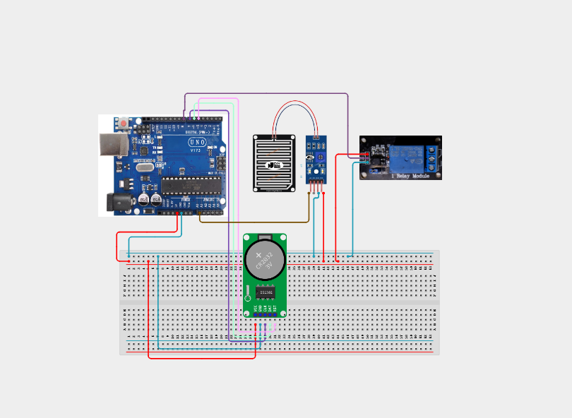

# Project 4.3.5: Scheduled Irrigation System with Rain Lockout

| **Description** | In this project, learners will build an automated scheduled watering system using a DS3231 Real-Time Clock, a Water Sensor module (simulating rain), a Relay module, and an Active Buzzer. The controller runs a clock check; during the watering window, it tests if rain has occurred. If dry, the relay switches the irrigation valve ON, otherwise it locks the system out.|
|------------------|----------------------------------------------------------------|
| **Use case**     |This system models smart agricultural watering timers, automated greenhouse irrigation, rain-sensing conservation controllers, and domestic garden automation.|

## Components (Things You will need)

|  |  |  |  |  |  |  |  |
| --- | --- | --- | --- | --- | --- | --- | --- |

## Building the circuit

Things Needed:

- Arduino Uno Core Board = 1
- DS3231 RTC Module = 1
- Water Level/Rain Sensor Module = 1
- Relay Module = 1
- Active Buzzer = 1
- USB Cable & Jumper Wires

## Mounting the component on the breadboard and wiring the circuit

**Step 1:** Establish 5V and GND rails on the breadboard from the Arduino pins.

**Step 2:** Place the DS3231 RTC module. Connect VCC to 5V, GND to GND, SDA to A4, and SCL to A5.

**Step 3:** Place the Water Sensor (Rain): Connect VCC to 5V, GND to GND, and its analog output signal to Arduino Analog Pin A0.

**Step 4:** Place the Relay: Connect VCC to 5V, GND to GND, and the input pin IN to Arduino digital Pin 8.

**Step 5:** Connect the active buzzer positive (+) pin to Arduino digital Pin 9 and the negative (-) pin to the GND rail.

**Step 6:** Inspect all wiring paths, check common ground lines, and connect the USB cable.



_Make sure to connect the Arduino USB cable to the Arduino board._

## PROGRAMMING

**Step 1:** Open your Arduino IDE. See how to set up here: [Getting Started](../../../STEMAIDE_CODER_Kit_Manual/Getting_Started/Arduino_IDE_Setup.md).

**Step 2:** Write the complete program implementing the system logic with appropriate pin definitions, setup configuration, and the main control loop.

```cpp
#include <Wire.h>
#include <RTClib.h>

RTC_DS3231 rtc;

const int rainSensorPin = A0;
const int relayPin = 8;
const int buzzerPin = 9;

// Watering Schedule Settings (e.g., 8:00 AM)
const int wateringHour = 8;
const int wateringMinute = 0;
const int dryThreshold = 500; // Below this indicates dry/no rain

void setup() {
  Serial.begin(9600);
  pinMode(relayPin, OUTPUT);
  pinMode(buzzerPin, OUTPUT);
  digitalWrite(relayPin, HIGH); // Relay OFF (Active LOW)
  digitalWrite(buzzerPin, LOW);

  if (!rtc.begin()) {
    Serial.println("RTC not found!");
    while (1);
  }
  if (rtc.lostPower()) {
    rtc.adjust(DateTime(F(__DATE__), F(__TIME__)));
  }
  Serial.println("Irrigation Controller Ready");
}

void loop() {
  DateTime now = rtc.now();
  int hour = now.hour();
  int minute = now.minute();
  int rainValue = analogRead(rainSensorPin);

  // Check if it is the scheduled watering minute
  if (hour == wateringHour && minute == wateringMinute) {
    if (rainValue < dryThreshold) {
      // Dry condition: Activate watering
      digitalWrite(relayPin, LOW); // Turn Relay ON (Active LOW)
      
      // Sound a warning beep
      digitalWrite(buzzerPin, HIGH);
      delay(500);
      digitalWrite(buzzerPin, LOW);
      
      Serial.println("System Status: Irrigation Active.");
    } else {
      // Wet condition: Lockout activated
      digitalWrite(relayPin, HIGH); // Ensure Relay is OFF
      Serial.println("System Warning: Irrigation Locked Out (Rain Detected).");
    }
  } else {
    // Turn off relay outside of the scheduled minute
    digitalWrite(relayPin, HIGH);
  }

  // Debug output
  Serial.print("Time: "); Serial.print(hour); Serial.print(":"); Serial.print(minute);
  Serial.print(" | Sensor Value: "); Serial.println(rainValue);

  delay(2000);
}
```

**Step 3:** Save your code. _See the [Getting Started](../../../STEMAIDE_CODER_Kit_Manual/Getting_Started/Arduino_IDE_Setup.md) section_

**Step 4:** Select the Arduino board and port. _See the [Getting Started](../../../STEMAIDE_CODER_Kit_Manual/Getting_Started/Arduino_IDE_Setup.md).

**Step 5:** Upload your code. 

## CONCLUSION

The Scheduled Irrigation System with Rain Lockout demonstrates how logic switches can gate automated processes based on sensor inputs. Combining real-time clocks and water tracking systems prevents wasteful water usage during rainy conditions.
