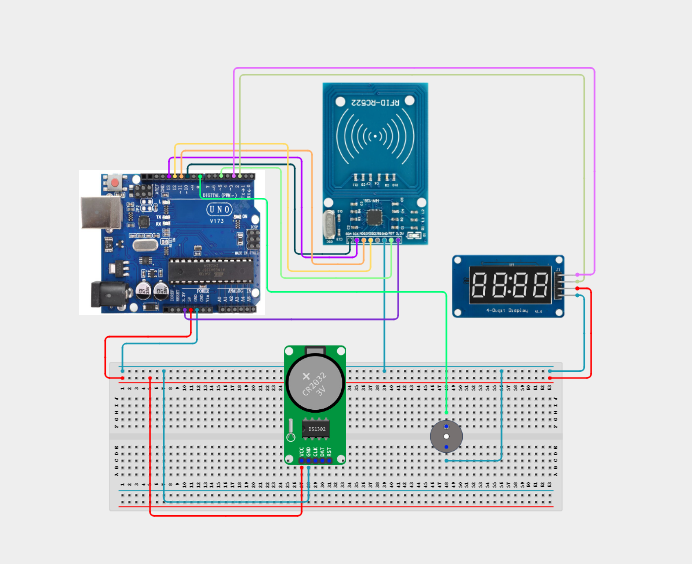

# Project 4.3.6: RFID Employee Attendance Counter

| **Description** | In this project, learners will build an automated personnel tracking and verification system using an MFRC522 RFID reader, a TM1637 4-digit display, an active buzzer, and a green LED indicator. When an attendee scans their RFID badge, the system beeps, blinks the green LED, increments the count of scanned badges, and displays it on the 4-digit display.|
|------------------|----------------------------------------------------------------|
| **Use case**     |This system applies to automated corporate sign-in stations, school attendance logging systems, public transit passenger counting gates, and crowd access control networks.|

## Components (Things You will need)

|  |  |  |  |  |  |  |  |
| --- | --- | --- | --- | --- | --- | --- | --- |

## Building the circuit

Things Needed:

- Arduino Uno Core Board = 1
- MFRC522 RFID Reader = 1
- TM1637 4-Digit Display = 1
- Active Buzzer = 1
- Green LED = 1
- Resistor (220 ohm) = 1
- USB Cable & Jumper Wires

## Mounting the component on the breadboard and wiring the circuit

**Step 1:** Establish common 5V, 3.3V, and GND rails on the breadboard from the Arduino.


**Step 2:** Wire the RFID module: 3.3V to 3.3V, GND to GND, MISO to Pin 12, MOSI to Pin 11, SCK to Pin 13, SS (SDA) to Pin 10, and RST to Pin 5.

**Step 3:** Place the TM1637 display: connect VCC to 5V, GND to GND, CLK to Pin 3, and DIO to Pin 2.

**Step 4:** Place the active buzzer and connect its positive (+) lead to Pin 8 and negative (-) to GND.

**Step 5:** Connect the Green LED: anode to Pin 4 (through a 220 ohm resistor), cathode to the GND rail.

**Step 6:** Verify all signal paths and power lines, then power the board using the USB cable.



_Make sure to connect the Arduino USB cable to the Arduino board._

## PROGRAMMING

**Step 1:** Open your Arduino IDE. See how to set up here: [Getting Started](../../../STEMAIDE_CODER_Kit_Manual/Getting_Started/Arduino_IDE_Setup.md).

**Step 2:** Write the complete program implementing the system logic with appropriate pin definitions, setup configuration, and the main control loop.

```cpp
#include <SPI.h>
#include <MFRC522.h>
#include <TM1637Display.h>

#define SS_PIN 10
#define RST_PIN 5
#define BUZZER_PIN 8
#define LED_PIN 4
#define CLK_PIN 3
#define DIO_PIN 2

MFRC522 mfrc522(SS_PIN, RST_PIN);
TM1637Display display(CLK_PIN, DIO_PIN);

int attendanceCount = 0;

void setup() {
  Serial.begin(9600);
  SPI.begin();
  mfrc522.PCD_Init();
  
  pinMode(BUZZER_PIN, OUTPUT);
  pinMode(LED_PIN, OUTPUT);
  digitalWrite(BUZZER_PIN, LOW);
  digitalWrite(LED_PIN, LOW);

  display.setBrightness(7);
  display.showNumberDec(attendanceCount); // Show starting 0
  
  Serial.println("Attendance Counter Online");
}

void loop() {
  if (!mfrc522.PICC_IsNewCardPresent() || !mfrc522.PICC_ReadCardSerial()) return;

  // Valid card scanned
  attendanceCount++;
  display.showNumberDec(attendanceCount);

  // Sound chime and blink LED
  digitalWrite(LED_PIN, HIGH);
  digitalWrite(BUZZER_PIN, HIGH);
  delay(150);
  digitalWrite(BUZZER_PIN, LOW);
  delay(150);
  digitalWrite(LED_PIN, LOW);

  Serial.print("Employee Logged! Total Count: ");
  Serial.println(attendanceCount);

  // Halt card to prevent double scans
  mfrc522.PICC_HaltA();
  delay(1000);
}
```

**Step 3:** Save your code. _See the [Getting Started](../../../STEMAIDE_CODER_Kit_Manual/Getting_Started/Arduino_IDE_Setup.md) section_

**Step 4:** Select the Arduino board and port. _See the [Getting Started](../../../STEMAIDE_CODER_Kit_Manual/Getting_Started/Arduino_IDE_Setup.md).

**Step 5:** Upload your code. 

## CONCLUSION

The RFID Employee Attendance Counter demonstrates how contactless sensors interface with digital counters. Logging identity tags and updating display segments in real time builds a baseline for connected IoT data counters.
