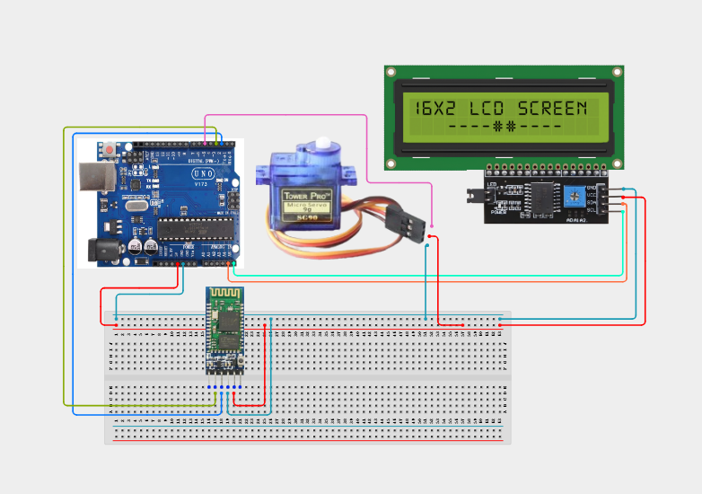

# Project 4.3.7: Wireless Bluetooth Industrial Robot Arm Drive

| **Description** | In this project, learners will construct a wireless dual-axis robotic arm controller using an HC-05 Bluetooth module, two SG90 servo motors (representing base and claw components), an I2C 1602 LCD, and an active buzzer. Users transmit serial codes from their phone to pivot the base or open/close the claw, and status values are output on the LCD screen.|
|------------------|----------------------------------------------------------------|
| **Use case**     |Wireless robotic manipulators are used in automotive assembly plants, automated manufacturing systems, warehouse package sorters, and remote hazardous material handling rigs.|

## Components (Things You will need)

|  |  |  |  |  |  |  |  |
| --- | --- | --- | --- | --- | --- | --- | --- |

## Building the circuit

Things Needed:

- Arduino Uno Core Board = 1
- HC-05 Bluetooth Module = 1
- SG90 Servo Motors = 2
- I2C 1602 LCD Module = 1
- Active Buzzer = 1
- USB Cable & Jumper Wires

## Mounting the component on the breadboard and wiring the circuit

**Step 1:** Link the 5V and GND rails on the breadboard from the Arduino board.

**Step 2:** Place the HC-05 Bluetooth: VCC to 5V, GND to GND, TXD to Pin 10, and RXD to Pin 11.

**Step 3:** Place Base Servo: Connect VCC to 5V, GND to GND, and signal line to Pin 5.

**Step 4:** Place Claw Servo: Connect VCC to 5V, GND to GND, and signal line to Pin 6.

**Step 5:** Connect the I2C LCD: VCC to 5V, GND to GND, SDA to A4, and SCL to A5. Connect the active buzzer positive (+) pin to Pin 8 and negative (-) to GND.

**Step 6:** Check that your servos share ground rails with the Arduino to prevent mechanical twitching, and connect the USB cable.



_Make sure to connect the Arduino USB cable to the Arduino board._

## PROGRAMMING

**Step 1:** Open your Arduino IDE. See how to set up here: [Getting Started](../../../STEMAIDE_CODER_Kit_Manual/Getting_Started/Arduino_IDE_Setup.md).

**Step 2:** Write the complete program implementing the system logic with appropriate pin definitions, setup configuration, and the main control loop.

```cpp
#include <Servo.h>
#include <Wire.h>
#include <LiquidCrystal_I2C.h>
#include <SoftwareSerial.h>

SoftwareSerial BT(10, 11); // RX, TX
LiquidCrystal_I2C lcd(0x27, 16, 2);

Servo baseServo;
Servo clawServo;

int baseAngle = 90;
int clawAngle = 45;
const int buzzerPin = 8;

void setup() {
  BT.begin(9600);
  lcd.init();
  lcd.backlight();
  
  baseServo.attach(5);
  clawServo.attach(6);
  baseServo.write(baseAngle);
  clawServo.write(clawAngle);

  pinMode(buzzerPin, OUTPUT);
  digitalWrite(buzzerPin, LOW);

  lcd.setCursor(0, 0);
  lcd.print("Robot Arm Ready");
  lcd.setCursor(0, 1);
  lcd.print("B:90 C:45");
}

void loop() {
  if (BT.available()) {
    char cmd = BT.read();
    bool valid = true;

    if (cmd == 'L' && baseAngle > 0) baseAngle -= 15;      // Base Left
    else if (cmd == 'R' && baseAngle < 180) baseAngle += 15; // Base Right
    else if (cmd == 'O' && clawAngle < 90) clawAngle += 15;  // Claw Open
    else if (cmd == 'C' && clawAngle > 0) clawAngle -= 15;   // Claw Close
    else valid = false;

    if (valid) {
      baseServo.write(baseAngle);
      clawServo.write(clawAngle);
      
      lcd.clear();
      lcd.setCursor(0, 0);
      lcd.print("Moving Arm...");
      lcd.setCursor(0, 1);
      lcd.print("B:"); lcd.print(baseAngle); lcd.print(" C:"); lcd.print(clawAngle);

      BT.print("Base: "); BT.print(baseAngle); BT.print(" | Claw: "); BT.println(clawAngle);
    } else {
      // Invalid command sound notification
      digitalWrite(buzzerPin, HIGH);
      delay(100);
      digitalWrite(buzzerPin, LOW);
    }
  }
}
```

**Step 3:** Save your code. _See the [Getting Started](../../../STEMAIDE_CODER_Kit_Manual/Getting_Started/Arduino_IDE_Setup.md) section_

**Step 4:** Select the Arduino board and port. _See the [Getting Started](../../../STEMAIDE_CODER_Kit_Manual/Getting_Started/Arduino_IDE_Setup.md).

**Step 5:** Upload your code.

## CONCLUSION

The Wireless Bluetooth Industrial Robot Arm Drive demonstrates mechanical manipulation using serial interfaces. Overwriting coordinate parameters via telemetry commands teaches students how automated machines execute remote physical actions.
