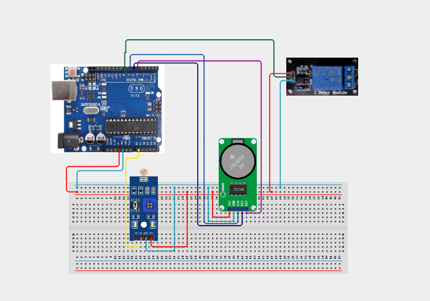

# Project 4.3.8: Real Time Clock Night Light Controller

| **Description** | In this project, learners will build a night light automation controller that activates high-voltage lighting systems only during set hours (e.g. night hours) and under dark ambient conditions. The system integrates a DS3231 RTC, a Photoresistor (LDR) sensor, a Relay module, and a Red LED status indicator.|
|------------------|----------------------------------------------------------------|
| **Use case**     |Smart streetlights, energy-conserving public lights, automatic security yard lamps, and residential outdoor night lights use scheduled ambient sensing to save power.|

## Components (Things You will need)

|  |  |  |  |  |  |  |  |
| --- | --- | --- | --- | --- | --- | --- | --- |

## Building the circuit

Things Needed:

- Arduino Uno
- DS3231 RTC Module
- Photoresistor (LDR)
- Relay Module
- Red LED
- Resistor (10k ohm) = 1
- Resistor (220 ohm) = 1
- USB Cable & Jumper Wires

## Mounting the component on the breadboard and wiring the circuit

**Step 1:** Link the 5V and GND pins of the Arduino to the breadboard power rails.

**Step 2:** Place the DS3231 RTC: SDA to Arduino A4, SCL to Arduino A5, VCC to 5V, and GND to GND.

**Step 3:** Place the LDR on the breadboard. Wire it in series with a 10k ohm resistor to create a voltage divider. Connect the node between them to Analog Pin A0.

**Step 4:** Place the Relay: Connect VCC to 5V, GND to GND, and its input IN to Arduino digital Pin 8.

**Step 5:** Connect the Red LED: anode to digital Pin 9 (via a 220 ohm resistor), cathode to the GND rail.

**Step 6:** Verify that all positive and ground rails are linked, then connect the USB cable to write and upload the sketch.



_Make sure to connect the Arduino USB cable to the Arduino board._

## PROGRAMMING

**Step 1:** Open your Arduino IDE. See how to set up here: [Getting Started](../../../STEMAIDE_CODER_Kit_Manual/Getting_Started/Arduino_IDE_Setup.md).

**Step 2:** Write the complete program implementing the system logic with appropriate pin definitions, setup configuration, and the main control loop.

```cpp
#include <Wire.h>
#include <RTClib.h>

RTC_DS3231 rtc;

const int ldrPin = A0;
const int relayPin = 8;
const int ledPin = 9;

// Light schedule: Active between 6 PM (18:00) and 6 AM (06:00)
const int startHour = 18;
const int endHour = 6;
const int darkThreshold = 300; // Below this indicates dark conditions

void setup() {
  Serial.begin(9600);
  pinMode(relayPin, OUTPUT);
  pinMode(ledPin, OUTPUT);
  
  digitalWrite(relayPin, HIGH); // Relay OFF (Active LOW)
  digitalWrite(ledPin, LOW);

  if (!rtc.begin()) {
    Serial.println("RTC not found!");
    while (1);
  }
  if (rtc.lostPower()) {
    rtc.adjust(DateTime(F(__DATE__), F(__TIME__)));
  }
}

void loop() {
  DateTime now = rtc.now();
  int hour = now.hour();
  int lightLevel = analogRead(ldrPin);

  // Check if current hour falls in the night schedule
  bool isNight = (hour >= startHour || hour < endHour);

  if (isNight && lightLevel < darkThreshold) {
    digitalWrite(relayPin, LOW); // Turn Relay ON (Active LOW)
    digitalWrite(ledPin, HIGH);  // Turn indicator LED ON
    Serial.println("Conditions Met: Night Light Activated.");
  } else {
    digitalWrite(relayPin, HIGH); // Turn Relay OFF
    digitalWrite(ledPin, LOW);   // Turn indicator LED OFF
    Serial.println("Conditions Unmet: Night Light Deactivated.");
  }

  Serial.print("Hour: "); Serial.print(hour);
  Serial.print(" | Light Reading: "); Serial.println(lightLevel);

  delay(2000);
}
```

**Step 3:** Save your code. _See the [Getting Started](../../../STEMAIDE_CODER_Kit_Manual/Getting_Started/Arduino_IDE_Setup.md) section_

**Step 4:** Select the Arduino board and port. _See the [Getting Started](../../../STEMAIDE_CODER_Kit_Manual/Getting_Started/Arduino_IDE_Setup.md)_.

**Step 5:** Upload your code. 

## CONCLUSION

The Real Time Clock Night Light Controller models energy-conserving automation logic. Interlocking real-time scheduling with optical sensory thresholds prevents lighting circuits from activating prematurely or running when it is already light.
