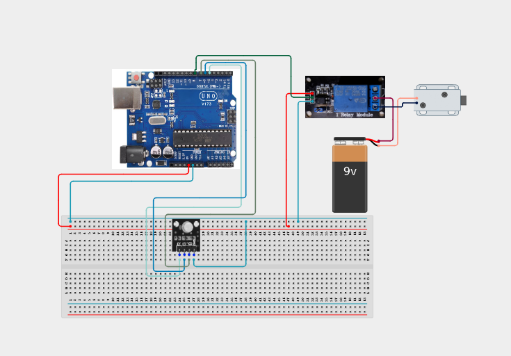

# Project 4.3.9: Smart RFID Door Access Control Gate

| **Description** | In this project, learners will build a secure door lock entry gate combining an MFRC522 RFID reader, a Relay module (representing an electric solenoid lock), an RGB LED module, and an Active Buzzer. If an authorized keycard is scanned, the RGB glows green and the relay triggers to open the door; scanning an unauthorized card turns the RGB red and sounds an alarm.|
|------------------|----------------------------------------------------------------|
| **Use case**     |This system models high-security bank vaults, residential card-lock doors, commercial office entrance validation gates, and secure keycard lockers.|

## Components (Things You will need)

|  |  |  |  |  |  |  |  |
| --- | --- | --- | --- | --- | --- | --- | --- |

## Building the circuit

Things Needed:

- Arduino Uno
- MFRC522 RFID Reader
- Relay Module 
- RGB LED Module
- Active Buzzer
- Resistors (220 ohm) = 3
- USB Cable & Jumper Wires

## Mounting the component on the breadboard and wiring the circuit

**Step 1:** Wire the 5V, 3.3V, and GND rails on the breadboard from the Arduino pins.

**Step 2:** Connect MFRC522 RFID: 3.3V to 3.3V, GND to GND, MISO to Pin 12, MOSI to Pin 11, SCK to Pin 13, SS (SDA) to Pin 10, and RST to Pin 9.

**Step 3:** Place the Relay: Connect VCC to 5V, GND to GND, and control pin IN to digital Pin 8.

**Step 4:** Place the RGB LED: Connect Red to Pin 5, Green to Pin 6, Blue to Pin 7 (via 220 ohm resistors), and Common to GND.

**Step 5:** Connect the buzzer positive (+) lead to Pin 4 and its negative (-) lead to the ground rail.

**Step 6:** Inspect all connections, check that the SPI and signal pins match, and upload the code.



_Make sure to connect the Arduino USB cable to the Arduino board._

## PROGRAMMING

**Step 1:** Open your Arduino IDE. See how to set up here: [Getting Started](../../../STEMAIDE_CODER_Kit_Manual/Getting_Started/Arduino_IDE_Setup.md).

**Step 2:** Write the complete program implementing the system logic with appropriate pin definitions, setup configuration, and the main control loop.

```cpp
#include <SPI.h>
#include <MFRC522.h>

#define SS_PIN 10
#define RST_PIN 9
MFRC522 mfrc522(SS_PIN, RST_PIN);

const int relayPin = 8;
const int redPin = 5;
const int greenPin = 6;
const int bluePin = 7;
const int buzzerPin = 4;

void setup() {
  Serial.begin(9600);
  SPI.begin();
  mfrc522.PCD_Init();
  
  pinMode(relayPin, OUTPUT);
  pinMode(redPin, OUTPUT);
  pinMode(greenPin, OUTPUT);
  pinMode(bluePin, OUTPUT);
  pinMode(buzzerPin, OUTPUT);
  
  digitalWrite(relayPin, HIGH); // Relay OFF (Active LOW)
  digitalWrite(redPin, LOW);
  digitalWrite(greenPin, LOW);
  digitalWrite(bluePin, HIGH); // Blue light ON (Standby state)
  digitalWrite(buzzerPin, LOW);

  Serial.println("RFID Lock Console Online");
}

void loop() {
  if (!mfrc522.PICC_IsNewCardPresent() || !mfrc522.PICC_ReadCardSerial()) return;

  Serial.print("Card UID:");
  String content= "";
  for (byte i = 0; i < mfrc522.uid.size; i++) {
     content.concat(String(mfrc522.uid.uidByte[i] < 0x10 ? " 0" : " "));
     content.concat(String(mfrc522.uid.uidByte[i], HEX));
  }
  content.toUpperCase();
  Serial.println(content);

  digitalWrite(bluePin, LOW); // Turn off Standby light

  // Authentication check (Enter your tag's UID instead of placeholder)
  if (content.substring(1) == "YOUR_TAG_UID_HERE" || content.substring(1) == "53 B2 F8 A9") {
    // Authorized: Unlock door
    digitalWrite(greenPin, HIGH);
    digitalWrite(relayPin, LOW); // Relay ON (Active LOW)
    
    // Play double beep chime
    digitalWrite(buzzerPin, HIGH); delay(100);
    digitalWrite(buzzerPin, LOW); delay(100);
    digitalWrite(buzzerPin, HIGH); delay(100);
    digitalWrite(buzzerPin, LOW);
    
    delay(3000); // Hold open for 3 seconds
    digitalWrite(relayPin, HIGH); // Lock door
    digitalWrite(greenPin, LOW);
  } else {
    // Unauthorized: Trigger alarm
    digitalWrite(redPin, HIGH);
    digitalWrite(buzzerPin, HIGH); // Long continuous beep
    delay(1500);
    digitalWrite(buzzerPin, LOW);
    digitalWrite(redPin, LOW);
  }

  digitalWrite(bluePin, HIGH); // Re-activate Standby light
  mfrc522.PICC_HaltA();
}
```

**Step 3:** Save your code. _See the [Getting Started](../../../STEMAIDE_CODER_Kit_Manual/Getting_Started/Arduino_IDE_Setup.md) section_

**Step 4:** Select the Arduino board and port. _See the [Getting Started](../../../STEMAIDE_CODER_Kit_Manual/Getting_Started/Arduino_IDE_Setup.md)_.

**Step 5:** Upload your code.

## CONCLUSION

The Smart RFID Door Access Control Gate provides a practical model for automated access barriers. Authenticating dynamic card IDs and triggering safety alarms teaches students how electromagnetic credentials control electronic actuators.
