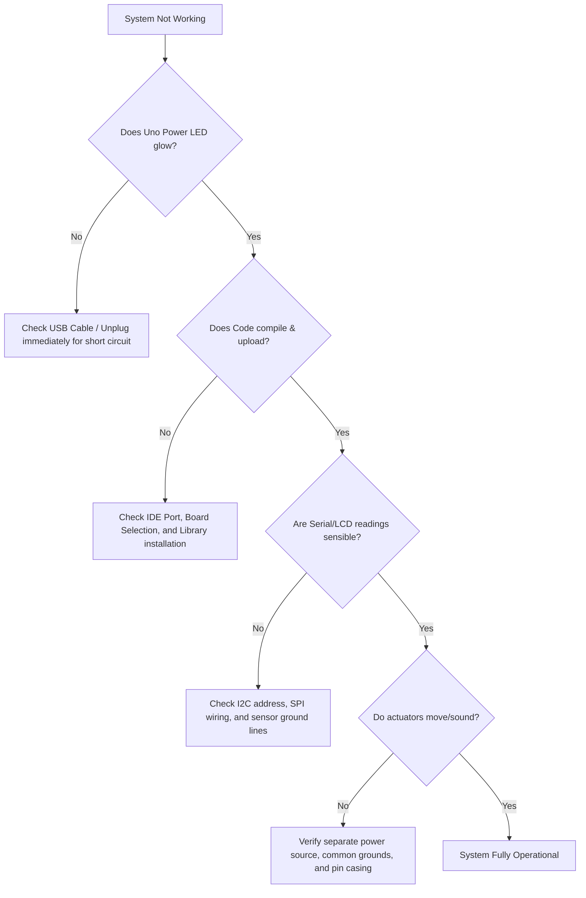

# Appendix: Troubleshooting & System Diagnostics (Coder Pro)

This appendix provides advanced debugging guidelines, diagnostic code snippets, and systematic checklists to isolate and fix hardware and software issues in complex STEMAIDE Coder Pro projects.

---

## 1. Systematic Troubleshooting Checklist

When integrating multiple sensors, keypads, displays, and motors, use this step-by-step diagnostic checklist to narrow down the fault:



### The "Pro Rule of Four":
1.  **Common Ground**: If you are using an external battery or power supply for DC motors, stepper motors, or high-draw servos, you **must** connect the ground (GND) of that external supply to the Arduino Uno's GND. Without this shared reference, signals will be erratic or fail completely.
2.  **SPI Pin Integrity**: Unlike I2C or digital pins, SPI lines on the Arduino Uno are hardwired to specific pins (MISO=12, MOSI=11, SCK=13). You cannot arbitrarily reassign these pins in code. Always verify these connections.
3.  **Port Collisions**: Unplug jumper connections from D0 (RX) and D1 (TX) while uploading code. These lines are shared with the USB interface; having active devices connected to them during uploads can cause serial collisions.
4.  **I2C Scanner Check**: If your LCD or BME280 sensor does not respond, compile and upload the I2C Scanner (shown below) to check if the microcontroller can discover them on the I2C bus.

---

## 2. Essential Diagnostic Sketch: I2C Scanner

If you get blank screen outputs or sensor failures, upload this utility to discover active I2C devices.

```cpp
#include <Wire.h>

void setup() {
  Wire.begin();
  Serial.begin(9600);
  while (!Serial); // Wait for serial monitor to open
  Serial.println("\nI2C Scanner Utility Starting...");
}

void loop() {
  byte error, address;
  int nDevices = 0;

  Serial.println("Scanning I2C Bus...");

  for (address = 1; address < 127; address++) {
    Wire.beginTransmission(address);
    error = Wire.endTransmission();

    if (error == 0) {
      Serial.print("I2C device found at address 0x");
      if (address < 16) {
        Serial.print("0");
      }
      Serial.print(address, HEX);
      
      // Common device mapping hints
      if (address == 0x27 || address == 0x3F) Serial.print(" (Possible I2C LCD Display)");
      else if (address == 0x76 || address == 0x77) Serial.print(" (Possible BME280 Sensor)");
      else if (address == 0x68) Serial.print(" (Possible DS3231/DS1307 RTC Module)");
      
      Serial.println();
      nDevices++;
    } else if (error == 4) {
      Serial.print("Unknown error at address 0x");
      if (address < 16) {
        Serial.print("0");
      }
      Serial.println(address, HEX);
    }
  }
  
  if (nDevices == 0) {
    Serial.println("No I2C devices found. Check your VCC, GND, SDA, and SCL wiring!\n");
  } else {
    Serial.println("Scan complete.\n");
  }
  
  delay(5000); // Scan again every 5 seconds
}
```

**How to use it**:
1. Upload the code to your Arduino.
2. Open the Serial Monitor (`Ctrl+Shift+M`) and set the baud rate to **9600**.
3. If no devices are listed, check that SCL goes to A5 and SDA goes to A4, and that the devices are powered (VCC and GND lines are secure).

---

## 3. Debugging Matrix Keypads

If pressing keypad buttons does not print characters or registers wrong keys:
*   **Inverted Layout**: Your row and column connections might be wired in reverse order (e.g., Row 1 connected to the pin intended for Column 1). Verify pin arrays:
    ```cpp
    byte rowPins[ROWS] = {9, 8, 7, 6}; // Connect to the row pinouts of the keypad
    byte colPins[COLS] = {5, 4, 3, 2}; // Connect to the column pinouts of the keypad
    ```
*   **Stuck Key Diagnostic**: Load a simple serial keypad sketch:
    ```cpp
    #include <Keypad.h>
    // ... define keys, rows, cols, rowPins, colPins ...
    Keypad keypad = Keypad(makeKeymap(keys), rowPins, colPins, ROWS, COLS);
    void setup() { Serial.begin(9600); }
    void loop() {
      char key = keypad.getKey();
      if (key) {
        Serial.print("Key Pressed: ");
        Serial.println(key);
      }
    }
    ```
    Press keys one by one. If a whole row or column fails, check the respective wire connection on the breadboard or shield.

---

## 4. Debugging Stepper Motors (28BYJ-48)

*   **Symptoms**: Motor vibrates heavily, gets warm, or moves back and forth instead of rotating smoothly.
*   **Causes**: The motor coil sequence in your code does not match the physical wiring connections. The standard Stepper library requires configuring pins in the sequence `1, 3, 2, 4` rather than `1, 2, 3, 4`.
*   **Fix**:
    Change the declaration:
    ```cpp
    // IN1 -> Pin 8, IN2 -> Pin 9, IN3 -> Pin 10, IN4 -> Pin 11
    // Correct coil sequence: IN1, IN3, IN2, IN4
    Stepper myStepper(stepsPerRevolution, 8, 10, 9, 11); 
    ```
