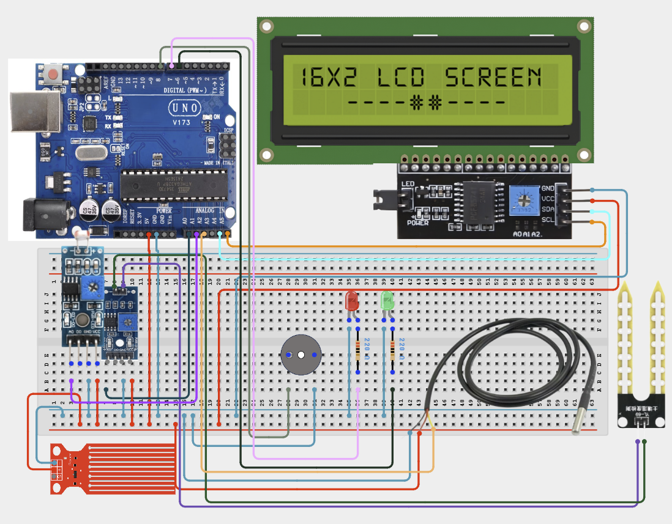

# 3.11. Smart Farm Automation System

| **Description** | In this project, learners will create a Smart Farm Automation System that monitors soil moisture, light intensity, and temperature. The system informs farmers when crops require attention and provides automatic alerts when environmental conditions become unfavorable. This project combines multiple sensors to create a practical agricultural monitoring solution.|
|------------------|----------------------------------------------------------------|
| **Use case**     |This project is connected to real-world uses such as: This project demonstrates how modern farms use sensors and automation to improve crop management and maximize productivity.|

## Components (Things You will need)

|  |  |  |  |  |  |  |  |  |  |  |
| --- | --- | --- | --- | --- | --- | --- | --- | --- | --- | --- |

## Building the circuit

Things Needed:

- Arduino Uno
- Soil Moisture Sensor
- LDR Module
- LM35 Temperature Sensor
- I2C LCD Display
- Buzzer
- Green LED
- Red LED
- Breadboard
- Jumper Wires
- 220Ω Resistors
- Arduino USB Cable


## Mounting the component on the breadboard and wiring the circuit

**Step 1:** Connect the Arduino Uno’s 5V pin to the breadboard’s positive (+) red power rail.

**Step 2:** Connect an Arduino Uno GND pin to the breadboard’s negative (−) blue ground rail.

**Step 3:** Connect the Soil Moisture Sensor’s VCC pin to the 5V power rail.

**Step 4:** Connect the Soil Moisture Sensor’s GND pin to the ground rail.

**Step 5:** Connect the Soil Moisture Sensor’s Signal/AO pin to Arduino analog pin A0.

**Step 6:** Connect the LDR Light Sensor Module’s VCC pin to the 5V power rail.

**Step 7:** Connect the LDR Light Sensor Module’s GND pin to the ground rail.

**Step 8:** Connect the LDR Light Sensor Module’s AO/Signal pin to Arduino analog pin A1.

**Step 9:** With the flat side of the LM35 Temperature Sensor facing you, connect its left VCC pin to the 5V power rail.

**Step 10:** Connect the LM35’s middle VOUT/Signal pin to Arduino analog pin A2.

**Step 11:** Connect the LM35’s right GND pin to the ground rail.

**Step 12:** Connect the I2C LCD Display’s VCC pin to the 5V power rail.

**Step 13:** Connect the I2C LCD Display’s GND pin to the ground rail.

**Step 14:** Connect the I2C LCD Display’s SDA pin to Arduino analog pin A4.

**Step 15:** Connect the I2C LCD Display’s SCL pin to Arduino analog pin A5.

**Step 16:** Insert the Green LED into the breadboard and connect its anode (longer leg) through a 220 Ω resistor to Arduino digital pin 6.

**Step 17:** Connect the Green LED’s cathode (shorter leg) to the ground rail.

**Step 18:** Insert the Red LED into the breadboard and connect its anode (longer leg) through a 220 Ω resistor to Arduino digital pin 7.

**Step 19:** Connect the Red LED’s cathode (shorter leg) to the ground rail.

**Step 20:** Connect the Buzzer’s positive (+) terminal to Arduino digital pin 8.

**Step 21:** Connect the Buzzer’s negative (−) terminal to the ground rail.

**Step 22:** Carefully check all connections to ensure the sensors, LCD, LEDs, resistors, and buzzer are connected to the correct power, ground, input, and output pins before powering the Arduino.



_Make sure to connect the Arduino USB cable to the Arduino board._

## PROGRAMMING

**Step 1:** Open your Arduino IDE. See how to set up here: [Getting Started](../../STEMAIDE_CODER_Kit_Manual/Getting_Started/Arduino_IDE_Setup.md).

**Step 2:** Write the complete program implementing the system logic with appropriate pin definitions, setup configuration, and the main control loop.

```cpp

#include <Wire.h>
#include <LiquidCrystal_I2C.h>

// Create LCD object
LiquidCrystal_I2C lcd(0x27, 16, 2);

// Pin definitions
const int soilPin = A0;
const int lightPin = A1;
const int tempPin = A2;

const int greenLED = 6;
const int redLED = 7;
const int buzzerPin = 8;

void setup() {

  // Initialize LCD
  lcd.init();
  lcd.backlight();

  // Configure output pins
  pinMode(greenLED, OUTPUT);
  pinMode(redLED, OUTPUT);
  pinMode(buzzerPin, OUTPUT);

  // Ensure outputs are OFF initially
  digitalWrite(greenLED, LOW);
  digitalWrite(redLED, LOW);
  digitalWrite(buzzerPin, LOW);

  // Startup message
  lcd.setCursor(0, 0);
  lcd.print("Smart Farm");
  lcd.setCursor(0, 1);
  lcd.print("Monitoring...");
  delay(1500);
  lcd.clear();
}

void loop() {

  // Read sensors
  int soil = analogRead(soilPin);
  int light = analogRead(lightPin);
  int tempReading = analogRead(tempPin);

  // Convert LM35 reading to Celsius
  float voltage = tempReading * (5.0 / 1023.0);
  float temperature = voltage * 100.0;

  // Display soil and light readings
  lcd.setCursor(0, 0);
  lcd.print("S:");
  lcd.print(soil);
  lcd.print(" L:");
  lcd.print(light);
  lcd.print("   ");

  // Determine if an alert is required
  bool alert = false;

  if (soil < 300) {
    alert = true;
  }

  if (light < 200) {
    alert = true;
  }

  if (temperature > 40.0) {
    alert = true;
  }

  // Update outputs
  if (alert) {

    digitalWrite(greenLED, LOW);
    digitalWrite(redLED, HIGH);
    digitalWrite(buzzerPin, HIGH);

    lcd.setCursor(0, 1);
    lcd.print("Check Farm!    ");

  } else {

    digitalWrite(greenLED, HIGH);
    digitalWrite(redLED, LOW);
    digitalWrite(buzzerPin, LOW);

    lcd.setCursor(0, 1);
    lcd.print("Farm Healthy   ");
  }

  delay(500);
}

```

**Step 3:** Save your code. _See the [Getting Started](../../STEMAIDE_CODER_Kit_Manual/Getting_Started/Arduino_IDE_Setup.md) section_

**Step 4:** Select the arduino board and port _See the [Getting Started](../../STEMAIDE_CODER_Kit_Manual/Getting_Started/Arduino_IDE_Setup.md).

**Step 5:** Upload your code.

## CONCLUSION

When the program is running, the Smart Farm Automation System continuously monitors the soil moisture, light intensity, and temperature. The LCD displays the current sensor readings, while the green LED indicates that environmental conditions are suitable. If the soil becomes too dry, the light level is too low, or the temperature exceeds the preset threshold, the red LED lights up, the buzzer sounds, and the LCD displays a warning message, providing immediate visual and audible feedback that the farm requires attention.
