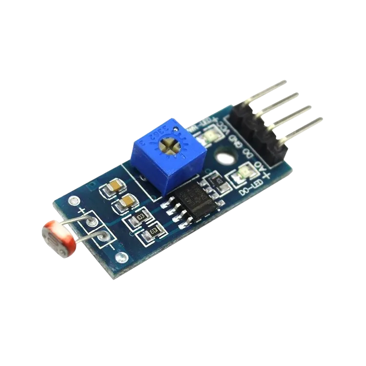

# 3.14. Smart Campus Management System

| **Description** |In this project, learners will build a Smart Campus Management System that combines RFID attendance tracking, environmental monitoring, and status display capabilities. The system records student entry and monitors classroom conditions simultaneously. This project integrates several concepts learned throughout the manual into a single educational solution.|
|------------------|----------------------------------------------------------------|
| **Use case**     |This project is connected to real-world uses such as: This project demonstrates how educational institutions can combine attendance systems and environmental monitoring into a unified management platform.|

## Components (Things You will need)

|  |  |  |  |  |  |  |  |  |
| --- | --- | --- | --- | --- | --- | --- | --- | --- |

## Building the circuit

Things Needed:

- Arduino Uno
- RFID Reader (MFRC522)
- RFID Tag/Card
- LDR Module
- LM35 Temperature Sensor
- I2C LCD Display
- Buzzer
- Breadboard
- Jumper Wires
- Arduino USB Cable


## Mounting the component on the breadboard and wiring the circuit

**Step 1:**	Identify each component listed in the Required Components table before assembling the circuit.

- Place the MFRC522 RFID Reader, RFID Card/Tag, LDR Module, LM35 Temperature Sensor, Buzzer, and I²C LCD Display on the breadboard.

- Connect the Buzzer by connecting the positive (+) pin to Digital Pin 8 and the negative (-) pin to GND on the Arduino Uno.

- Connect the LDR Module by connecting the AO pin to Analog Pin A0, the VCC pin to 5V, and the GND pin to GND on the Arduino Uno.

- Connect the LM35 Temperature Sensor by connecting the Signal (VOUT) pin to Analog Pin A1, the VCC pin to 5V, and the GND pin to GND on the Arduino Uno.

- Connect the MFRC522 RFID Reader using the SPI pins:

-  SDA (SS) → Digital Pin 10
-  SCK → Digital Pin 13
-  MOSI → Digital Pin 11
-  MISO → Digital Pin 12
-  RST → Digital Pin 9
-  3.3V → 3.3V pin on Arduino Uno
-  GND → GND on Arduino Uno
 _Important: Connect the MFRC522 RFID Reader to 3.3V only. Connecting it to 5V may damage the module permanently._

- Connect the I²C LCD Display by connecting the SDA pin to Analog Pin A4, the SCL pin to Analog Pin A5, the VCC pin to 5V, and the GND pin to GND on the Arduino Uno.

- Ensure all components share a common GND connection and that all power connections are correctly connected before supplying power.


_Make sure to connect the Arduino USB cable to the Arduino board._

## PROGRAMMING

**Step 1:** Open your Arduino IDE. See how to set up here: [Getting Started](../../STEMAIDE_CODER_Kit_Manual/Getting_Started/Arduino_IDE_Setup.md).

**Step 2:** Write the complete program implementing the system logic with appropriate pin definitions, setup configuration, and the main control loop.

```cpp

#include <SPI.h>
#include <MFRC522.h>
#include <Wire.h>
#include <LiquidCrystal_I2C.h>

// RFID pins
#define SS_PIN 10
#define RST_PIN 9

// Create RFID object
MFRC522 rfid(SS_PIN, RST_PIN);

// Create LCD object
LiquidCrystal_I2C lcd(0x27, 16, 2);

// Sensor and output pins
const int lightPin = A0;
const int tempPin = A1;
const int buzzerPin = 8;

void setup() {

  // Initialize RFID
  SPI.begin();
  rfid.PCD_Init();

  // Initialize LCD
  lcd.init();
  lcd.backlight();

  // Initialize buzzer
  pinMode(buzzerPin, OUTPUT);
  digitalWrite(buzzerPin, LOW);

  // Startup message
  lcd.setCursor(0, 0);
  lcd.print("Campus Ready");
  lcd.setCursor(0, 1);
  lcd.print("Scan Card");
  delay(1500);
  lcd.clear();
}

void loop() {

  // Read classroom conditions
  int lightLevel = analogRead(lightPin);
  int tempReading = analogRead(tempPin);

  // Convert LM35 reading to temperature
  float voltage = tempReading * (5.0 / 1023.0);
  float temperature = voltage * 100.0;


  // Display environmental conditions
  lcd.setCursor(0, 0);
  lcd.print("L:");
  lcd.print(lightLevel);
  lcd.print(" T:");
  lcd.print(temperature, 1);
  lcd.print("C ");


  // Temperature alert
  if (temperature > 40) {

    digitalWrite(buzzerPin, HIGH);

    lcd.setCursor(0, 1);
    lcd.print("High Temp!    ");

  }
  else {

    digitalWrite(buzzerPin, LOW);

    lcd.setCursor(0, 1);
    lcd.print("Scan RFID     ");
  }


  // Check RFID card
  if (rfid.PICC_IsNewCardPresent() &&
      rfid.PICC_ReadCardSerial()) {

    lcd.clear();

    lcd.setCursor(0, 0);
    lcd.print("Attendance");

    lcd.setCursor(0, 1);
    lcd.print("Recorded");

    delay(2000);

    lcd.clear();

    // Stop RFID communication
    rfid.PICC_HaltA();
    rfid.PCD_StopCrypto1();
  }

  delay(500);
}

```

**Step 3:** Save your code. _See the [Getting Started](../../STEMAIDE_CODER_Kit_Manual/Getting_Started/Arduino_IDE_Setup.md) section_

**Step 4:** Select the arduino board and port _See the [Getting Started](../../Getting Started/Arduino_IDE_Setup.md).

**Step 5:** Upload your code. 

## CONCLUSION

When a registered student scans an RFID card, the system recognizes the card and the LCD displays "Attendance Recorded" to confirm that the attendance entry has been captured.

When the classroom temperature rises above the preset safety limit, the LCD displays "Temperature High" and the buzzer activates to alert users that the classroom environment requires attention.
