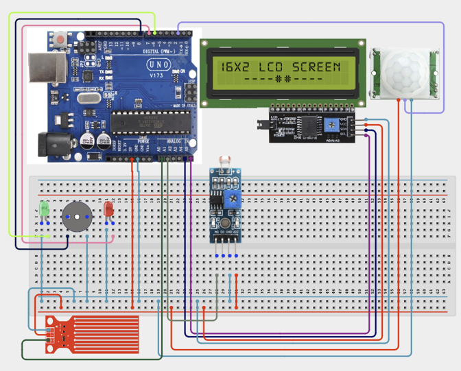

# 3.15. Smart City Integrated Monitoring Hub

| **Description** |This capstone project combines multiple sensors and actuators to create a Smart City Integrated Monitoring Hub. The system monitors environmental conditions, traffic flow, water levels, and security events while displaying system status on an LCD and activating alerts when necessary. This project represents the culmination of all concepts learned throughout the Coder Pro Kit curriculum|
|------------------|----------------------------------------------------------------|
| **Use case**     |This project is connected to real-world uses such as: This capstone project demonstrates how multiple monitoring systems can be integrated into a single intelligent platform. Similar systems are used in smart cities, industrial facilities, transportation networks, and public infrastructure management. It serves as a culmination of all the skills learned throughout the Coder Pro Kit curriculum and prepares learners for more advanced embedded systems and IoT development.|

## Components (Things You will need)

|  |  |  |  |  |  |  |  |  |  |  |
|---|---|---|---|---|---|---|---|---|---|---|

## Building the circuit

Things Needed:

- Arduino Uno
- Ultrasonic Sensor
- Water Level Sensor
- PIR Motion Sensor
- LDR Module
- LCD Display
- Buzzer
- Red LED
- Green LED
- Breadboard
- Jumper Wires
- Arduino USB Cable

## Mounting the component on the breadboard and wiring the circuit

**Step 1:**	Identify each component listed in the Required Components table before assembling the circuit.

- Place the Water Level Sensor, LDR Module, PIR Motion Sensor, Green LED, Red LED, Buzzer, and LCD Display on the breadboard.

- Connect the Water Level Sensor by connecting the Signal pin to Analog Pin A0, the VCC pin to 5V, and the GND pin to GND on the Arduino Uno.

- Connect the LDR Module by connecting the Signal pin to Analog Pin A1, the VCC pin to 5V, and the GND pin to GND on the Arduino Uno.

- Connect the PIR Motion Sensor by connecting the OUT pin to Digital Pin 2, the VCC pin to 5V, and the GND pin to GND on the Arduino Uno.

- Connect the Green LED by connecting the Anode (+) pin to Digital Pin 6 and the Cathode (-) pin to GND on the Arduino Uno.

- Connect the Red LED by connecting the Anode (+) pin to Digital Pin 7 and the Cathode (-) pin to GND on the Arduino Uno.

- Connect the Buzzer by connecting the positive (+) pin to Digital Pin 8 and the negative (-) pin to GND on the Arduino Uno.

- Connect the I²C LCD Display by connecting the SDA pin to Analog Pin A4, the SCL pin to Analog Pin A5, the VCC pin to 5V, and the GND pin to GND on the Arduino Uno.

- Ensure all modules share a common GND connection and verify that all power and signal connections are correctly connected.

- Check the polarity of the LEDs, buzzer, LCD module, and sensor modules before connecting USB power.



_Make sure to connect the Arduino USB cable to the Arduino board._

## PROGRAMMING

**Step 1:** Open your Arduino IDE. See how to set up here: [Getting Started](../../STEMAIDE_CODER_Kit_Manual/Getting_Started/Arduino_IDE_Setup.md).

**Step 2:** Write the complete program implementing the system logic with appropriate pin definitions, setup configuration, and the main control loop.

```cpp

#include <Wire.h>
#include <LiquidCrystal_I2C.h>

// Create LCD object
LiquidCrystal_I2C lcd(0x27, 16, 2);

// Sensor pins
const int waterPin = A0;
const int lightPin = A1;
const int pirPin = 2;

// Output pins
const int greenLED = 6;
const int redLED = 7;
const int buzzerPin = 8;

void setup() {

  // Initialize LCD
  lcd.init();
  lcd.backlight();

  // Configure pins
  pinMode(pirPin, INPUT);

  pinMode(greenLED, OUTPUT);
  pinMode(redLED, OUTPUT);
  pinMode(buzzerPin, OUTPUT);

  // Initial state
  digitalWrite(greenLED, LOW);
  digitalWrite(redLED, LOW);
  digitalWrite(buzzerPin, LOW);

  // Startup message
  lcd.setCursor(0, 0);
  lcd.print("Safety Monitor");
  lcd.setCursor(0, 1);
  lcd.print("Starting...");
  delay(1500);
  lcd.clear();
}

void loop() {

  // Read sensors
  int waterLevel = analogRead(waterPin);
  int lightLevel = analogRead(lightPin);
  int motion = digitalRead(pirPin);

  // Display sensor readings
  lcd.setCursor(0, 0);
  lcd.print("W:");
  lcd.print(waterLevel);

  lcd.print(" L:");
  lcd.print(lightLevel);


  bool alert = false;


  // Check warning conditions
  if (waterLevel > 700) {
    alert = true;
  }

  if (motion == HIGH) {
    alert = true;
  }


  // Alert condition
  if (alert) {

    digitalWrite(redLED, HIGH);
    digitalWrite(greenLED, LOW);
    digitalWrite(buzzerPin, HIGH);

    lcd.setCursor(0, 1);
    lcd.print("Alert Active  ");

  }

  // Normal condition
  else {

    digitalWrite(redLED, LOW);
    digitalWrite(greenLED, HIGH);
    digitalWrite(buzzerPin, LOW);

    lcd.setCursor(0, 1);
    lcd.print("System Normal ");

  }

  delay(500);
}

```

**Step 3:** Save your code. _See the [Getting Started](../../STEMAIDE_CODER_Kit_Manual/Getting_Started/Arduino_IDE_Setup.md) section_

**Step 4:** Select the arduino board and port _See the [Getting Started](../../STEMAIDE_CODER_Kit_Manual/Getting_Started/Arduino_IDE_Setup.md).

**Step 5:** Upload your code.

## CONCLUSION

During normal operation, the system continuously monitors the environmental conditions. The LCD displays the sensor readings (for example, W:320) and shows "System Normal" to indicate that no danger has been detected. The green LED remains active while the red LED and buzzer stay off.

When an alert condition is detected, such as a high water level or motion detection, the LCD displays the warning message "Alert Active". The red LED illuminates and the buzzer sounds to notify users that immediate attention is required.
