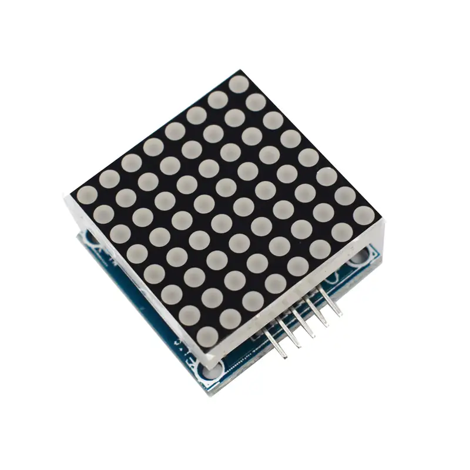
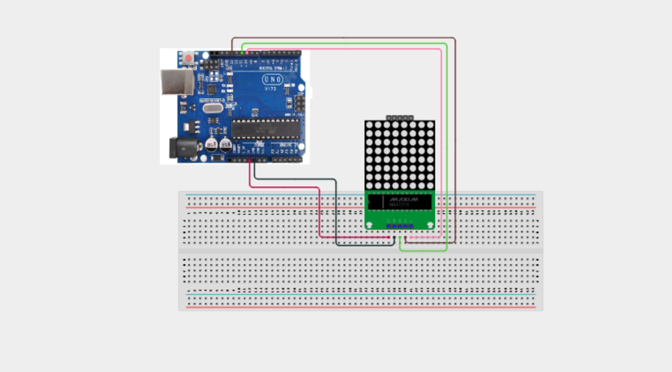

# 3.22. Dot Matrix Word Scroller

| **Description** | In this project, learners will use an 8×8 LED dot matrix module to scroll a text message across the display. The MAX7219-based dot matrix module is commonly used in LED signboards, retail display boards, and notification panels. This project introduces matrix display control, font libraries, and scrolling animation — key skills for building LED message boards and visual display systems.|
|------------------|----------------------------------------------------------------|
| **Use case**     | This project is connected to real-world uses such as: LED dot matrix displays are used in public transport signs, retail message boards, sports scoreboards, and information panels. The MAX7219 chip simplifies control by handling the LED multiplexing automatically.|

## Components (Things You will need)

|  |  |  |  |  |  |
| --- | --- | --- | --- | --- | --- |

## Building the circuit

Things Needed:

- Arduino Uno
- 8×8 Dot Matrix Module (MAX7219)
- Breadboard
- Jumper Wires
- USB Cable
- LED


## Mounting the component on the breadboard and wiring the circuit

**Step 1:**	Identify each component listed in the Required Components table before assembling the circuit.

- Place the 8×8 LED Dot Matrix Module (MAX7219) on the breadboard or connect it directly to the Arduino Uno.

- Connect the MAX7219 Dot Matrix Module:

- Connect the DIN pin to Digital Pin 11 on the Arduino Uno for serial data input.

- Connect the CLK pin to Digital Pin 13 on the Arduino Uno for the clock signal.

- Connect the CS (Load) pin to Digital Pin 10 on the Arduino Uno for the chip select (latch) signal.

- Connect the VCC pin to 5V on the Arduino Uno.

- Connect the GND pin to GND on the Arduino Uno.

- Ensure all GND connections share the same ground line on the breadboard.

- Check the polarity of the MAX7219 module and verify that all connections are secure before supplying power.

_Note: The MAX7219 LED Dot Matrix Module communicates with the Arduino using the SPI interface through the DIN, CLK, and CS pins. This interface allows the Arduino to efficiently control all 64 LEDs on the 8×8 matrix using only three digital pins._



 _Make sure to connect the Arduino USB cable to the Arduino board._

## PROGRAMMING

**Step 1:** Open your Arduino IDE. See how to set up here: [Getting Started](../../STEMAIDE_CODER_Kit_Manual/Getting_Started/Arduino_IDE_Setup.md).

**Step 2:** Write the complete program implementing the system logic with appropriate pin definitions, setup configuration, and the main control loop.

```cpp

// Dot Matrix Word Scroller
// Requires:
// MD_MAX72XX Library
// MD_Parola Library

#include <MD_Parola.h>
#include <MD_MAX72XX.h>
#include <SPI.h>

// MAX7219 configuration
#define HARDWARE_TYPE MD_MAX72XX::FC16_HW
#define MAX_DEVICES 1

#define DATA_PIN 11
#define CLK_PIN 13
#define CS_PIN 10

// Create display object
MD_Parola display =
MD_Parola(HARDWARE_TYPE, DATA_PIN, CLK_PIN, CS_PIN, MAX_DEVICES);

void setup()
{
  Serial.begin(9600);

  display.begin();
  display.setIntensity(5);
  display.displayClear();

  // Start the first scrolling message
  display.displayScroll(
    "HELLO STEMAIDE!",
    PA_LEFT,
    PA_SCROLL_LEFT,
    80
  );

  Serial.println("Dot Matrix Scroller Ready");
}

void loop()
{
  // Animate the display
  if (display.displayAnimate())
  {
    // Restart the scrolling message
    display.displayReset();
  }
}

```

**Step 3:** Save your code. _See the [Getting Started](../../STEMAIDE_CODER_Kit_Manual/Getting_Started/Arduino_IDE_Setup.md) section_

**Step 4:** Select the arduino board and port _See the [Getting Started](../../STEMAIDE_CODER_Kit_Manual/Getting_Started/Arduino_IDE_Setup.md).

**Step 5:** Upload your code.

## CONCLUSION

When the program starts, the message "HELLO STEMAIDE!" scrolls smoothly from right to left across the 8×8 LED dot matrix display. Once the message reaches the end of the display, it automatically restarts and continues scrolling repeatedly.

You can customize the displayed message by changing the text inside the displayScroll() function. You can also adjust the scroll speed by modifying the last parameter (currently 80). Lower values make the message scroll faster, while higher values slow the scrolling speed.
