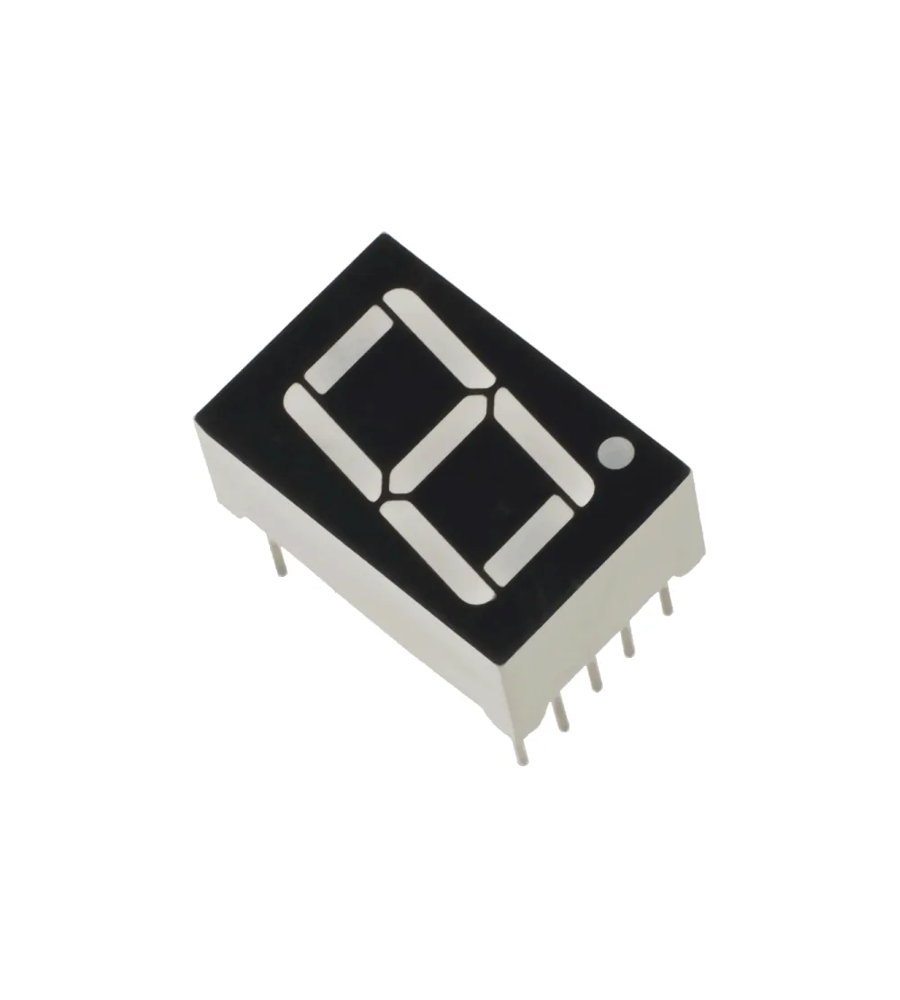
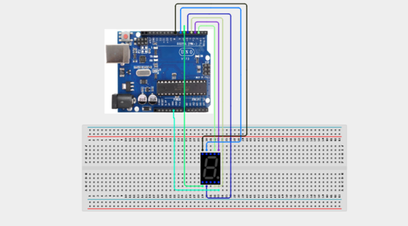

# 3.23. 7 Segment Number Display

| **Description** | In this project, learners will directly control a single-digit 7-segment LED display to count up from 0 to 9 repeatedly. Rather than using a library, learners will control each individual LED segment directly, building deep understanding of how digital displays work. This project demystifies seven-segment displays by revealing the binary patterns behind every digit — foundational knowledge for embedded display design.|
|------------------|----------------------------------------------------------------|
| **Use case**     | This project is connected to real-world uses such as: Seven-segment displays are found on digital clocks, calculators, microwave ovens, and scoreboards. Understanding segment patterns is essential for all embedded display design work.|

## Components (Things You will need)

|  |  |  |  |  |  |
| --- | --- | --- | --- | --- | --- |

## Building the circuit

Things Needed:

- Arduino Uno
- 1-Digit 7-Segment Display (Common Cathode)
- Breadboard
- Jumper Wires
- USB Cable
- 220Ω Resistors

## Mounting the component on the breadboard and wiring the circuit

**Step 1:**	Identify each component listed in the Required Components table before assembling the circuit.

- Place the 1-Digit 7-Segment Display (Common Cathode) and the 220Ω resistors on the breadboard.

- Connect the 7-segment display:
 - Connect Segment A to Digital Pin 2 through a 220Ω resistor.

 - Connect Segment B to Digital Pin 3 through a 220Ω resistor.
 
 - Connect Segment C to Digital Pin 4 through a 220Ω resistor.

 - Connect Segment D to Digital Pin 5 through a 220Ω resistor.

 - Connect Segment E to Digital Pin 6 through a 220Ω resistor.

 - Connect Segment F to Digital Pin 7 through a 220Ω resistor.

 - Connect Segment G to Digital Pin 8 through a 220Ω resistor.

- Connect the Common Cathode (GND) pin of the display to GND on the Arduino Uno.

- Ensure all GND connections share the same ground line on the breadboard.

- Verify that each 220Ω resistor is connected in series with its corresponding segment to limit the current and protect the display.

- Check all wiring connections and confirm that the display is a Common Cathode type before supplying power.

_Note: Each segment of the 7-segment display is controlled independently by the Arduino. By turning different segments ON and OFF in the correct combination, the display can show the digits 0–9 and a variety of simple characters._



 _Make sure to connect the Arduino USB cable to the Arduino board._

## PROGRAMMING

**Step 1:** Open your Arduino IDE. See how to set up here: [Getting Started](../../STEMAIDE_CODER_Kit_Manual/Getting_Started/Arduino_IDE_Setup.md).

**Step 2:** Write the complete program implementing the system logic with appropriate pin definitions, setup configuration, and the main control loop.

```cpp

// 7-Segment Number Display (Common Cathode)

// Segment pin connections
// a=2, b=3, c=4, d=5, e=6, f=7, g=8

const byte segments[] = {2, 3, 4, 5, 6, 7, 8};

// Digit patterns
// [a, b, c, d, e, f, g]
// 1 = ON
// 0 = OFF

const byte digits[10][7] =
{
  {1,1,1,1,1,1,0}, // 0
  {0,1,1,0,0,0,0}, // 1
  {1,1,0,1,1,0,1}, // 2
  {1,1,1,1,0,0,1}, // 3
  {0,1,1,0,0,1,1}, // 4
  {1,0,1,1,0,1,1}, // 5
  {1,0,1,1,1,1,1}, // 6
  {1,1,1,0,0,0,0}, // 7
  {1,1,1,1,1,1,1}, // 8
  {1,1,1,1,0,1,1}  // 9
};

void displayDigit(byte num)
{
  if (num > 9)
    return;

  for (byte i = 0; i < 7; i++)
  {
    digitalWrite(segments[i], digits[num][i]);
  }
}

void setup()
{
  for (byte i = 0; i < 7; i++)
  {
    pinMode(segments[i], OUTPUT);
  }

  Serial.begin(9600);
}

void loop()
{
  for (byte num = 0; num <= 9; num++)
  {
    displayDigit(num);

    Serial.print("Displaying: ");
    Serial.println(num);

    delay(800);
  }
}

```

**Step 3:** Save your code. _See the [Getting Started](../../STEMAIDE_CODER_Kit_Manual/Getting_Started/Arduino_IDE_Setup.md) section_

**Step 4:** Select the arduino board and port _See the [Getting Started](../../STEMAIDE_CODER_Kit_Manual/Getting_Started/Arduino_IDE_Setup.md).

**Step 5:** Upload your code.

## CONCLUSION

When the program starts, the 7-segment display continuously counts from 0 to 9, displaying each digit for approximately 0.8 seconds before moving to the next one. At the same time, the current digit is printed to the Serial Monitor.

After displaying the digit 9, the sequence automatically restarts from 0 and continues repeating. You can adjust the counting speed by changing the value in the delay(800) function. Smaller values make the digits change faster, while larger values slow down the counting rate.
