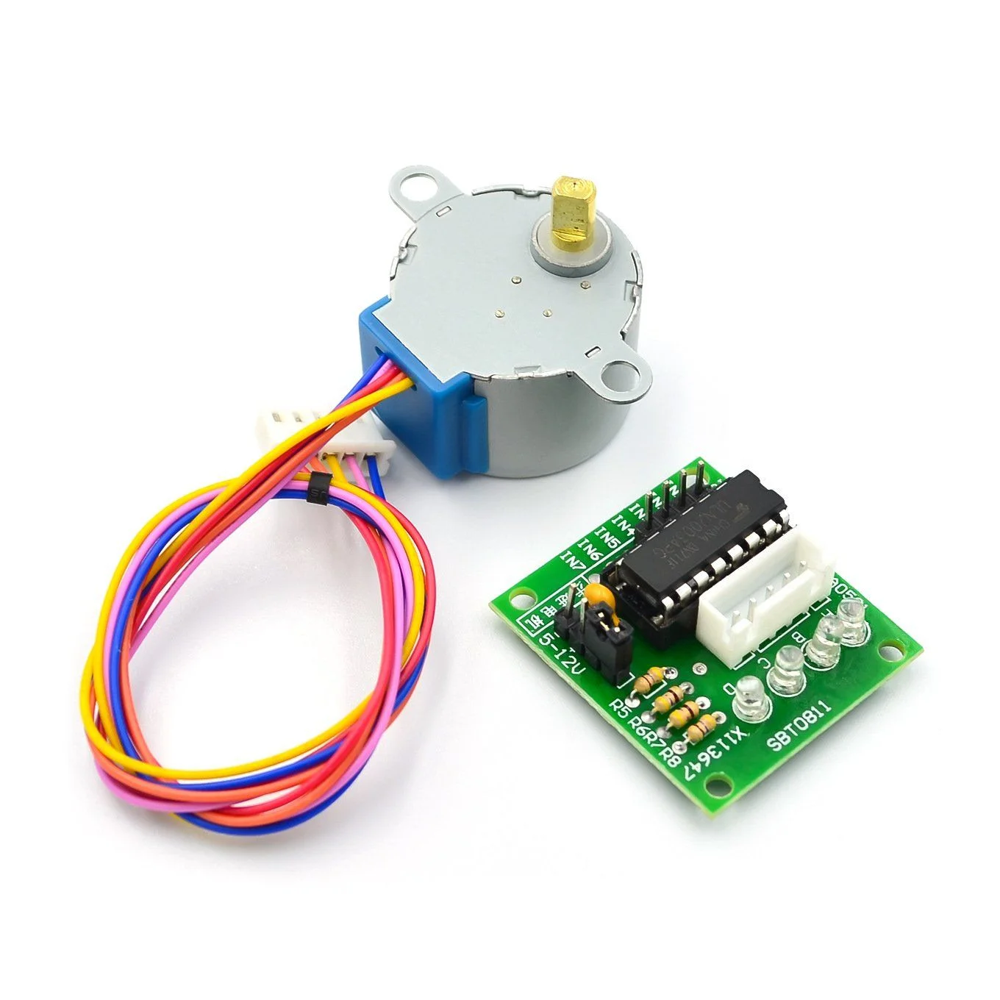
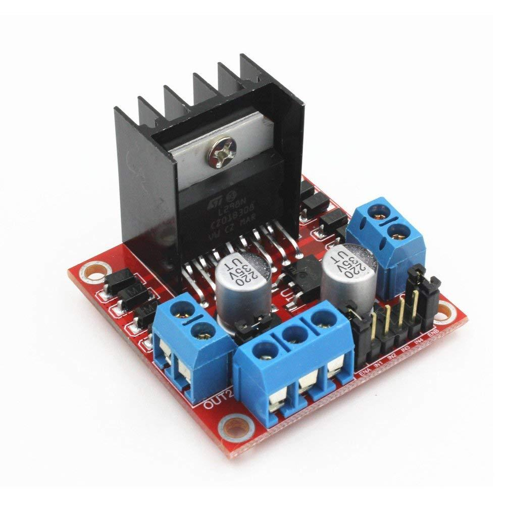
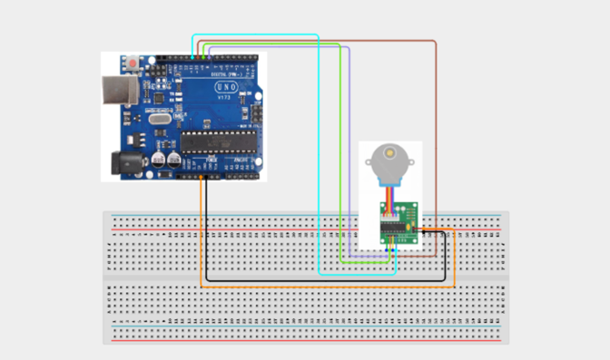

# 3.24. Stepper Motor Position Controller

| **Description** | In this project, learners will directly control a single-digit 7-segment LED display to count up from 0 to 9 repeatedly. Rather than using a library, learners will control each individual LED segment directly, building deep understanding of how digital displays work. This project demystifies seven-segment displays by revealing the binary patterns behind every digit — foundational knowledge for embedded display design.|
|------------------|----------------------------------------------------------------|
| **Use case**     | This project is connected to real-world uses such as: Seven-segment displays are found on digital clocks, calculators, microwave ovens, and scoreboards. Understanding segment patterns is essential for all embedded display design work.|

## Components (Things You will need)

|  |  |  |  |  |  |
| --- | --- | --- | --- | --- | --- |

|  |  |  |  |  | 
| --- | --- | --- | --- | --- | 

## Building the circuit

Things Needed:

- Arduino Uno
- 28BYJ-48 Stepper Motor
- ULN2003 Stepper Motor Driver Board
- Breadboard
- Jumper Wires
- USB Cable

## Mounting the component on the breadboard and wiring the circuit

**Step 1:**	Identify each component listed in the Required Components table before assembling the circuit.

- Place the 28BYJ-48 Stepper Motor and the ULN2003 Stepper Motor Driver Board on the breadboard or position them for easy connection.

- Connect the ULN2003 driver board to the Arduino Uno:
 - Connect IN1 to Digital Pin 8.

 - Connect IN2 to Digital Pin 9.

 - Connect IN3 to Digital Pin 10.

 - Connect IN4 to Digital Pin 11.

 - Connect VCC (+5V) to the Arduino 5V pin.

 - Connect GND to the Arduino GND pin.

- Connect the 28BYJ-48 stepper motor cable directly to the motor connector on the ULN2003 driver board. Ensure the connector is fully inserted and correctly aligned.

- Verify that all GND connections share a common ground.

- Check all wiring connections, ensuring the control pins, power, and motor connector are securely connected before applying power.

_Note: The ULN2003 driver board controls the four coils of the 28BYJ-48 stepper motor, allowing the Arduino to rotate the motor in precise steps. By changing the sequence of signals sent to IN1–IN4, the motor can rotate clockwise or counterclockwise with accurate position control._



 _Make sure to connect the Arduino USB cable to the Arduino board._

## PROGRAMMING

**Step 1:** Open your Arduino IDE. See how to set up here: [Getting Started](../../STEMAIDE_CODER_Kit_Manual/Getting_Started/Arduino_IDE_Setup.md).

**Step 2:** Write the complete program implementing the system logic with appropriate pin definitions, setup configuration, and the main control loop.

```cpp

// Stepper Motor Position Controller
// Uses a 28BYJ-48 Stepper Motor with ULN2003 Driver Board

#include <Stepper.h>

// Number of steps per revolution
const int STEPS_PER_REV = 2048;

// Motor speed (RPM)
const int MOTOR_SPEED = 10;

// Create stepper motor object
// Pin order for 28BYJ-48 with ULN2003:
// IN1, IN3, IN2, IN4
Stepper myStepper(STEPS_PER_REV, 8, 10, 9, 11);

void setup()
{
  Serial.begin(9600);

  // Set motor speed
  myStepper.setSpeed(MOTOR_SPEED);

  Serial.println("Stepper Motor Ready");
}

void loop()
{
  // Rotate clockwise
  Serial.println("Rotating clockwise...");
  myStepper.step(STEPS_PER_REV);

  delay(1000);

  // Rotate counterclockwise
  Serial.println("Rotating counterclockwise...");
  myStepper.step(-STEPS_PER_REV);

  delay(1000);
}

```

**Step 3:** Save your code. _See the [Getting Started](../../STEMAIDE_CODER_Kit_Manual/Getting_Started/Arduino_IDE_Setup.md) section_

**Step 4:** Select the arduino board and port _See the [Getting Started](../../STEMAIDE_CODER_Kit_Manual/Getting_Started/Arduino_IDE_Setup.md).

**Step 5:** Upload your code. 

## CONCLUSION

When the program starts, the 28BYJ-48 stepper motor rotates one complete revolution clockwise, pauses for 1 second, then rotates one complete revolution counterclockwise before pausing again. This sequence repeats continuously.

The Serial Monitor displays messages indicating the current direction of rotation, such as "Rotating clockwise..." and "Rotating counterclockwise...".

The stepper motor moves smoothly and precisely, stopping at the exact position specified by the program. Unlike a standard DC motor, the stepper motor provides accurate positional control, making it suitable for applications that require precise movement.
