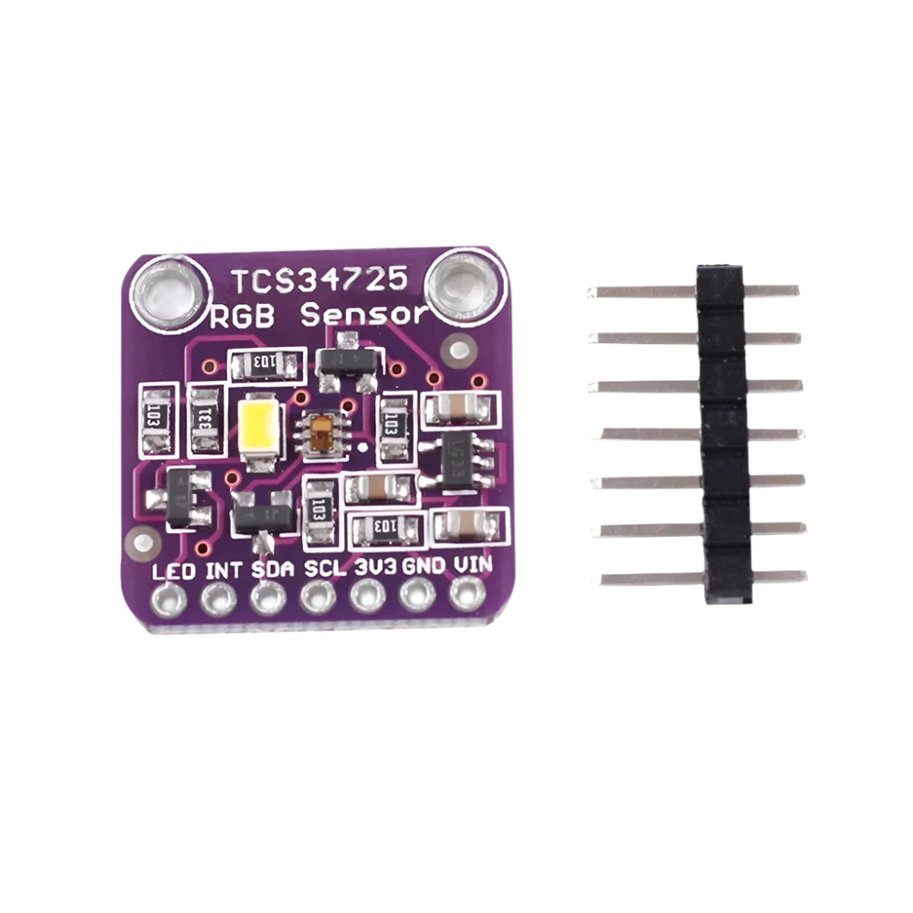
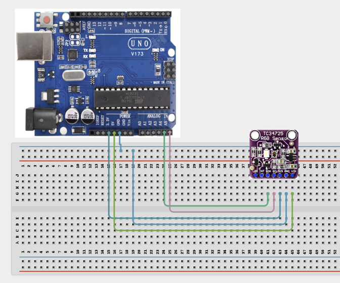

# 3.29. Colour Sensor Object Identifier

| **Description** | In this project, learners will use a TCS3200 colour sensor module to detect and identify the colour of objects placed in front of it. The sensor reads the red, green, and blue components of reflected light and reports them as frequency values, which the Arduino converts into RGB colour data. This project introduces optical colour sensing — used in industrial quality control, paint mixing machines, food sorting systems, and colour-guided robots.|
|------------------|----------------------------------------------------------------|
| **Use case**     | This project is connected to real-world uses such as: Colour sensors are used in industrial sorting lines, paint mixing systems, quality inspection equipment, and colour-tracking robots. Calibration against known colour targets improves accuracy significantly.|

## Components (Things You will need)

|  |  |  |  |  |
| --- | --- | --- | --- | --- |

## Building the circuit

Things Needed:

- Arduino Uno
- TCS34725 Colour Sensor Module
- Breadboard
- Jumper Wires
- USB Cable
- Coloured objects (Red, Green, Blue, White paper)

## Mounting the component on the breadboard and wiring the circuit

**Step 1:**	Identify each component listed in the Required Components table before assembling the circuit.

- Identify the TCS34725 Colour Sensor Module, Arduino Uno, and test objects before starting.

- Place the TCS34725 sensor module on the breadboard or connect it directly to the Arduino.

- Connect TCS34725 VIN to the appropriate Arduino power supply, 5V if supported by your breakout board.

- Connect TCS34725 GND to Arduino GND.

- Connect TCS34725 SDA to Arduino A4. This is the I²C data connection.

- Connect TCS34725 SCL to Arduino A5. This is the I²C clock connection.

- Check that the sensor's power and ground connections are correct.

- Check the module's voltage requirements before connecting USB power.

- Connect the Arduino Uno to the computer only after all wiring has been checked.



 _Make sure to connect the Arduino USB cable to the Arduino board._

## PROGRAMMING

**Step 1:** Open your Arduino IDE. See how to set up here: [Getting Started](../../STEMAIDE_CODER_Kit_Manual/Getting_Started/Arduino_IDE_Setup.md).

**Step 2:** Write the complete program implementing the system logic with appropriate pin definitions, setup configuration, and the main control loop.

```cpp

// TCS34725 Colour Sensor
// Requires: Adafruit TCS34725 library

#include <Wire.h>
#include "Adafruit_TCS34725.h"

// Create TCS34725 sensor object
Adafruit_TCS34725 tcs(
  TCS34725_INTEGRATIONTIME_50MS,
  TCS34725_GAIN_4X
);

void setup() {

  Serial.begin(9600);

  Serial.println("TCS34725 Colour Sensor");
  Serial.println("----------------------");

  // Initialize the colour sensor
  if (tcs.begin()) {
    Serial.println("Colour sensor detected successfully.");
  }
  else {
    Serial.println("ERROR: TCS34725 not found.");
    Serial.println("Check the SDA, SCL, VCC and GND connections.");

    // Stop the program if the sensor is not detected
    while (1);
  }
}

void loop() {

  uint16_t red;
  uint16_t green;
  uint16_t blue;
  uint16_t clear;

  // Read raw colour data
  tcs.getRawData(&red, &green, &blue, &clear);

  // Display the readings
  Serial.print("Red: ");
  Serial.print(red);

  Serial.print(" | Green: ");
  Serial.print(green);

  Serial.print(" | Blue: ");
  Serial.print(blue);

  Serial.print(" | Clear: ");
  Serial.println(clear);

  delay(500);
}
```

**Step 3:** Save your code. _See the [Getting Started](../../STEMAIDE_CODER_Kit_Manual/Getting_Started/Arduino_IDE_Setup.md) section_

**Step 4:** Select the arduino board and port _See the [Getting Started](../../STEMAIDE_CODER_Kit_Manual/Getting_Started/Arduino_IDE_Setup.md).

**Step 5:** Upload your code. 

## CONCLUSION

When a red object is placed in front of the sensor, the red reading is highest and the system displays “Detected: RED.”
When a green object is placed in front of the sensor, the green reading is highest and the system displays “Detected: GREEN.”

When a blue object is placed in front of the sensor, the blue reading is highest and the system displays “Detected: BLUE.”
When a white object is placed in front of the sensor, the RGB readings are high and similar, and the system displays “Detected: WHITE.”
When a black object is placed in front of the sensor, the RGB readings are low, and the system displays “Detected: BLACK.”
