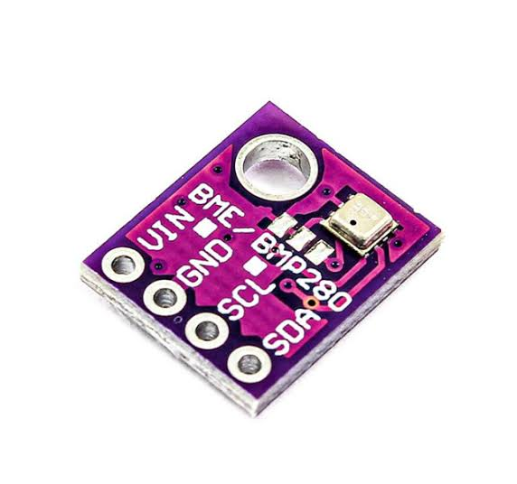
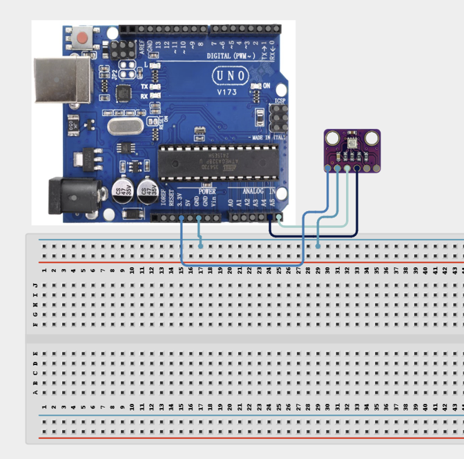

# 3.30. BME280 Weather Station

| **Description** | In this project, learners will build a mini weather station using the BME280 sensor, which measures temperature, humidity, and atmospheric pressure simultaneously over the I2C interface. All three readings are displayed in the Serial Monitor in real time. This project introduces multi-parameter environmental sensing and I2C sensor libraries — the core of weather stations, altitude measurement systems, and environmental monitoring platforms.|
|------------------|----------------------------------------------------------------|
| **Use case**     | This project is connected to real-world uses such as: The BME280 is one of the most versatile environmental sensors available. It is used in professional weather stations, indoor air quality monitors, drones for altitude control, and portable GPS navigation devices that display barometric altitude.|

## Components (Things You will need)

|  |  |  |  |  |
| --- | --- | --- | --- | --- |

## Building the circuit

Things Needed:

- Arduino Uno
- BME280 Sensor Module
- Breadboard
- Jumper Wires
- Arduino USB Cable

## Mounting the component on the breadboard and wiring the circuit

**Step 1:**	Identify each component listed in the Required Components table before assembling the circuit.

- Identify the BME280 Sensor Module and Arduino Uno.

- Place the BME280 module on the breadboard.

- Connect BME280 VCC to Arduino 3.3V.

- Connect BME280 GND to Arduino GND.

- Connect BME280 SDA to Arduino A4 for I²C data.

- Connect BME280 SCL to Arduino A5 for I²C clock.

- Check that all connections are secure and that the power connections are correct.

- Connect the Arduino Uno to the computer only after the wiring has been checked.



 _Make sure to connect the Arduino USB cable to the Arduino board._

## PROGRAMMING

**Step 1:** Open your Arduino IDE. See how to set up here: [Getting Started](../../STEMAIDE_CODER_Kit_Manual/Getting_Started/Arduino_IDE_Setup.md).

**Step 2:** Write the complete program implementing the system logic with appropriate pin definitions, setup configuration, and the main control loop.

```cpp

// BME280 Weather Station
// Requires:
// - Adafruit BME280 Library
// - Adafruit Unified Sensor Library

#include <Wire.h>
#include <Adafruit_BME280.h>

// Create BME280 sensor object
Adafruit_BME280 bme;

void setup() {

  Serial.begin(9600);
  Wire.begin();

  // Initialize BME280
  // Common I2C address is 0x76.
  // If your sensor does not respond, try 0x77.
  if (!bme.begin(0x76)) {

    Serial.println("ERROR: BME280 not found!");
    Serial.println("Check the wiring and I2C address.");

    while (1);
  }

  Serial.println("BME280 Weather Station Ready");
  Serial.println("----------------------------");
}

void loop() {

  // Read sensor values
  float temperature = bme.readTemperature();
  float humidity = bme.readHumidity();
  float pressure = bme.readPressure() / 100.0F;
  float altitude = bme.readAltitude(1013.25);

  // Display temperature
  Serial.print("Temperature: ");
  Serial.print(temperature, 1);
  Serial.println(" C");

  // Display humidity
  Serial.print("Humidity: ");
  Serial.print(humidity, 1);
  Serial.println(" %");

  // Display pressure
  Serial.print("Pressure: ");
  Serial.print(pressure, 1);
  Serial.println(" hPa");

  // Display altitude
  Serial.print("Altitude: ");
  Serial.print(altitude, 1);
  Serial.println(" m");

  Serial.println("----------------------------");

  // Update every 2 seconds
  delay(2000);
}

```

**Step 3:** Save your code. _See the [Getting Started](../../STEMAIDE_CODER_Kit_Manual/Getting_Started/Arduino_IDE_Setup.md) section_

**Step 4:** Select the arduino board and port _See the [Getting Started](../../STEMAIDE_CODER_Kit_Manual/Getting_Started/Arduino_IDE_Setup.md).

**Step 5:** Upload your code. 

## CONCLUSION

The Serial Monitor displays the temperature in Celsius, relative humidity, barometric pressure in hPa, and estimated altitude in metres. The readings are updated every 2 seconds.
Breathing near the sensor briefly increases the temperature and humidity readings. Moving the sensor to a higher or lower position causes small changes in the altitude and pressure readings.
