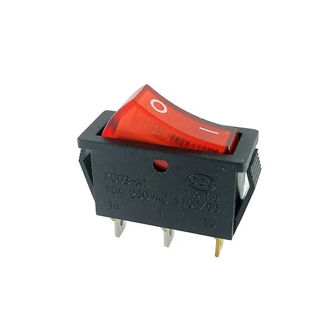
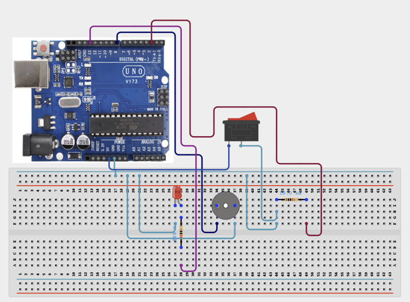

# 3.31. Rocket Switch Circuit Breaker

| **Description** | In this project, learners will use a rocket switch (also called a toggle switch) to act as a manual circuit control device that turns an LED and a buzzer on and off. A rocket switch is a latching SPST (Single Pole Single Throw) switch — unlike a pushbutton that springs back, a rocket switch stays in the last position it was switched to. This project introduces latching switch control and demonstrates how physical power management switches are used in electronic devices, control panels, and safety circuits.|
|------------------|----------------------------------------------------------------|
| **Use case**     | This project is connected to real-world uses such as: Rocket switches (toggle switches) provide permanent latching ON/OFF control. They are used as main power switches in electronic equipment, control panels, laboratory instruments, and safety shutoff mechanisms in machines and vehicles.|

## Components (Things You will need)

|  |  |  |  |  |  |  |  |
| --- | --- | --- | --- | --- | --- | --- | --- |

## Building the circuit

Things Needed:

- Arduino Uno
- Rocket Switch (Toggle Switch)
- LED
- 5V Active Buzzer
- 220 Ohm Resistor
- 10k Ohm Resistor
- Breadboard
- Jumper Wires
- Arduino USB Cable


## Mounting the component on the breadboard and wiring the circuit

**Step 1:**	Identify the Rocket Switch, LED, 220 Ω resistor, 10 kΩ resistor, and buzzer before starting.

- Connect one terminal of the rocket switch to 5V.

- Connect the other terminal of the rocket switch to Digital Pin 2.

- Connect a 10 kΩ resistor between Pin 2 and GND. This keeps Pin 2 LOW when the switch is open.

- Connect the LED anode (+) to Pin 13 through a 220 Ω resistor.

- Connect the LED cathode (−) to GND.

- Connect the buzzer positive (+) to Pin 8.

- Connect the buzzer negative (−) to GND.

- Check that all GND connections share a common ground.

- Verify all connections before connecting the Arduino to USB power.



 _Make sure to connect the Arduino USB cable to the Arduino board._

## PROGRAMMING

**Step 1:** Open your Arduino IDE. See how to set up here: [Getting Started](../../STEMAIDE_CODER_Kit_Manual/Getting_Started/Arduino_IDE_Setup.md).

**Step 2:** Write the complete program implementing the system logic with appropriate pin definitions, setup configuration, and the main control loop.

```cpp

// Rocket Switch Circuit Breaker

const int switchPin = 2;   // Rocket switch input
const int ledPin = 13;     // LED output
const int buzzerPin = 8;   // Buzzer output

void setup() {

  Serial.begin(9600);

  // External 10kΩ pull-down resistor is used
  pinMode(switchPin, INPUT);

  pinMode(ledPin, OUTPUT);
  pinMode(buzzerPin, OUTPUT);

  // Start with outputs OFF
  digitalWrite(ledPin, LOW);
  digitalWrite(buzzerPin, LOW);

  Serial.println("Rocket Switch Circuit Breaker Ready");
}

void loop() {

  // Read rocket switch
  int switchState = digitalRead(switchPin);

  if (switchState == HIGH) {

    // Switch ON
    digitalWrite(ledPin, HIGH);
    digitalWrite(buzzerPin, HIGH);

    Serial.println("Switch: ON | LED: ON | Buzzer: ON");

  } else {

    // Switch OFF
    digitalWrite(ledPin, LOW);
    digitalWrite(buzzerPin, LOW);

    Serial.println("Switch: OFF | LED: OFF | Buzzer: OFF");
  }

  delay(200);
}

```

**Step 3:** Save your code. _See the [Getting Started](../../STEMAIDE_CODER_Kit_Manual/Getting_Started/Arduino_IDE_Setup.md) section_

**Step 4:** Select the arduino board and port _See the [Getting Started](../../STEMAIDE_CODER_Kit_Manual/Getting_Started/Arduino_IDE_Setup.md).

**Step 5:** Upload your code. 

## CONCLUSION

When the rocket switch is flipped ON, the LED turns on, the buzzer activates, and the Serial Monitor displays “Switch: ON.”
When the rocket switch is flipped OFF, the LED turns off, the buzzer stops, and the Serial Monitor displays “Switch: OFF.”
Unlike a pushbutton, the rocket switch remains in its selected position until it is manually switched back.
