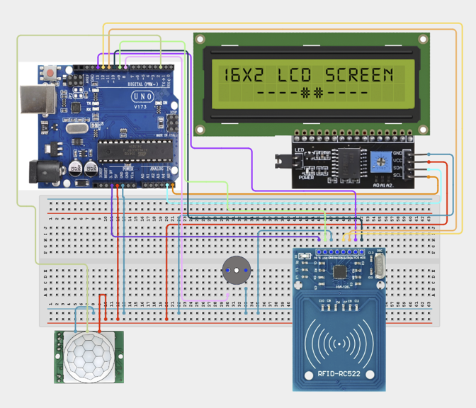

# 3.6. Intelligent Visitor Management System

| **Description** | This project combines RFID authentication, an LCD display, and a buzzer to create a visitor management system. Authorized visitors gain access while unauthorized visitors trigger alerts.|
|------------------|----------------------------------------------------------------|
| **Use case**     |This project is connected to real-world uses such as: This project demonstrates authentication systems commonly used in offices, schools, hotels, and secure facilities.|

## Components (Things You will need)

|  |  |  |  |  |  |  |
| --- | --- | --- | --- | --- | --- | --- |

## Building the circuit

Things Needed:

- Arduino Uno
- MFRC522 RFID Reader
- RFID Cards/Tags
- LCD Display
- Buzzer
- Breadboard
- Jumper Wires


## Mounting the component on the breadboard and wiring the circuit

**Step 1:** Identify the Arduino Uno, MFRC522 RFID Reader, PIR Motion Sensor, Buzzer, I2C LCD Display, breadboard, and jumper wires. Ensure the USB cable is disconnected before wiring.

**Step 2:** Place the MFRC522 RFID Reader, I2C LCD Display module, Buzzer, and PIR Motion Sensor firmly on or near the breadboard.

**Step 3:** Connect the Arduino Uno’s 5V pin to the breadboard’s positive (+) power rail.

**Step 4:** Connect an Arduino GND pin to the breadboard’s negative (−) ground rail.

**Step 5:** Connect the Buzzer’s positive (+) terminal to Arduino digital pin 8.

**Step 6:** Connect the Buzzer’s negative (−) terminal to the breadboard’s ground rail.

**Step 7:** Connect the PIR Motion Sensor’s VCC pin to the breadboard’s 5V power rail.

**Step 8:** Connect the PIR Motion Sensor’s GND pin to the breadboard’s ground rail.

**Step 9:** Connect the PIR Motion Sensor’s OUT pin to Arduino digital pin 2.

**Step 10:** Connect the I2C LCD Display’s SDA pin to Arduino analog pin A4.

**Step 11:** Connect the I2C LCD Display’s SCL pin to Arduino analog pin A5.

**Step 12:** Connect the I2C LCD Display’s VCC pin to the breadboard’s 5V power rail.

**Step 13:** Connect the I2C LCD Display’s GND pin to the breadboard’s ground rail.

**Step 14:** Connect the MFRC522 RFID Reader according to the required SPI connections for the Arduino Uno, ensuring its power and signal pins are connected correctly.

**Step 15:** Carefully check all connections to ensure that every component is connected to the correct power, ground, and signal pins before connecting the USB cable.



_Make sure to connect the Arduino USB cable to the Arduino board._

## PROGRAMMING

**Step 1:** Open your Arduino IDE. See how to set up here: [Getting Started](../../Getting Started/Arduino_IDE_Setup.md).

**Step 2:** Write the complete program implementing the system logic with appropriate pin definitions, setup configuration, and the main control loop.

```cpp
#include <SPI.h>
#include <MFRC522.h>
#include <Wire.h>
#include <LiquidCrystal_I2C.h>

// --- Pin Definitions based on Step-by-Step Wiring ---
#define PIR_PIN     2    // Step 9: PIR Motion Sensor OUT pin -> Digital Pin 2
#define BUZZER_PIN  8    // Step 5: Buzzer positive (+) terminal -> Digital Pin 8

// MFRC522 RFID SPI Pin Definitions (Standard Arduino Uno SPI)
#define RST_PIN     9    // MFRC522 Reset Pin -> Digital Pin 9
#define SS_PIN      10   // MFRC522 SDA/SS Pin -> Digital Pin 10
                         // MOSI -> Digital Pin 11
                         // MISO -> Digital Pin 12
                         // SCK  -> Digital Pin 13

// --- Component Initialization ---
MFRC522 rfid(SS_PIN, RST_PIN);
LiquidCrystal_I2C lcd(0x27, 16, 2); // Steps 10 & 11: I2C LCD on A4 (SDA) & A5 (SCL)

// Registered/Authorized RFID Card UID (Replace with your card's UID)
byte authorizedUID[4] = {0xDE, 0xAD, 0xBE, 0xEF};

void setup() {
  Serial.begin(9600);
  
  // Pin Modes
  pinMode(PIR_PIN, INPUT);
  pinMode(BUZZER_PIN, OUTPUT);
  digitalWrite(BUZZER_PIN, LOW);

  // Initialize I2C LCD
  lcd.init();
  lcd.backlight();
  lcd.setCursor(0, 0);
  lcd.print("System Ready");
  
  // Initialize SPI Bus & MFRC522 RFID Reader (Step 14)
  SPI.begin();
  rfid.PCD_Init();

  delay(2000);
  lcd.clear();
  lcd.setCursor(0, 0);
  lcd.print("Scan Card / Motion");
}

void loop() {
  // --- 1. Motion Detection (PIR Sensor) ---
  int motionDetected = digitalRead(PIR_PIN);
  if (motionDetected == HIGH) {
    lcd.setCursor(0, 1);
    lcd.print("Motion Detected!");
  } else {
    lcd.setCursor(0, 1);
    lcd.print("               "); // Clear line
  }

  // --- 2. RFID Reader Check ---
  if (rfid.PICC_IsNewCardPresent() && rfid.PICC_ReadCardSerial()) {
    lcd.clear();
    
    // Compare scanned card UID with authorized UID
    if (isAuthorized(rfid.uid.uidByte, rfid.uid.size)) {
      // Access Granted
      lcd.setCursor(0, 0);
      lcd.print("Visitor Approved");
      lcd.setCursor(0, 1);
      lcd.print("Welcome");
      
      // Short high pitch tone for approval
      tone(BUZZER_PIN, 1000, 200); 
    } else {
      // Access Denied
      lcd.setCursor(0, 0);
      lcd.print("Unauthorized");
      lcd.setCursor(0, 1);
      lcd.print("Alert Active");
      
      // Alarm tone for unauthorized access
      for (int i = 0; i < 3; i++) {
        digitalWrite(BUZZER_PIN, HIGH);
        delay(150);
        digitalWrite(BUZZER_PIN, LOW);
        delay(150);
      }
    }

    // Halt PICC & Stop Encryption on PCD
    rfid.PICC_HaltA();
    rfid.PCD_StopCrypto1();

    delay(2500);
    lcd.clear();
    lcd.setCursor(0, 0);
    lcd.print("Scan Card / Motion");
  }

  delay(100);
}

// Helper function to match UID
bool isAuthorized(byte *scannedUID, byte size) {
  if (size != 4) return false;
  for (byte i = 0; i < size; i++) {
    if (scannedUID[i] != authorizedUID[i]) {
      return false;
    }
  }
  return true;
}

```

**Step 3:** Save your code. _See the [Getting Started](../../STEMAIDE_CODER_Kit_Manual/Getting_Started/Arduino_IDE_Setup.md) section_

**Step 4:** Select the arduino board and port _See the [Getting Started](../../STEMAIDE_CODER_Kit_Manual/Getting_Started/Arduino_IDE_Setup.md)

**Step 5  :** Upload your code.

## CONCLUSION

The RFID Monitoring System successfully demonstrates how an Arduino can communicate with an RFID reader to identify cards or tags and display information on an LCD. This project introduces learners to wireless identification technology, SPI communication, and LCD interfacing. The system can serve as a foundation for advanced applications such as smart access control, attendance systems, inventory tracking, and automated security solutions.
