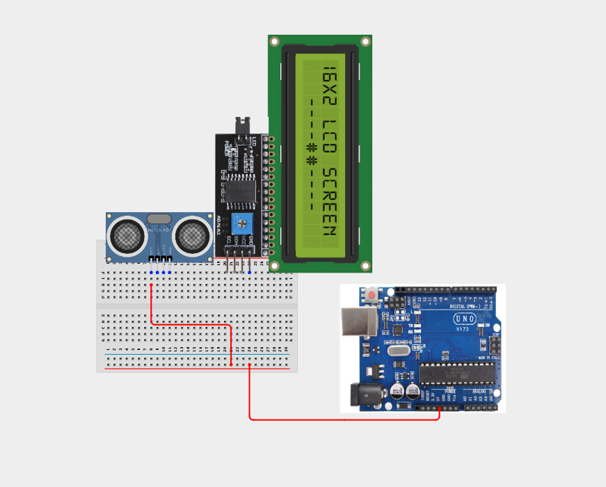
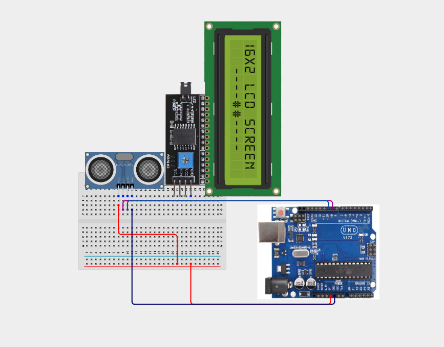
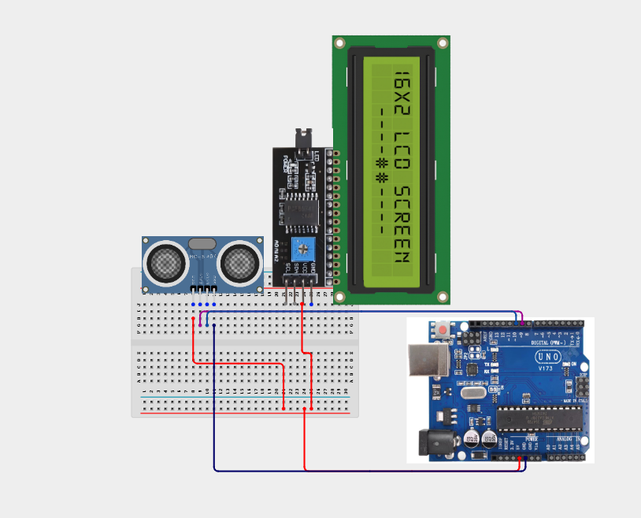
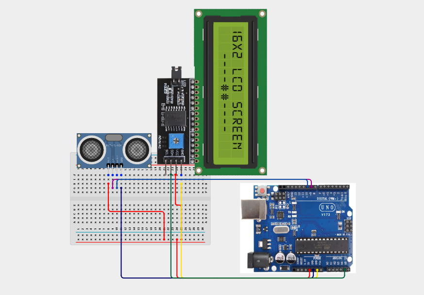
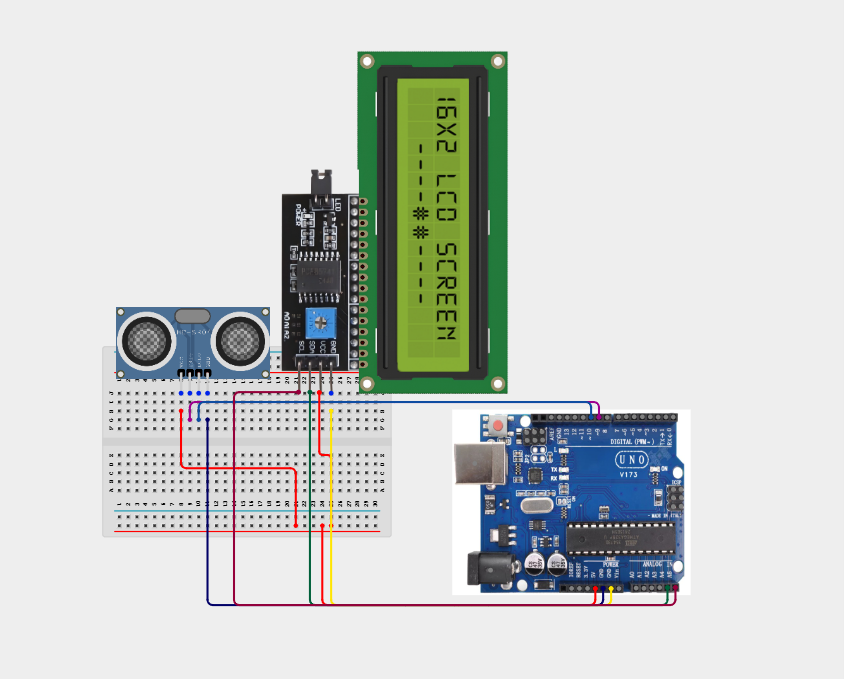

# 1.10. Sonic Range Number Reporter

| **Description** | Learners build a distance-reporting system using an ultrasonic sensor and LCD. The project introduces distance measurement using sound waves. In this manual, learners will follow a practical build process, connect the circuit safely, upload the Arduino program, and observe how the prototype behaves when the input condition changes. |
|------------------|-------------------------------------------------------------------------------------------------------------------------------------------------------------------------------------------------------------------------------------------------------------------------------------------------------------------------------------|
| **Use case**     | This project is connected to real-world uses such as: measuring object distance in centimetres, demonstrating parking-sensor ideas without using the same project, and introducing non-contact measurement. |

## Components (Things You will need)

|  |  |  |  |  |  |
| --- | --- | --- | --- | --- | --- |

| --------------------------------------------------- | ------------------------------------------------------ | ----------------------------------------------------------- | --------------------------------------------------------- | ------------------------------------------------------ | ------------------------------------------------------ | 

## Building the circuit

Things Needed:

- Arduino Uno = 1
- Arduino USB cable = 1
- Bread Board = 1
- Jumper Wires
- Ultrasonic Sensor
- LCD Screen

## Mounting the component on the breadboard and wiring the circuit

**Step 1:**	Place the Ultrasonic Sensor and LCD screen on the Breadboard as shown below.


**Step 2:**	Using a jumper wire, connect the 5V pin on the Arduino Uno board to the positive rail on the breadboard. Then, connect the VCC pin of the ultrasonic sensor to the 5V power rail on the breadboard. 



**Step 3:**	Connect the GND pin of the ultrasonic sensor to the GND pin on the Arduino Uno board using a jumper wire.


**Step 4:** Connect the Trig pin of the ultrasonic sensor to Pin 9 on the Arduino Uno board using a jumper wire.


**Step 5:**	Connect the Echo pin of the ultrasonic sensor to Pin 10 on the Arduino Uno board using a jumper wire.



**Step 6:** Connect the VCC pin of the LCD to the 5V power rail on the breadboard using a jumper wire.



**Step 7:**	Connect the GND pin of the LCD to the GND pin on the Arduino Uno board using a jumper wire.


**Step 8:**	Connect the SDA pin of the LCD to A4 on the Arduino Uno board using a jumper wire.



**Step 9:**	Connect the SCL pin of the LCD to A5 on the Arduino Uno board using a jumper wire.



_Make sure to connect the Arduino USB cable to the Arduino board._

## PROGRAMMING

**Step 1:** Open your Arduino IDE. See how to set up here: [Getting Started](../../Getting Started/Arduino_IDE_Setup.md).

**Step 2:** Write the complete program implementing the system logic with appropriate pin definitions, setup configuration, and the main control loop.

```cpp

#include <Wire.h>
#include <LiquidCrystal_I2C.h>
LiquidCrystal_I2C lcd(0x27,16,2);
int trigPin = 9;
int echoPin = 10;
 
void setup() {
  Serial.begin(9600);
  lcd.init();
  lcd.backlight();
  lcd.setCursor(0,0);
  lcd.print("Ready");
  pinMode(trigPin, OUTPUT);
  pinMode(echoPin, INPUT);
}
 
void loop() {
  digitalWrite(trigPin, LOW);
  delayMicroseconds(2);
  digitalWrite(trigPin, HIGH);
  delayMicroseconds(10);
  digitalWrite(trigPin, LOW);
  long duration = pulseIn(echoPin, HIGH);
  int value = duration * 0.034 / 2; // distance in cm
  lcd.clear();
  lcd.setCursor(0,0);
  lcd.print("Value:");
  lcd.setCursor(0,1);
  lcd.print(value);
  delay(500);
}


```

**Step 3:** Save your code. _See the [Getting Started](../../Getting Started/Arduino_IDE_Setup.md) section_

**Step 4:** Select the arduino board and port _See the [Getting Started](../../Getting Started/Arduino_IDE_Setup.md) section:Selecting Arduino Board Type and Uploading your code_.

**Step 5:** Upload your code. _See the [Getting Started](../../Getting Started/Arduino_IDE_Setup.md) section:Selecting Arduino Board Type and Uploading your code_

## CONCLUSION

 The Sonic Range Number Reporter powers on and waits for sensor input or user action. Input or command changes: The display, buzzer, LED, motor, servo, relay, or RGB output responds according to the program logic. Threshold or event condition: The system gives visible, audible, movement, or display feedback when the condition is detected.
