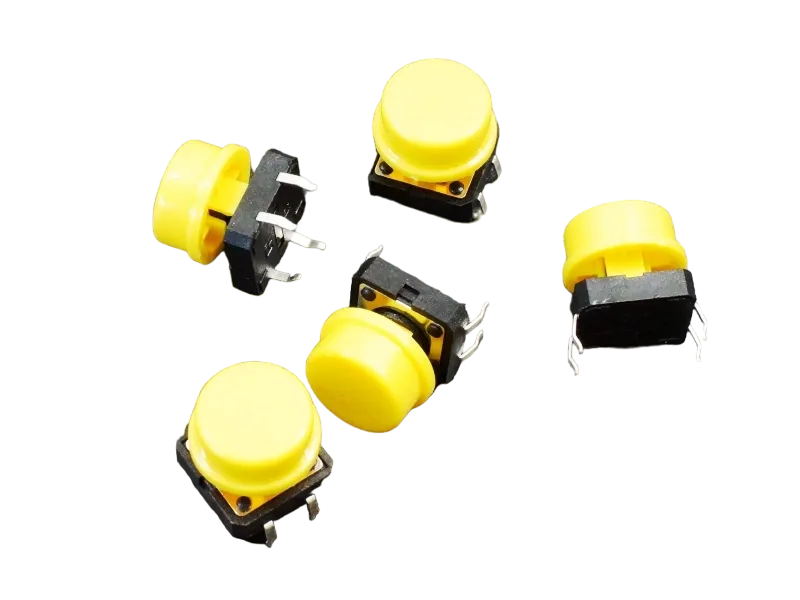
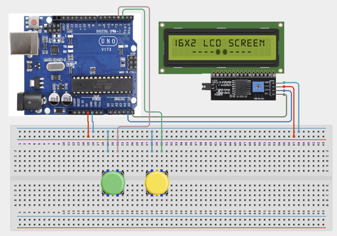

# 1.11. Electronic Voting Counter

| **Description** | This project simulates a simple electronic voting machine. Two buttons represent two candidates, and votes are counted and displayed. |
|------------------|----------------------------------------------------------------|
| **Use case**     | This project is connected to real-world uses such as: This project introduces data collection and counting systems used in attendance trackers, surveys, and voting systems. |

## Components (Things You will need)

|  |  |  |  | | |
| --------------------------------------------------- | ------------------------------------------------------ | ----------------------------------------------------------- | --------------------------------------------------------- | ------------------------------------------------------ | ------------------------------------------------------ | 

## Building the circuit

Things Needed:

- Arduino Uno = 1
- Arduino USB cable = 1
- Bread Board = 1
- Jumper Wires
- Push Button
- LCD Screen


## Mounting the component on the breadboard and wiring the circuit

**Step 1:**	Place the Two Push Buttons and LCD Display on the breadboard.

- Connect one terminal of the Candidate A Button to Pin 2 and the other to GND using jumper wires. 

- Connect one terminal of the Candidate B Button to Pin 3 and the other to GND using jumper wires. 

- Connect the LCD VCC pin to 5V and the GND pin to GND on the Arduino using jumper wires. 

- Connect the SDA pin of the LCD to A4 and the SCL pin to A5 on the Arduino Uno board using jumper wires.

- Ensure all GND connections share a common ground line. Double-check all wiring, especially polarity for the LCD, before connecting USB power. 

- Connect the Arduino Uno to the computer only after the wiring has been verified.




_Make sure to connect the Arduino USB cable to the Arduino board._

## PROGRAMMING

**Step 1:** Open your Arduino IDE. See how to set up here: [Getting Started](../../Getting Started/Arduino_IDE_Setup.md).

**Step 2:** Write the complete program implementing the system logic with appropriate pin definitions, setup configuration, and the main control loop.

```cpp

#include <LiquidCrystal_I2C.h>
LiquidCrystal_I2C lcd(0x27,16,2);
int candidateA = 0;
int candidateB = 0;
void setup() {
 pinMode(2,INPUT_PULLUP);
 pinMode(3,INPUT_PULLUP);
 lcd.init();
 lcd.backlight();
}
void loop() {
 if(digitalRead(2)==LOW){
   candidateA++;
   delay(300);
 }
 if(digitalRead(3)==LOW){
   candidateB++;
   delay(300);
 }
 lcd.setCursor(0,0);
 lcd.print("A:");
 lcd.print(candidateA);
 lcd.setCursor(8,0);
 lcd.print("B:");
 lcd.print(candidateB);
}

```

**Step 3:** Save your code. _See the [Getting Started](../../Getting Started/Arduino_IDE_Setup.md) section_

**Step 4:** Select the arduino board and port _See the [Getting Started](../../Getting Started/Arduino_IDE_Setup.md) section:Selecting Arduino Board Type and Uploading your code_.

**Step 5:** Upload your code. _See the [Getting Started](../../Getting Started/Arduino_IDE_Setup.md) section:Selecting Arduino Board Type and Uploading your code_

## CONCLUSION

Pressing Button A increases Candidate A votes. Pressing Button B increases Candidate B votes.vResults update instantly.
