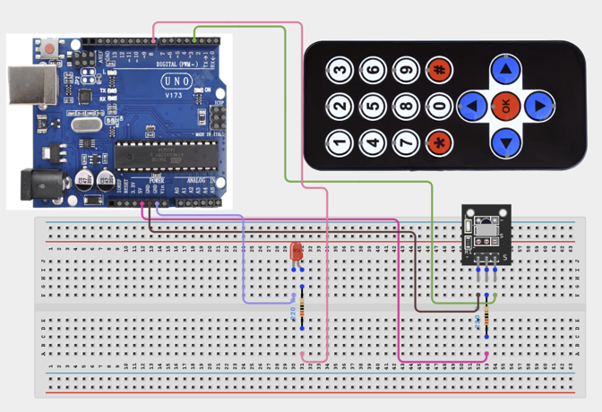

# 1.14. Remote Controlled LED

| **Description** | In this project, learners will build a wireless lighting system using an infrared (IR) remote control. The IR receiver detects commands from the remote and controls an LED accordingly. This introduces wireless communication and remote operation of electronic devices. |
|------------------|------------------------------------------------------------------------------------------------------------------------------------------------------------------------------------------------------------------------------------------------------|
| **Use case**     | This project is connected to real-world uses such as television remotes, home automation systems, and wireless consumer electronics. |

## Components (Things You will need)

|  |  |  |  |  |  |  |  |  |
| --- | --- | --- | --- | --- | --- | --- | --- | --- |

| --------------------------------------------------- | ------------------------------------------------------ | ----------------------------------------------------------- | --------------------------------------------------------- | ------------------------------------------------------ | ------------------------------------------------------ | ------------------------------------------------------ |--------------------------------------------------- |  

## Building the circuit

Things Needed:

- Arduino Uno = 1
- Arduino USB cable = 1
- Bread Board = 1
- Jumper Wires
- IR Remote Module
- IR Remot Control
- LEDs
- Push Button
- Resistor
- IR Receiver


## Mounting the component on the breadboard and wiring the circuit

**Step 1:**	Place the LED and IR Receiver Module  on the breadboard.

- Connect the LED anode (positive) to Arduino Digital Pin 8.

- Connect the LED cathode (negative) to a 220Ω resistor, which then connects to the breadboard's ground rail.

- Connect the IR Receiver Module's output pin to Arduino Digital Pin 2.

- Connect the IR Receiver Module's VCC pin to the Arduino 5V pin.

- Connect the IR Receiver Module's GND pin to the breadboard's ground rail.

- Ensure all ground points (LED resistor, IR Receiver GND) are connected to the Arduino GND pin.



_Make sure to connect the Arduino USB cable to the Arduino board._

## PROGRAMMING

**Step 1:** Open your Arduino IDE. See how to set up here: [Getting Started](../../Getting Started/Arduino_IDE_Setup.md).

**Step 2:** Write the complete program implementing the system logic with appropriate pin definitions, setup configuration, and the main control loop.

```cpp
// Required Library: IRremote
#include <IRremote.h>
// IR receiver pin
const int receiverPin = 2;
// LED pin
const int ledPin = 8;
// Create receiver object
IRrecv irrecv(receiverPin);
// Variable to store decoded data
decode_results results;
void setup() {
 pinMode(ledPin, OUTPUT);
 Serial.begin(9600);
 // Start receiver
 irrecv.enableIRIn();
}
void loop() {
 // Check for remote signal
 if (irrecv.decode(&results)) {
   // Print code value
   Serial.println(results.value, HEX);
   // Example button code
   if(results.value == 0xFFA25D) {
     digitalWrite(ledPin, HIGH);
   }
   if(results.value == 0xFFE21D) {
     digitalWrite(ledPin, LOW);
   }
   // Prepare for next command
   irrecv.resume();
 }
}

```

**Step 3:** Save your code. _See the [Getting Started](../../Getting Started/Arduino_IDE_Setup.md) section_

**Step 4:** Select the arduino board and port _See the [Getting Started](../../Getting Started/Arduino_IDE_Setup.md) section:Selecting Arduino Board Type and Uploading your code_.

**Step 5:** Upload your code. _See the [Getting Started](../../Getting Started/Arduino_IDE_Setup.md) section:Selecting Arduino Board Type and Uploading your code_

## CONCLUSION

Pressing the programmed ON button lights the LED. Pressing the programmed OFF button turns the LED off. Different remotes may produce different hexadecimal codes.


