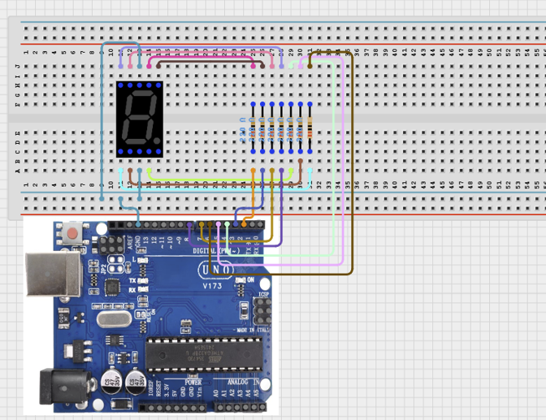

# 1.3. Electronic Dice

| **Description** | In this project, learners will build an electronic version of a traditional six-sided dice using a one-digit seven-segment display. Each time the Arduino runs the program, it generates a random number between 1 and 6 and displays it on the seven-segment display. This project introduces learners to numerical displays and the concept of randomness in programming. Electronic dice are commonly used in digital games, educational tools, and simulations. |
| --- | --- |
| **Use case**     | This project is connected to real-world concepts and uses: seven-segment displays to represent numbers, arrays to organise repeated data, random number generation to add unpredictability, and functions to improve code readability and reusability. Simple electronic components can be combined to create engaging interactive systems used in digital games, classroom tools, and simulations. |

## Components (Things You will need)

|  |  |  |  |  |
| --- | --- | --- | --- | --- |

## Building the circuit

Things Needed:

- Arduino Uno = 1
- Arduino USB cable = 1
- Bread Board = 1
- Jumper Wires
- 220Ω resistor
- Seven-Segment Display 

## Mounting the component on the breadboard and wiring the circuit

**Step 1:**	Place the 1-Digit Seven-Segment Display and the 220 Ω resistors on the breadboard. Match each letter to its corresponding number: A goes to 2, B goes to 3, C goes to 4, D goes to 5, E goes to 6, F goes to 7, and G goes to 8.



_Make sure to connect the Arduino USB cable to the Arduino board._

## PROGRAMMING

**Step 1:** Open your Arduino IDE. See how to set up here: [Getting Started](../../Getting Started/Arduino_IDE_Setup.md).

**Step 2:** Write the complete program implementing the system logic with appropriate pin definitions, setup configuration, and the main control loop.

```cpp
int segments[] = {2, 3, 4, 5, 6, 7, 8};
byte numbers[6][7] = {
  {0,1,1,0,0,0,0}, //1
  {1,1,0,1,1,0,1}, //2
  {1,1,1,1,0,0,1}, //3
  {0,1,1,0,0,1,1}, //4
  {1,0,1,1,0,1,1}, //5
  {1,0,1,1,1,1,1}  //6
};
void setup() {
  for(int i = 0; i < 7; i++) {
    pinMode(segments[i], OUTPUT);
  }
  randomSeed(analogRead(A0));
}
void displayNumber(int num) {
  for(int i = 0; i < 7; i++) {
    digitalWrite(segments[i], numbers[num-1][i]);
  }
}
void loop() {
  int dice = random(1,7);
  displayNumber(dice);
  delay(2000);
}


```

**Step 3:** Save your code. _See the [Getting Started](../../Getting Started/Arduino_IDE_Setup.md) section_

**Step 4:** Select the arduino board and port _See the [Getting Started](../../Getting Started/Arduino_IDE_Setup.md) section:Selecting Arduino Board Type and Uploading your code_.

**Step 5:** Upload your code. _See the [Getting Started](../../Getting Started/Arduino_IDE_Setup.md) section:Selecting Arduino Board Type and Uploading your code_

## CONCLUSION

Congratulations! You have successfully built an Electronic Dice using the Arduino Uno and a seven-segment display. Through this project, you learned how to control a numerical display, generate random numbers, and use functions and arrays to write cleaner, more organized code. You also practiced building electronic circuits safely and connecting hardware with software to create an interactive system. These skills form an important foundation for more advanced Arduino projects, such as digital games, electronic displays, and smart devices. Keep experimenting by modifying the code, adding new features, and exploring how simple components can be combined to solve real-world problems. Every project you complete brings you one step closer to becoming a confident programmer, engineer, and innovator.
