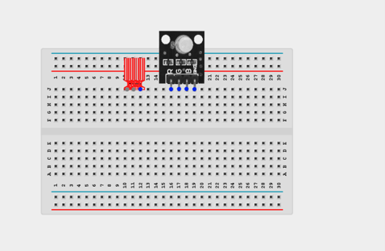
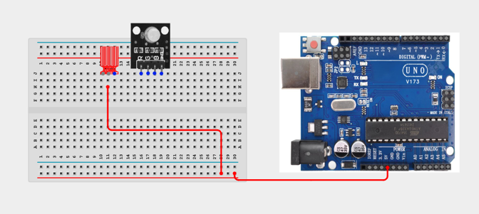
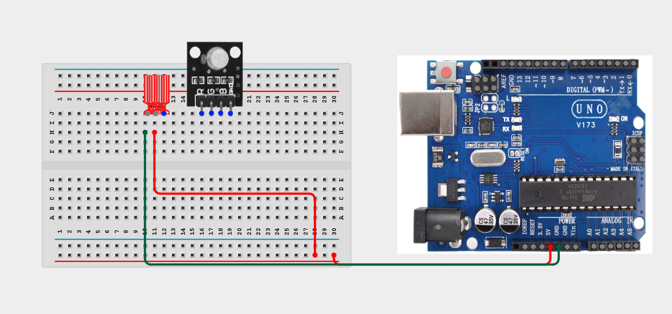
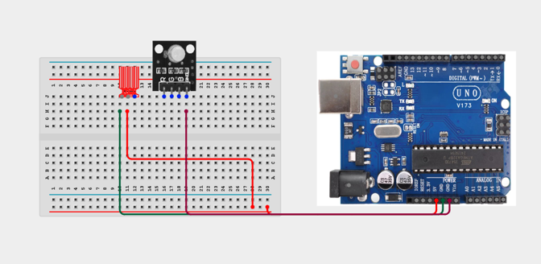
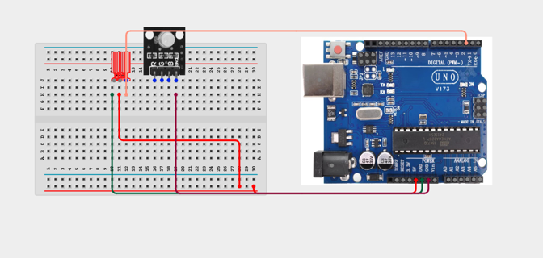
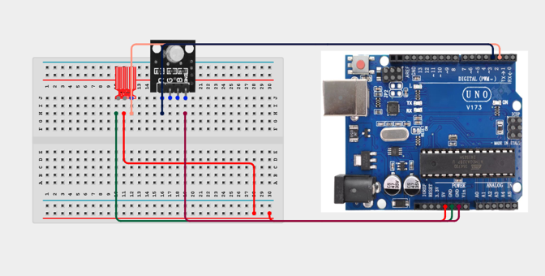
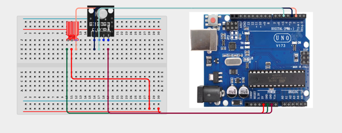
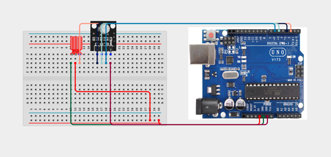

# 1.5. AquaDropColourSignal

| **Description** | Learners build a water-detection signal that changes RGB colour when moisture is detected. The project connects environmental sensing with visual feedback. Learners will follow a practical build process, connect the circuit safely, upload the Arduino program, and observe how the prototype behaves when the input condition changes. |
| --- | --- |
| **Use case**     | This project is connected to real-world uses such as detecting small water spills, creating a visual moisture warning display, and introducing flood-sensing concepts at a beginner level. |

## Components (Things You will need)

|  |  |  |  |  |  |  |
| --- | --- | --- | --- | --- | --- | --- |

## Building the circuit

Things Needed:

- Arduino Uno = 1
- Arduino USB cable = 1
- Bread Board = 1
- Jumper Wires
- RGB Module
- Water sensor
- LED


## Mounting the component on the breadboard and wiring the circuit

**Step 1:**	Place the Water Test Module and RGB into your Breadboard.



**Step 2:**	Using a jumper wire connect VCC on the Arduino Uno onto the positive section on the breadboard. Connect VCC on the Water test module onto the VCC section on the Breadboard.




**Step 3:**	Using a jumper wire connect the GND on the water test module onto the GND on the Arduino Uno.



**Step 4:**	Using a jumper wire connect the GND on the RGB to the GND on the Breadboard



**Step 5:**	Connect the Signal pin of the water test module to Pin 2 on the Arduino board using a jumper wire.



**Step 6:**	Connect the R pin of the RGB LED to Pin 3 on the Arduino board using a jumper wire.



**Step 7:**	Connect the G pin of the RGB LED to Pin 5 on the Arduino board using a jumper wire.



**Step 8:**	Connect the B pin of the RGB LED to Pin 6 on the Arduino board using a jumper wire.



_Make sure to connect the Arduino USB cable to the Arduino board._

## PROGRAMMING

**Step 1:** Open your Arduino IDE. See how to set up here: [Getting Started](../../Getting Started/Arduino_IDE_Setup.md).

**Step 2:** Write the complete program implementing the system logic with appropriate pin definitions, setup configuration, and the main control loop.

```cpp

/*
 * Project 05: AquaDrop Colour Signal
 * 
 * This code reads moisture levels from the Water Test Module 
 * and maps the value to control the RGB 3 Color Module.
 */

// Pin Definitions
const int sensorPin = A0; // Water Test Module input
const int redPin    = 3;  // RGB Red channel
const int greenPin  = 5;  // RGB Green channel
const int bluePin   = 6;  // RGB Blue channel

void setup() {
  // Initialize serial communication for debugging
  Serial.begin(9600);
  
  // Set RGB LED pins as outputs
  pinMode(redPin, OUTPUT);
  pinMode(greenPin, OUTPUT);
  pinMode(bluePin, OUTPUT);
}

void loop() {
  // Read the analog value from the moisture sensor
  int value = analogRead(sensorPin);
  
  // Update RGB LED colors based on sensor value
  // We use the modulo operator (%) to keep the color values within the 0-255 range
  analogWrite(redPin,   value % 255);
  analogWrite(greenPin, (value * 2) % 255);
  analogWrite(bluePin,  (value * 3) % 255);
  
  // Small delay for stability
  delay(500);
}

```

**Step 3:** Save your code. _See the [Getting Started](../../Getting Started/Arduino_IDE_Setup.md) section_

**Step 4:** Select the arduino board and port _See the [Getting Started](../../Getting Started/Arduino_IDE_Setup.md) section:Selecting Arduino Board Type and Uploading your code_.

**Step 5:** Upload your code. _See the [Getting Started](../../Getting Started/Arduino_IDE_Setup.md) section:Selecting Arduino Board Type and Uploading your code_

## CONCLUSION
 The AquaDrop Colour Signal powers on and waits for sensor input or user action. Input or command changes: The display, buzzer, LED, motor, servo, relay, or RGB output responds according to the program logic. Threshold or event condition: The system gives visible, audible, movement, or display feedback when the condition is detected.
