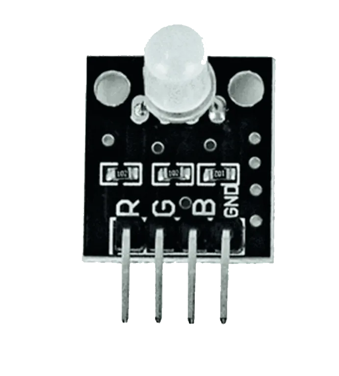
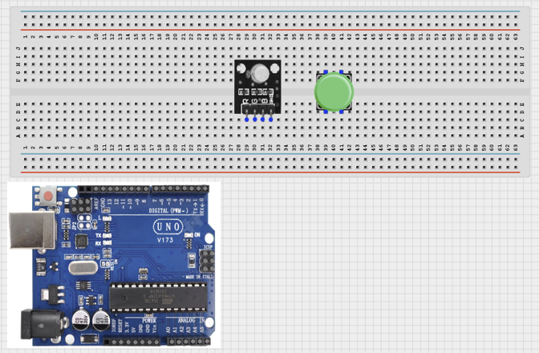
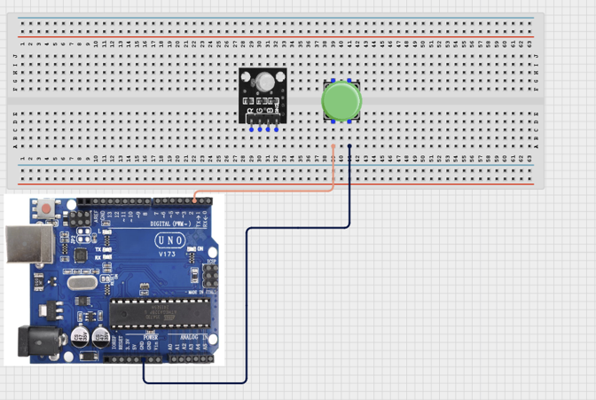
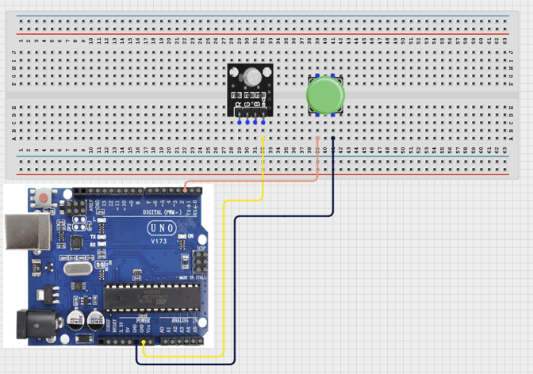
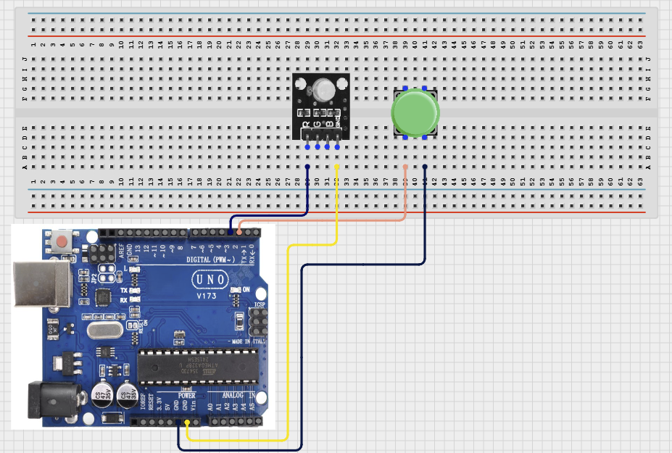
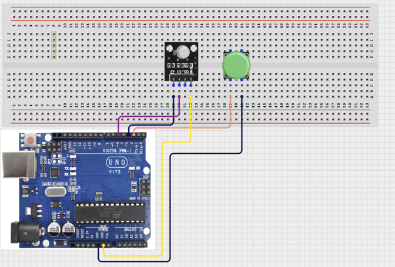
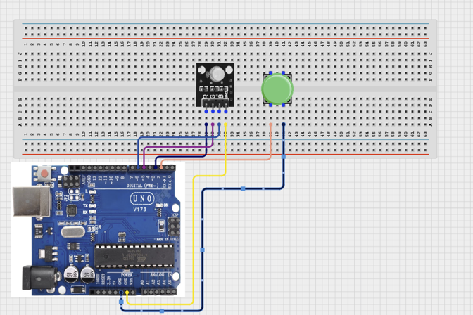

# 1.6. Push Button Direction Signal

| **Description** | Learners build a push-button direction signal that cycles an RGB module through colours when the button is pressed. The project introduces digital inputs, debouncing, and basic state handling. Learners will follow a practical build process, connect the circuit safely, upload the Arduino program, and observe how the prototype responds to user input. |
| --- | --- |
| **Use case**     | This project is connected to real-world uses such as manual state control, simple switch-based toggles, and basic position or presence indicators used in interactive devices. |

## Components (Things You will need)

|  |  |  |  |  |  |  |
| --- | --- | --- | --- | --- | --- | --- |

## Building the circuit

Things Needed:

- Arduino Uno = 1
- Arduino USB cable = 1
- Bread Board = 1
- Jumper Wires
- 220Ω resistor
- RGB Module
- Push Button


## Mounting the component on the breadboard and wiring the circuit

**Step 1:**	Place the Push Button and RGB on the breadboard.



**Step 2:**	Connect one terminal of the push button to Pin 2 on the Arduino Uno board and the other terminal to GND using jumper wires.



**Step 3:**	Connect the GND pin of the RGB 3 Color Module to GND (Ground) on the Arduino Uno board using a jumper wire.



  **Step 4:**	Connect the R pin of the RGB 3 Color Module to Pin 3 (Red channel) on the Arduino Uno board using a jumper wire.



**Step 5:**	Connect the G pin of the RGB 3 Color Module to Pin 5 (Green channel) on the Arduino Uno board using a jumper wire.



**Step 6:**	Connect the B pin of the RGB 3 Color Module to Pin 6 (Blue channel) on the Arduino Uno board using a jumper wire.



_Make sure to connect the Arduino USB cable to the Arduino board._

## PROGRAMMING

**Step 1:** Open your Arduino IDE. See how to set up here: [Getting Started](../../Getting Started/Arduino_IDE_Setup.md).

**Step 2:** Write the complete program implementing the system logic with appropriate pin definitions, setup configuration, and the main control loop.

```cpp
const int buttonPin = 2;
const int redPin = 3;
const int greenPin = 5;
const int bluePin = 6;

int buttonState = HIGH;
int lastButtonState = HIGH;
int color = 0;

void setup() {
  pinMode(buttonPin, INPUT_PULLUP);

  pinMode(redPin, OUTPUT);
  pinMode(greenPin, OUTPUT);
  pinMode(bluePin, OUTPUT);

  setColor(0);   // Start with Red
}

void loop() {
  buttonState = digitalRead(buttonPin);

  // Detect button press
  if (lastButtonState == HIGH && buttonState == LOW) {
    color++;
    if (color > 6) color = 0;

    setColor(color);

    delay(200); // Debounce
  }

  lastButtonState = buttonState;
}

void setColor(int c) {
  switch (c) {
    case 0: // Red
      digitalWrite(redPin, HIGH);
      digitalWrite(greenPin, LOW);
      digitalWrite(bluePin, LOW);
      break;

    case 1: // Green
      digitalWrite(redPin, LOW);
      digitalWrite(greenPin, HIGH);
      digitalWrite(bluePin, LOW);
      break;

    case 2: // Blue
      digitalWrite(redPin, LOW);
      digitalWrite(greenPin, LOW);
      digitalWrite(bluePin, HIGH);
      break;

    case 3: // Yellow
      digitalWrite(redPin, HIGH);
      digitalWrite(greenPin, HIGH);
      digitalWrite(bluePin, LOW);
      break;

    case 4: // Cyan
      digitalWrite(redPin, LOW);
      digitalWrite(greenPin, HIGH);
      digitalWrite(bluePin, HIGH);
      break;

    case 5: // Magenta
      digitalWrite(redPin, HIGH);
      digitalWrite(greenPin, LOW);
      digitalWrite(bluePin, HIGH);
      break;

    case 6: // White
      digitalWrite(redPin, HIGH);
      digitalWrite(greenPin, HIGH);
      digitalWrite(bluePin, HIGH);
      break;
  }
}

```

**Step 3:** Save your code. _See the [Getting Started](../../Getting Started/Arduino_IDE_Setup.md) section_

**Step 4:** Select the arduino board and port _See the [Getting Started](../../Getting Started/Arduino_IDE_Setup.md) section:Selecting Arduino Board Type and Uploading your code_.

**Step 5:** Upload your code. _See the [Getting Started](../../Getting Started/Arduino_IDE_Setup.md) section:Selecting Arduino Board Type and Uploading your code_

## CONCLUSION

 The Push Button Signal powers on and waits for user action. Input or command changes: The RGB output toggles on or off when the push button is pressed. Threshold or event condition: The system gives visible feedback by lighting up the RGB module when the button is closed to GND.
