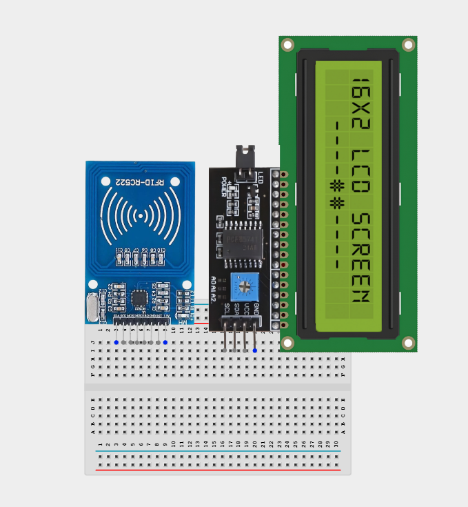
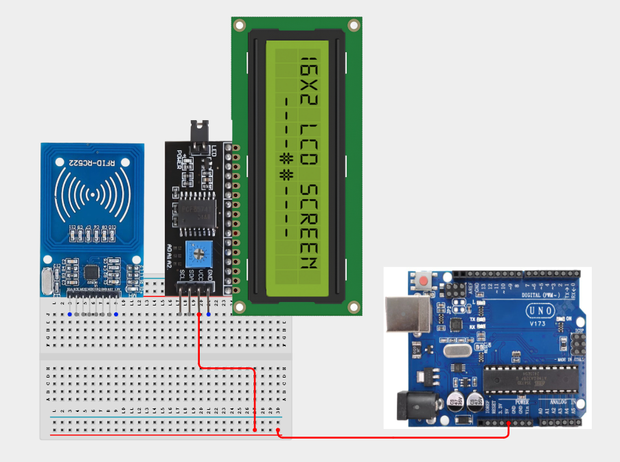
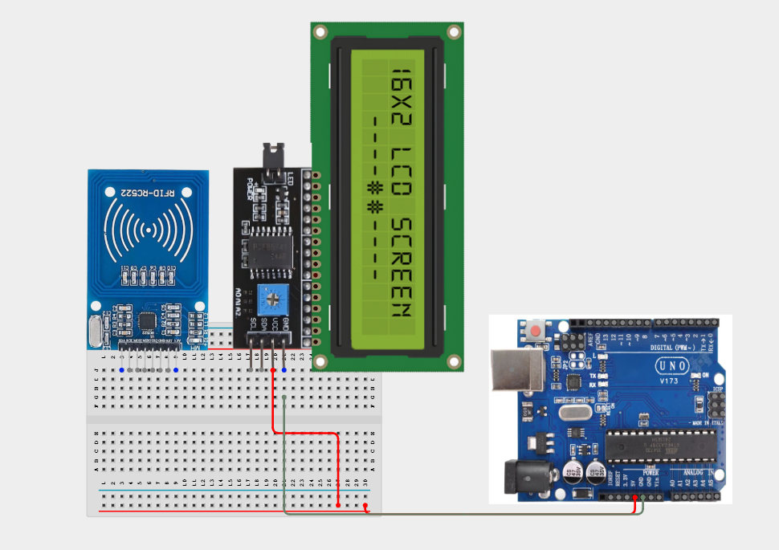
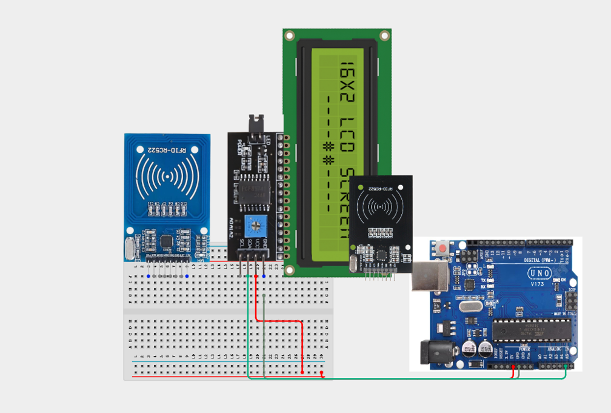
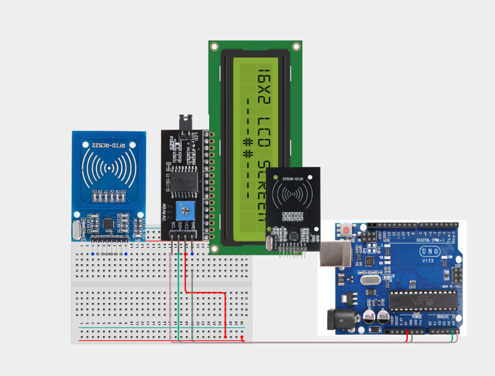
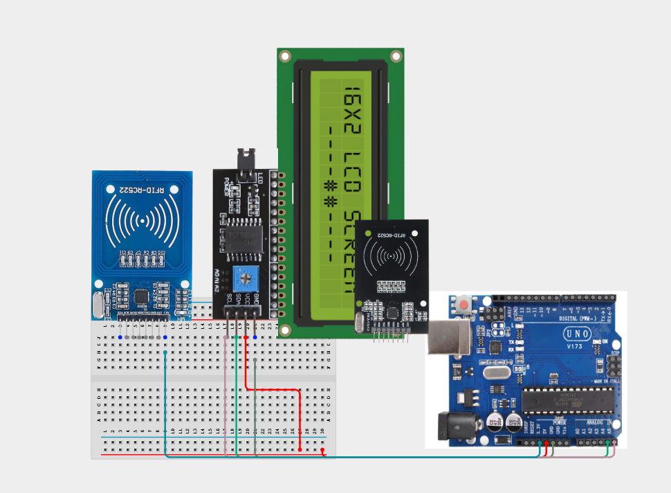
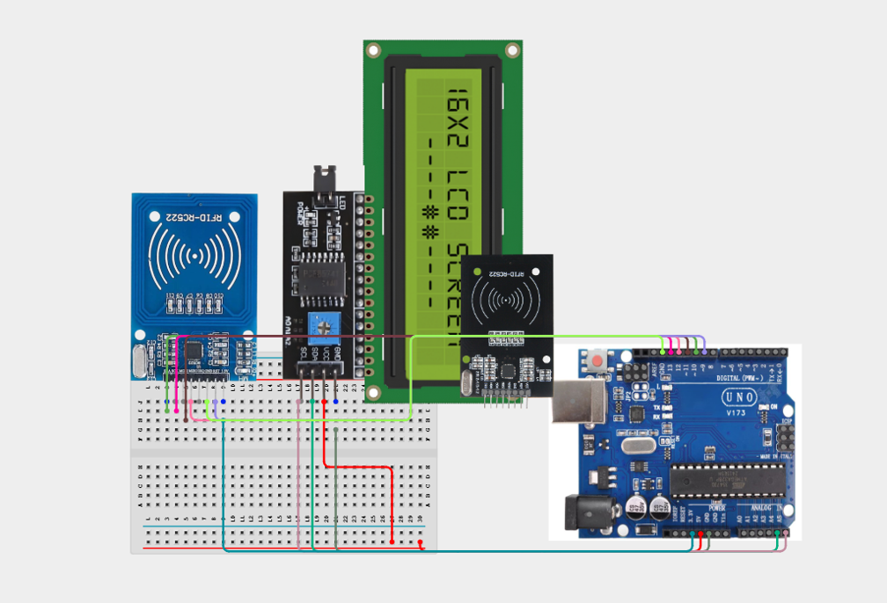

# 1.7. Smart Badge RFID Reader

| **Description** | Learners build a simple RFID badge reader that displays scan feedback on an LCD. The project introduces wireless identification and basic digital access concepts. Learners will follow a practical build process, connect the circuit safely, upload the Arduino program, and observe how the prototype behaves when a badge is presented. |
| --- | --- |
| **Use case**     | Typical uses include school attendance badge reading, library card identification demonstrations, and an introduction to RFID access-control systems. |

## Components (Things You will need)
|  |  |  |  |  |  |  |
| --- | --- | --- | --- | --- | --- | --- |

## Building the circuit

Things Needed:

- Arduino Uno = 1
- Arduino USB cable = 1
- Bread board = 1
- Jumper Wires
- 220Ω resistor
- LCD screen module
- RFID Reader


## Mounting the component on the breadboard and wiring the circuit

**Step 1:**	Place the RFID and LCD module on the breadboard as shown below.



**Step 2:**	Using a jumper wire to the 5V on the Arduino Uno and the other to the positive section on the breadboard



**Step 3:** Using a jumper wire to connect the GND on the Ardinuo Uno and the other pin to the positive section on the breadboard.



**Step 4:**	Connect the SDA pin on the LCD to A4 on the Arduino Uno board using a jumper wire.



**Step 5:**	Connect SCL on the LCD to A5 on the Arduino Uno board using a jumper wire.



**Step 6:** Using a jumper wire connect 3.3v on the RFID to 3.3V on the Arduino Uno



**Step 7:** Connect the RFID module to the Arduino by connecting SDA (SS) to D10, SCK to D13, MOSI to D11, MISO to D12, RST to D9, and GND to the Arduino's GND pin.



_Make sure to connect the Arduino USB cable to the Arduino board._

## PROGRAMMING

**Step 1:** Open your Arduino IDE. See how to set up here: [Getting Started](../../Getting Started/Arduino_IDE_Setup.md).

**Step 2:** Write the complete program implementing the system logic with appropriate pin definitions, setup configuration, and the main control loop.

```cpp
#include <SPI.h>
#include <MFRC522.h>
#include <Wire.h>
#include <LiquidCrystal_I2C.h>

#define SS_PIN 10
#define RST_PIN 9

MFRC522 rfid(SS_PIN, RST_PIN);
LiquidCrystal_I2C lcd(0x27, 16, 2);

void setup() {
  Serial.begin(9600);

  SPI.begin();
  rfid.PCD_Init();

  lcd.init();
  lcd.backlight();

  lcd.setCursor(0,0);
  lcd.print("Scan Card");
}

void loop() {

  if (!rfid.PICC_IsNewCardPresent())
    return;

  if (!rfid.PICC_ReadCardSerial())
    return;

  lcd.clear();
  lcd.setCursor(0,0);
  lcd.print("Card Detected");

  Serial.print("UID: ");

  String uid = "";

  for (byte i = 0; i < rfid.uid.size; i++) {
    uid += String(rfid.uid.uidByte[i], HEX);
    Serial.print(rfid.uid.uidByte[i], HEX);
    Serial.print(" ");
  }

  Serial.println();

  lcd.setCursor(0,1);
  lcd.print(uid);

  delay(3000);

  lcd.clear();
  lcd.setCursor(0,0);
  lcd.print("Scan Card");

  rfid.PICC_HaltA();
}

```

**Step 3:** Save your code. _See the [Getting Started](../../Getting Started/Arduino_IDE_Setup.md) section_

**Step 4:** Select the arduino board and port _See the [Getting Started](../../Getting Started/Arduino_IDE_Setup.md) section:Selecting Arduino Board Type and Uploading your code_.

**Step 5:** Upload your code. _See the [Getting Started](../../Getting Started/Arduino_IDE_Setup.md) section:Selecting Arduino Board Type and Uploading your code_

## CONCLUSION

The Smart Badge RFID Reader powers on and waits for sensor input or user action. Input or command changes: The display, buzzer, LED, motor, servo, relay, or RGB output responds according to the program logic. Threshold or event condition: The system gives visible, audible, movement, or display feedback when the condition is detected.
