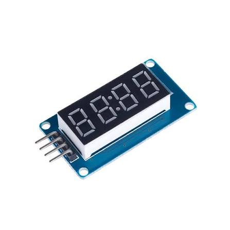
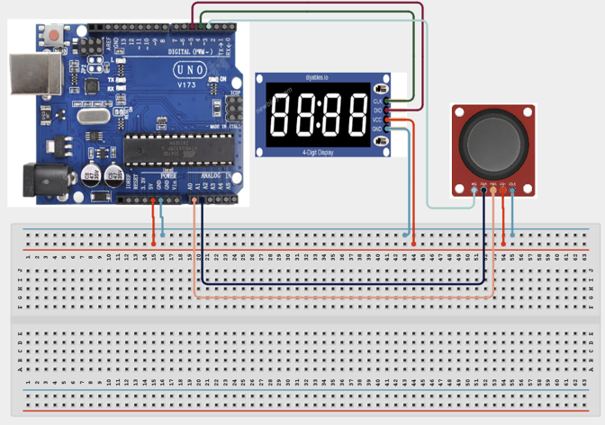

# 1.8. JoyMap Position Meter

| **Description** | Learners read joystick movement and display a changing position value. The project introduces human input devices and data mapping. Learners will follow a practical build process, connect the circuit safely, upload the Arduino program, and observe how the prototype behaves when the input condition changes. |
| --- | --- |
| **Use case**     | This project is connected to real-world uses such as understanding game-controller inputs, measuring directional movement, and introducing manual control interfaces. |

## Components (Things You will need)

|  |  |  |  |  |  |
| --- | --- | --- | --- | --- | --- |

## Building the circuit

Things Needed:

- Arduino Uno = 1
- Arduino USB cable = 1
- Bread board = 1
- Jumper Wires
- 220Ω resistor
- Joy Stick Module
- 4 Digit Display Tube

## Mounting the component on the breadboard and wiring the circuit

**Step 1:**	Connect Power (5V) and Ground (GND) lines from the Arduino to the breadboard rails. Connect the Joystick and Display modules to the breadboard power rails. Connect the Joystick VRx pin to A0, VRy pin to A1, and SW pin to Pin 2. Connect the Display CLK pin to Pin 4 and the DIO pin to Pin 5. Perform a final check of all connections and then connect the USB cable to the computer.



_Make sure to connect the Arduino USB cable to the Arduino board._

## PROGRAMMING

**Step 1:** Open your Arduino IDE. See how to set up here: [Getting Started](../../Getting Started/Arduino_IDE_Setup.md).

**Step 2:** Write the complete program implementing the system logic with appropriate pin definitions, setup configuration, and the main control loop.

```cpp

#include <TM1637Display.h>

// Pin Definitions
TM1637Display display(4, 5); // CLK, DIO
int pinVRx = A0;
int pinVRy = A1;
int pinSW = 2;

void setup() {
  Serial.begin(9600);
  display.setBrightness(7);
  pinMode(pinSW, INPUT_PULLUP); // Enable internal pullup for the switch
}

void loop() {
  int xValue = analogRead(pinVRx);
  int yValue = analogRead(pinVRy);
  int swValue = digitalRead(pinSW);

  // Print all values to Serial Monitor for testing
  Serial.print("X: "); Serial.print(xValue);
  Serial.print(" | Y: "); Serial.print(yValue);
  Serial.print(" | SW: "); Serial.println(swValue);

  // Display the X-axis value on the 4-Digit Display
  display.showNumberDec(xValue);
  delay(500);
}


```

**Step 3:** Save your code. _See the [Getting Started](../../Getting Started/Arduino_IDE_Setup.md) section_

**Step 4:** Select the arduino board and port _See the [Getting Started](../../Getting Started/Arduino_IDE_Setup.md) section:Selecting Arduino Board Type and Uploading your code_.

**Step 5:** Upload your code. _See the [Getting Started](../../Getting Started/Arduino_IDE_Setup.md) section:Selecting Arduino Board Type and Uploading your code_

## CONCLUSION

The JoyMap Position Meter powers on and waits for sensor input or user action. Input or command changes: The display, buzzer, LED, motor, servo, relay, or RGB output responds according to the program logic. Threshold or event condition: The system gives visible, audible, movement, or display feedback when the condition is detected.
