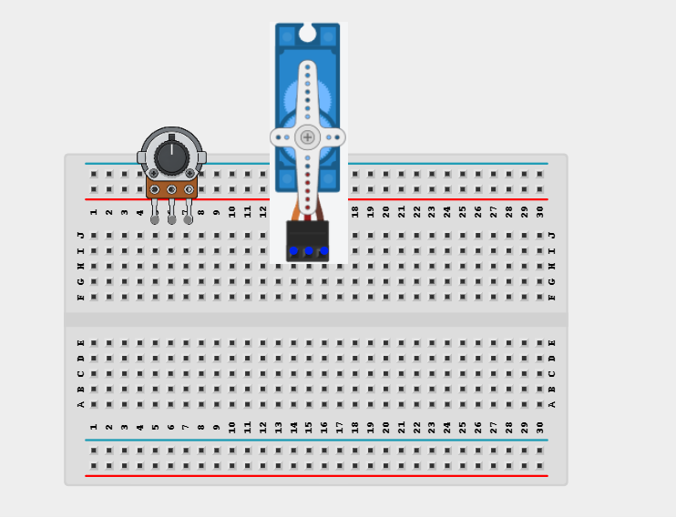
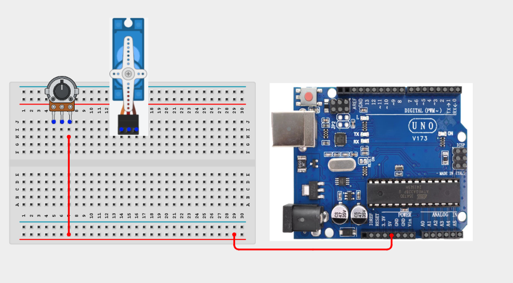
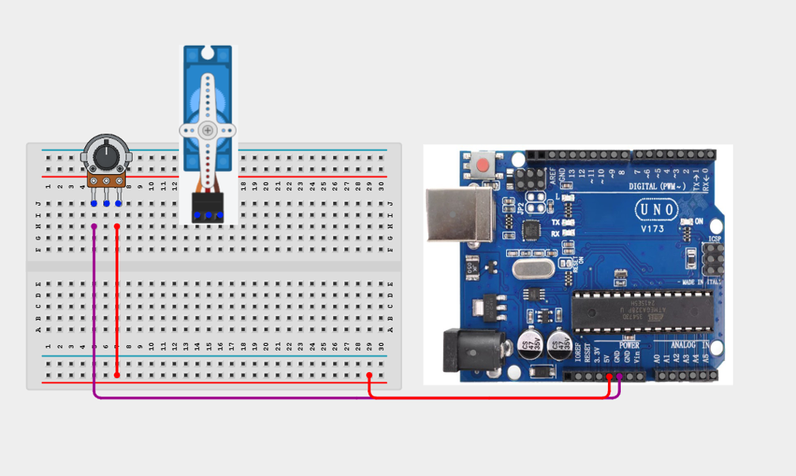
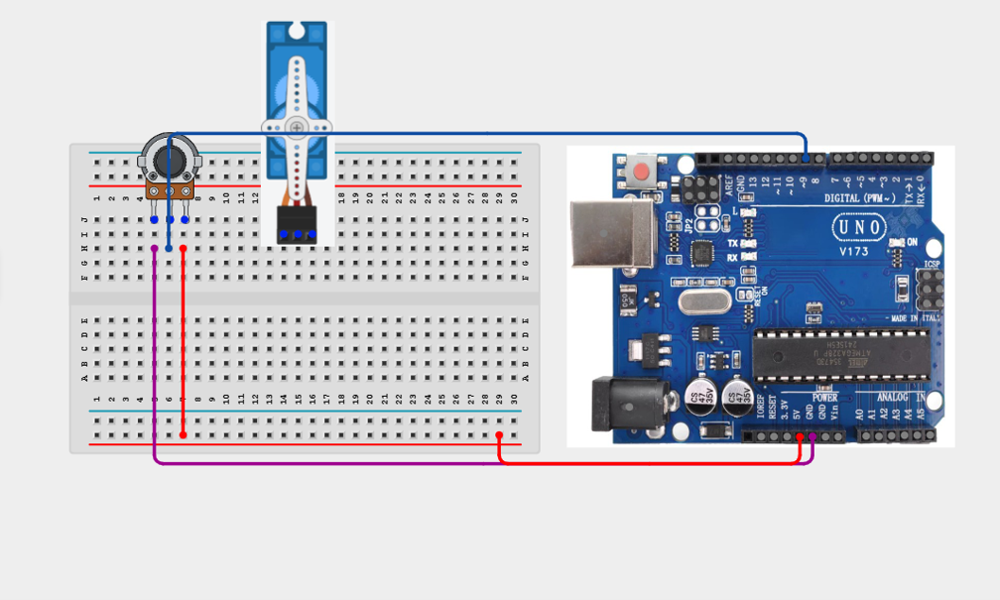
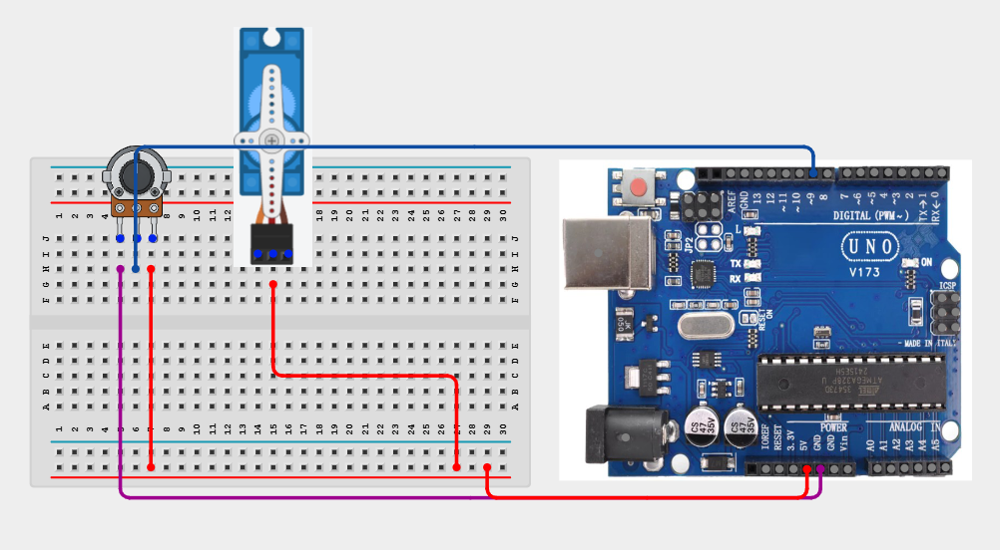
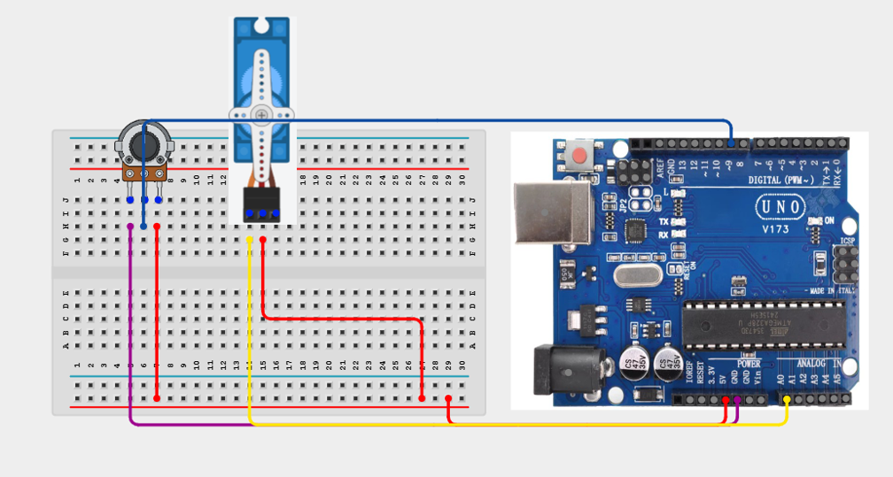
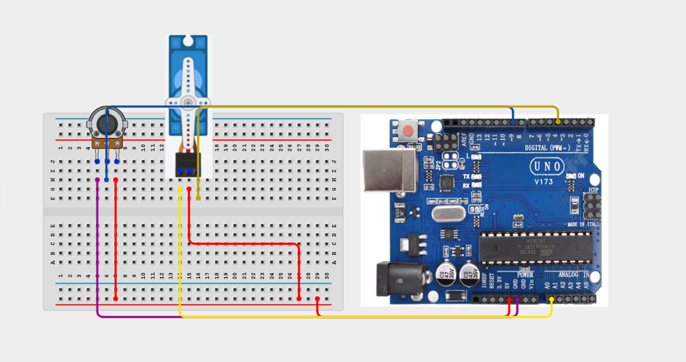

# 1.9. Servo Angle Classroom Pointer

| **Description** | Learners use a potentiometer to control a servo position. The project demonstrates how analog input can control mechanical movement. In this manual, learners will follow a practical build process, connect the circuit safely, upload the Arduino program, and observe how the prototype behaves when the input condition changes. |
|------------------|-------------------------------------------------------------------------------------------------------------------------------------------------------------------------------------------------------------------------------------------------------------------|
| **Use case**     | This project is connected to real-world uses such as: controlling a pointer arm, explaining servo motion in robotics, and building a small manual positioning system. |

## Components (Things You will need)

|  |  |  |  | | |
| --------------------------------------------------- | ------------------------------------------------------ | ----------------------------------------------------------- | --------------------------------------------------------- | ------------------------------------------------------ | ------------------------------------------------------ | 

## Building the circuit

Things Needed:

- Arduino Uno = 1
- Arduino USB cable = 1
- Bread Board = 1
- Jumper Wires
- 220Ω resistor
- Servo Motor
- Potentiometer


## Mounting the component on the breadboard and wiring the circuit

**Step 1:**	Place the Potenttiometer and Servo motor onto the breadboard.



**Step 2:**	Connect the 5V pin on the Arduino Uno board to the positive rail of the breadboard, then connect the VCC pin of the potentiometer to the positive rail as shown below.



**Step 3:**	Connect the GND pin of the potentiometer to the GND pin on the Arduino Uno board using a jumper wire. 



**Step 4:**	Connect the Signal pin of the servo motor to Pin 9 on the Arduino Uno board using a jumper wire, as shown below.



**Step 5:**	Connect the VCC pin of the servo motor to the 5V power rail on the breadboard, as shown below.



**Step 6:** Connect the Signal pin of the potentiometer to A0 on the Arduino Uno board as shown below.



**Step 7:**	Connect the Signal pin of the servo motor to Pin 9 on the Arduino Uno board as shown below.



_Make sure to connect the Arduino USB cable to the Arduino board._

## PROGRAMMING

**Step 1:** Open your Arduino IDE. See how to set up here: [Getting Started](../../Getting Started/Arduino_IDE_Setup.md).

**Step 2:** Write the complete program implementing the system logic with appropriate pin definitions, setup configuration, and the main control loop.

```cpp
#include <Servo.h>

Servo servo1;

const int servoPin = 4;
const int sensorPin = A0;

void setup() {
  Serial.begin(9600);
  servo1.attach(servoPin);
}

void loop() {
  int value = analogRead(sensorPin);

  int angle = map(value, 0, 1023, 0, 180);

  servo1.write(angle);

  Serial.print("Potentiometer: ");
  Serial.print(value);
  Serial.print("  Angle: ");
  Serial.println(angle);

  delay(15);
}

```

**Step 3:** Save your code. _See the [Getting Started](../../Getting Started/Arduino_IDE_Setup.md) section_

**Step 4:** Select the arduino board and port _See the [Getting Started](../../Getting Started/Arduino_IDE_Setup.md) section:Selecting Arduino Board Type and Uploading your code_.

**Step 5:** Upload your code. _See the [Getting Started](../../Getting Started/Arduino_IDE_Setup.md) section:Selecting Arduino Board Type and Uploading your code_

## CONCLUSION

 The ServoAngle Classroom Pointer powers on and waits for sensor input or user action. Input or command changes: The display, buzzer, LED, motor, servo, relay, or RGB output responds according to the program logic. Threshold or event condition: The system gives visible, audible, movement, or display feedback when the condition is detected.
