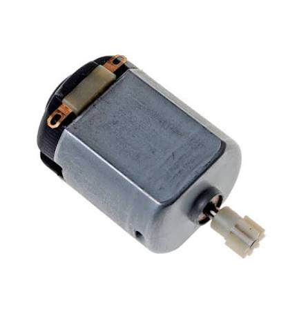
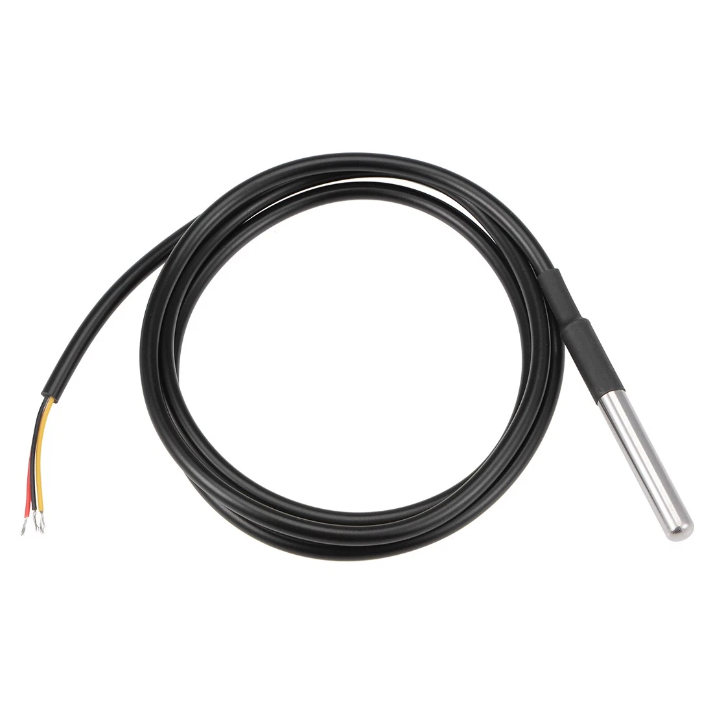
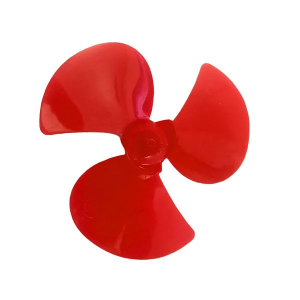
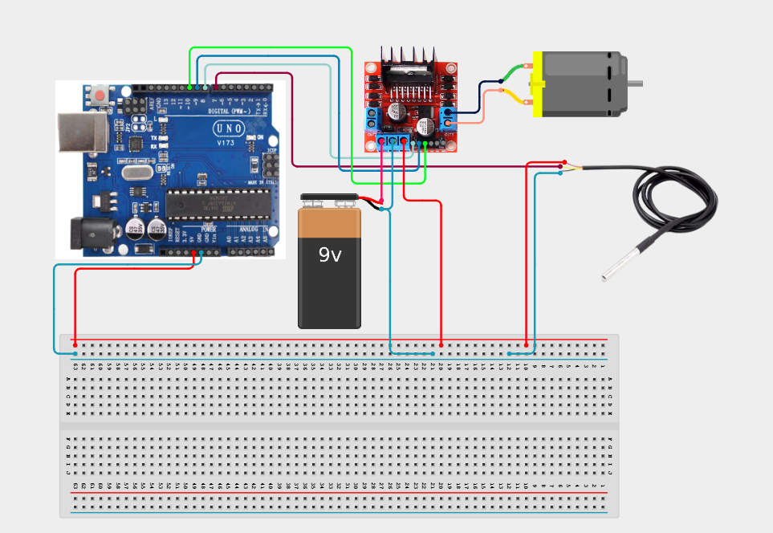

# 4.1.10. Temperature Triggered Cooling Fan

| **Description**| In this project, learners will engineer an advanced 'Temperature-Triggered Cooling Fan' multi-component system. This design integrates DS18B20 + DC Motor + L298N Driver + RGB LED into a cohesive industrial automation unit.|
|------------------|----------------------------------------------------------------|
| **Use case**     |This project connects to real-world industrial and IoT applications such as: Project 65 provides essential master-level engineering skills for real-world IoT, safety, and control systems.|

## Components (Things You will need)

|  |  |  |  |  |  |  |  |  |
| --- | --- | --- | --- | --- | --- | --- | --- | --- |

## Building the circuit

Things Needed:

- Arduino Uno Board = 1
- DS18B20 Temperature Sensor = 1
- DC Motor = 1
- L298N Driver = 1
- USB Cable = 1 
- Jumper Wires
- Bread Board
- LED
- Fan Blades


## Mounting the component on the breadboard and wiring the circuit

**Step 1:** Inventory the Components

Check the Required Components table and confirm that all listed modules and components are available.

**Step 2:** Connect the Sensors and Inputs

Connect the sensor and input leads to their assigned analog or digital pins on the Arduino.

**Step 3:** Connect the Actuators and Displays

Connect the actuator and display leads to their assigned digital, PWM, or I²C pins on the Arduino.

**Step 4:** Connect the Power Lines

Connect the VCC and power lines to the appropriate 5V or 3.3V power pins on the Arduino, according to the component requirements.

**Step 5:** Connect the Ground Lines

Connect all GND lines to an available GND pin on the Arduino or to the breadboard's common ground rail.

**Step 6:** Perform a Final Check

Double-check all power, signal, and ground connections. Ensure that each component is connected to the correct 5V, 3.3V, or GND connection and that there are no accidental short circuits.



_Make sure to connect the Arduino USB cable to the Arduino board._

## PROGRAMMING

**Step 1:** Open your Arduino IDE. See how to set up here: [Getting Started](../../../Getting Started/Arduino_IDE_Setup.md).

**Step 2:** Write the complete program implementing the system logic with appropriate pin definitions, setup configuration, and the main control loop.

```cpp
#include <OneWire.h>
#include <DallasTemperature.h>

// Pins
const int oneWireBus = 2; // DS18B20 data pin
const int enA = 9;        // L298N Enable A
const int in1 = 8;        // L298N Input 1
const int in2 = 7;        // L298N Input 2
const int redPin = 6;
const int greenPin = 5;
const int bluePin = 3;

// Threshold
const float tempThreshold = 25.0; // Set your desired threshold

OneWire oneWire(oneWireBus);
DallasTemperature sensors(&oneWire);

void setup() {
  Serial.begin(9600);
  sensors.begin();
  
  pinMode(enA, OUTPUT);
  pinMode(in1, OUTPUT);
  pinMode(in2, OUTPUT);
  pinMode(redPin, OUTPUT);
  pinMode(greenPin, OUTPUT);
  pinMode(bluePin, OUTPUT);
}

void loop() {
  sensors.requestTemperatures();
  float tempC = sensors.getTempCByIndex(0);
  
  Serial.print("Temperature: ");
  Serial.print(tempC);
  Serial.println(" C");

  if (tempC > tempThreshold) {
    // Fan ON
    digitalWrite(in1, HIGH);
    digitalWrite(in2, LOW);
    analogWrite(enA, 200); // Set motor speed (0-255)
    
    // LED RED
    analogWrite(redPin, 255);
    analogWrite(greenPin, 0);
    analogWrite(bluePin, 0);
  } else {
    // Fan OFF
    digitalWrite(in1, LOW);
    digitalWrite(in2, LOW);
    
    // LED GREEN
    analogWrite(redPin, 0);
    analogWrite(greenPin, 255);
    analogWrite(bluePin, 0);
  }
  delay(1000);
}
```

**Step 3:** Save your code. _See the [Getting Started](../../../Getting Started/Arduino_IDE_Setup.md) section_

**Step 4:** Select the arduino board and port _See the [Getting Started](../../../Getting Started/Arduino_IDE_Setup.md) section:Selecting Arduino Board Type and Uploading your code_.

**Step 5:** Upload your code. _See the [Getting Started](../../../Getting Started/Arduino_IDE_Setup.md) section:Selecting Arduino Board Type and Uploading your code_

## CONCLUSION

The system responds dynamically when physical conditions cross pre-programmed setpoints, driving output devices reliably.
