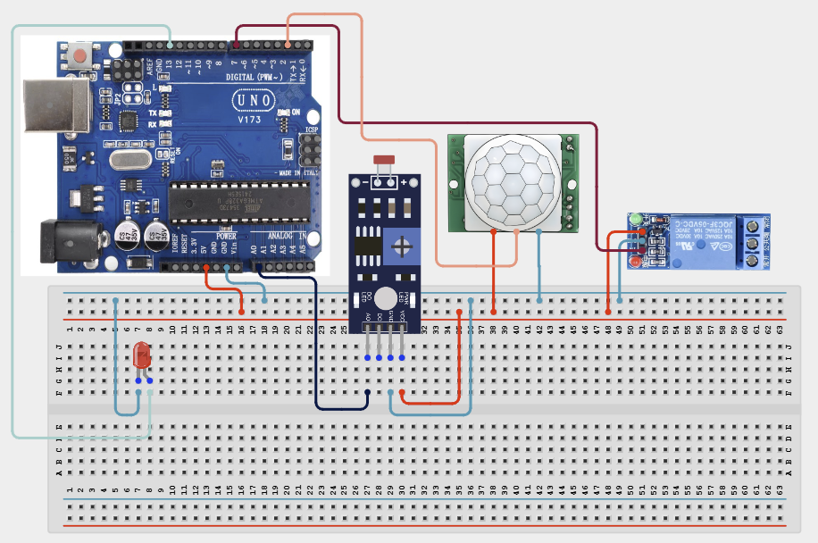

# 4.1.26. Ambient Light  Motion Streetlight

| **Description** In Project 81, learners will engineer an advanced 'Ambient Light & Motion Streetlight' multi-component system. This design integrates Photoresistor + PIR Motion Sensor + Relay Module + LED into a cohesive industrial automation unit.|------------------|----------------------------------------------------------------|
| **Use case**     |This project connects to real-world industrial and IoT applications such as: Project 81 provides essential master-level engineering skills for real-world IoT, safety, and control systems.|

## Components (Things You will need)

|  |  |  |  |  |  |  |
| --- | --- | --- | --- | --- | --- | --- |

## Building the circuit

Things Needed:

- Arduino Uno Core Board = 1
- Photoresistor = 1
- PIR Motion Sensor = 1
- Relay Module = 1
- USB Cable & Jumper Wires = 1
- Bread Board


## Mounting the component on the breadboard and wiring the circuit

**Step 1:** Inventory all modules listed in the Required Components table.

**Step 2:** Connect line [Sensor / Input Leads] to [Analog / Digital Pins] — (Primary signal input bus.).

**Step 3:** Connect line [Actuator / Display Leads] to [PWM / I2C Bus Pins] — (Primary control output bus.).

**Step 4:** Connect line [VCC / Power Lines] to [5V / 3.3V] — (System power rails.).

**Step 5:** Connect line [GND Lines] to [GND] — (Common ground reference.).

**Step 6:** Double-check all VCC, 5V, 3.3V, and GND polarities to prevent electrical shorts.

**Step 7:** Connect USB programming cable only after verifying all signal path wiring.



_Make sure to connect the Arduino USB cable to the Arduino board._

## PROGRAMMING

**Step 1:** Open your Arduino IDE. See how to set up here: [Getting Started](../../../Getting Started/Arduino_IDE_Setup.md).

**Step 2:** Write the complete program implementing the system logic with appropriate pin definitions, setup configuration, and the main control loop.

```cpp
// Project 81: Ambient Light & Motion Streetlight
const int LDR_PIN = A0;
const int PIR_PIN = 2;
const int RELAY_PIN = 7;
const int LED_PIN = 13;
const int LIGHT_THRESHOLD = 300;

void setup() {
  pinMode(LDR_PIN, INPUT);
  pinMode(PIR_PIN, INPUT);
  pinMode(RELAY_PIN, OUTPUT);
  pinMode(LED_PIN, OUTPUT);
  Serial.begin(9600);
  Serial.println("System Initialized...");
}

void loop() {
  int lightLevel = analogRead(LDR_PIN);
  int motionStatus = digitalRead(PIR_PIN);

  if (lightLevel < LIGHT_THRESHOLD && motionStatus == HIGH) {
    digitalWrite(RELAY_PIN, HIGH);
    digitalWrite(LED_PIN, HIGH);
    Serial.println("Night + Motion: Streetlight ON");
  } else {
    digitalWrite(RELAY_PIN, LOW);
    digitalWrite(LED_PIN, LOW);
  }
  delay(500);
}
```

**Step 7:** Save your code. _See the [Getting Started](../../../Getting Started/Arduino_IDE_Setup.md) section_

**Step 8:** Select the arduino board and port _See the [Getting Started](../../../Getting Started/Arduino_IDE_Setup.md) section:Selecting Arduino Board Type and Uploading your code_.

**Step 9:** Upload your code. _See the [Getting Started](../../../Getting Started/Arduino_IDE_Setup.md) section:Selecting Arduino Board Type and Uploading your code_

## CONCLUSION

The system responds dynamically when physical conditions cross pre-programmed setpoints, driving output devices reliably.
