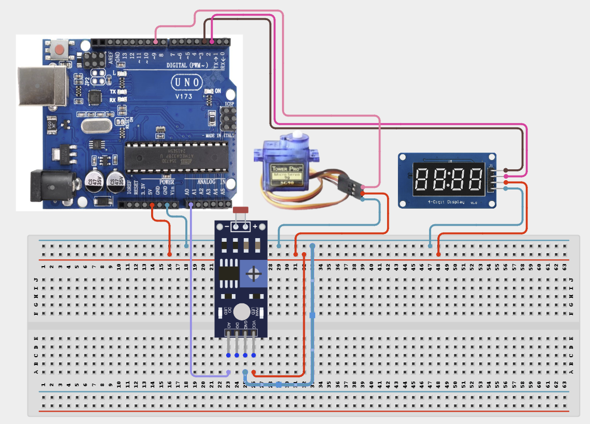

# Project 4.1.32: Solar Tracker Position Simulator

| **Description** In Project 87, learners will engineer an advanced 'Solar Tracker Position Simulator' multi-component system. This design integrates Photoresistor + Servo Motor SG90 + TM1637 4-Digit Display into a cohesive industrial automation unit.|------------------|----------------------------------------------------------------|
| **Use case**     |This project connects to real-world industrial and IoT applications such as: Project 87 provides essential master-level engineering skills for real-world IoT, safety, and control systems.|

## Components (Things You will need)

|  |  |  |  | | | |
|------------------------------------------------------ | ----------------------------------------------------------- | --------------------------------------------------------- | ------------------------------------------------------ | ------------------------------------------------------ |------------------------------------------------------ |------------------------------------------------------ |

## Building the circuit

Things Needed:

- Arduino Uno Core Board
- Photoresistor
- Servo Motor SG90
- TM1637 4-Digit Display
- USB Cable & Jumper Wires

## Mounting the component on the breadboard and wiring the circuit

**Step 1:** Connect the Arduino 5V pin to the breadboard's positive (+) power rail and the Arduino GND pin to the negative (-) power rail.

**Step 2:** Place the Photoresistor on the breadboard.
  - Connect one leg to the 5V power rail on the breadboard
  - Connect the other leg to Analog Pin A0 and also to the ground rail on the breadboard through a 10kΩ pull-down resistor

**Step 3:** Place the Servo Motor SG90 on the breadboard.
  - Connect the red wire to the 5V power rail on the breadboard
  - Connect the brown wire to the ground rail on the breadboard
  - Connect the orange/yellow control wire to Digital Pin 9

**Step 4:** Place the TM1637 4-Digit Display on the breadboard.
  - Connect the VCC pin to the 5V power rail on the breadboard
  - Connect the GND pin to the ground rail on the breadboard
  - Connect the CLK pin to Digital Pin 3
  - Connect the DIO pin to Digital Pin 2

**Step 5:** Ensure all components share a common GND connection, then verify all wiring before connecting the Arduino Uno to your computer using the USB cable.



**Step 6:** After confirming that all connections are correct, connect the USB cable to the Arduino Uno board and the computer to power the circuit.

_Make sure to connect the Arduino USB cable to the Arduino board._

## PROGRAMMING

**Step 1:** Open your Arduino IDE. See how to set up here: [Getting Started](../../../Getting Started/Arduino_IDE_Setup.md).

**Step 2:** Write the complete program implementing the system logic with appropriate pin definitions, setup configuration, and the main control loop.

```cpp
#include <Servo.h>
#include <TM1637Display.h>

const int photoResistorPin = A0;
const int servoPin = 9;
const int CLK = 3;
const int DIO = 2;

Servo myservo;
TM1637Display display(CLK, DIO);

void setup() {
  Serial.begin(9600);
  myservo.attach(servoPin);
  display.setBrightness(0x0f);
  Serial.println("Project 87: Solar Tracker Position Simulator Initialized...");
}

void loop() {
  int sensorValue = analogRead(photoResistorPin);
  int angle = map(sensorValue, 0, 1023, 0, 180);
  myservo.write(angle);
  display.showNumberDec(sensorValue);
  delay(500);
}
```

**Step 7:** Save your code. _See the [Getting Started](../../../Getting Started/Arduino_IDE_Setup.md) section_

**Step 8:** Select the arduino board and port _See the [Getting Started](../../../Getting Started/Arduino_IDE_Setup.md) section:Selecting Arduino Board Type and Uploading your code_.

**Step 9:** Upload your code. _See the [Getting Started](../../../Getting Started/Arduino_IDE_Setup.md) section:Selecting Arduino Board Type and Uploading your code_

## CONCLUSION

The system responds dynamically when physical conditions cross pre-programmed setpoints, driving output devices reliably.
