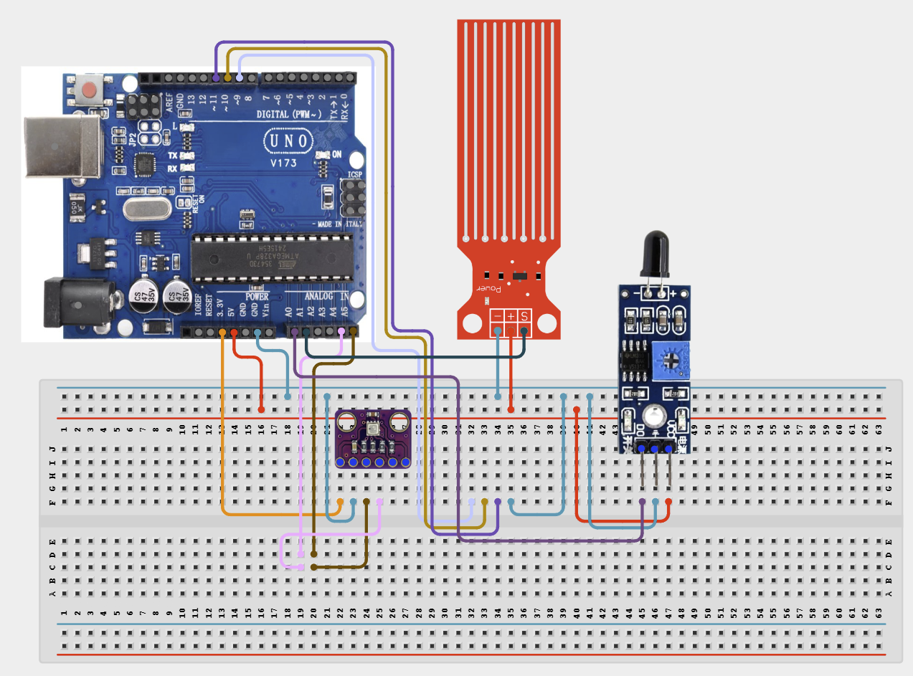

# Project 4.1.35: Master Safety Monitoring Station

| **Description** In Project 90, learners will engineer an advanced 'Master Safety Monitoring Station' multi-component system. This design integrates BME280 + Flame Sensor + Water Test Module + IIC 1602 LCD + Buzzer + Relay Module into a cohesive industrial automation unit.|------------------|----------------------------------------------------------------|
| **Use case**     |This project connects to real-world industrial and IoT applications such as: Project 90 provides essential master-level engineering skills for real-world IoT, safety, and control systems.|

## Components (Things You will need)

|  |  |  |  | | | |
|------------------------------------------------------ | ----------------------------------------------------------- | --------------------------------------------------------- | ------------------------------------------------------ | ------------------------------------------------------ |------------------------------------------------------ |------------------------------------------------------ |

## Building the circuit

Things Needed:

- Arduino Uno Core Board
- BME280
- Flame Sensor
- Water Test Module
- USB Cable & Jumper Wires

## Mounting the component on the breadboard and wiring the circuit

**Step 1:** Connect the Arduino 5V pin to the breadboard's positive (+) power rail and the Arduino GND pin to the negative (-) power rail.

**Step 2:** Place the BME280 Sensor on the breadboard.
  - Connect the VCC pin to the 3.3V pin on the Arduino Uno
  - Connect the GND pin to the ground rail on the breadboard
  - Connect the SDA pin to Analog Pin A4 (SDA)
  - Connect the SCL pin to Analog Pin A5 (SCL)

**Step 3:** Place the Flame Sensor on the breadboard.
  - Connect the VCC pin to the 5V power rail on the breadboard
  - Connect the GND pin to the ground rail on the breadboard
  - Connect the DO pin to Analog Pin A0

**Step 4:** Place the Water Test Module on the breadboard.
  - Connect the VCC pin to the 5V power rail on the breadboard
  - Connect the GND pin to the ground rail on the breadboard
  - Connect the Signal (S) pin to Analog Pin A1
  
**Step 5:** Place the Active Buzzer on the breadboard.
  - Connect its positive (+) pin to Digital Pin 9
  - Connect its negative (-) pin to the ground rail on the breadboard
  
**Step 6:** Place the Relay Module on the breadboard.
  - Connect the VCC pin to the 5V power rail on the breadboard
  - Connect the GND pin to the ground rail on the breadboard
  - Connect the IN pin to Digital Pin 8

**Step 7:** Ensure all components share a common GND connection, then verify all wiring before connecting the Arduino Uno to your computer using the USB cable.



**Step 8:** After confirming that all connections are correct, connect the USB cable to the Arduino Uno board and the computer to power the circuit.

_Make sure to connect the Arduino USB cable to the Arduino board._

## PROGRAMMING

**Step 1:** Open your Arduino IDE. See how to set up here: [Getting Started](../../../Getting Started/Arduino_IDE_Setup.md).

**Step 2:** Write the complete program implementing the system logic with appropriate pin definitions, setup configuration, and the main control loop.

```cpp
// Project 90: Master Safety Monitoring Station
#include <Wire.h>
#include <LiquidCrystal_I2C.h>
#include <Adafruit_BME280.h>

LiquidCrystal_I2C lcd(0x27, 16, 2);
Adafruit_BME280 bme;

const int flamePin = A0;
const int waterPin = A1;
const int buzzerPin = 9;
const int relayPin = 8;

void setup() {
  Serial.begin(9600);
  lcd.init();
  lcd.backlight();
  if (!bme.begin(0x76)) {
    Serial.println("Could not find a valid BME280 sensor!");
  }
  pinMode(flamePin, INPUT);
  pinMode(waterPin, INPUT);
  pinMode(buzzerPin, OUTPUT);
  pinMode(relayPin, OUTPUT);
  Serial.println("Project 90: Master Safety Monitoring Station Initialized...");
}

void loop() {
  // Read sensor values
  float temperature = bme.readTemperature();
  int flameValue = analogRead(flamePin);
  int waterValue = analogRead(waterPin);

  // Display on LCD
  lcd.setCursor(0, 0);
  lcd.print("T: ");
  lcd.print(temperature);
  lcd.print("C");
  
  // Logic: Trigger alarm if flame detected or water level high
  if (flameValue < 500 || waterValue > 500) {
    digitalWrite(buzzerPin, HIGH);
    digitalWrite(relayPin, HIGH);
    lcd.setCursor(0, 1);
    lcd.print("ALERT!          ");
  } else {
    digitalWrite(buzzerPin, LOW);
    digitalWrite(relayPin, LOW);
    lcd.setCursor(0, 1);
    lcd.print("Normal          ");
  }
  delay(500);
}
```

**Step 7:** Save your code. _See the [Getting Started](../../../Getting Started/Arduino_IDE_Setup.md) section_

**Step 8:** Select the arduino board and port _See the [Getting Started](../../../Getting Started/Arduino_IDE_Setup.md) section:Selecting Arduino Board Type and Uploading your code_.

**Step 9:** Upload your code. _See the [Getting Started](../../../Getting Started/Arduino_IDE_Setup.md) section:Selecting Arduino Board Type and Uploading your code_

## CONCLUSION

The system responds dynamically when physical conditions cross pre-programmed setpoints, driving output devices reliably.
