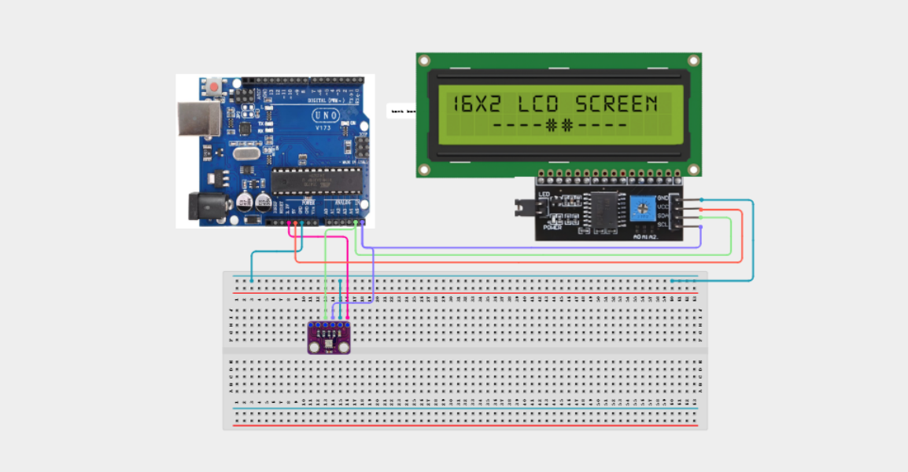

# Project 4.1.7: BME280 LCD Environmental Monitor

| **Description** In this expert project, learners will combine the high-precision BME280 environmental sensor with an IIC 1602 Liquid Crystal Display (LCD) to build a standalone, real-time environmental monitoring station. The system continuously reads atmospheric temperature, relative humidity, and barometric pressure, displaying formatted readings directly on the LCD screen without needing a computer serial monitor connection.|------------------|----------------------------------------------------------------|
| **Use case**     |This project connects to real-world industrial and IoT applications such as: Multi-device I2C architecture enables compact, highly capable weather station builds.|

## Components (Things You will need)

|  |  |  |  | | | |
|------------------------------------------------------ | ----------------------------------------------------------- | --------------------------------------------------------- | ------------------------------------------------------ | ------------------------------------------------------ |------------------------------------------------------ |------------------------------------------------------ |

## Building the circuit

Things Needed:

- Arduino Uno Board
- BME280 Sensor Module
- IIC 1602 LCD Module
- 830-point Breadboard
- Male to Female Jumper Wires
- USB Cable

## Mounting the component on the breadboard and wiring the circuit

**Step 1:** Connect the Arduino 5V pin to the breadboard's positive (+) power rail and the Arduino GND pin to the negative (-) power rail.

**Step 2:** Place the BME280 Sensor Module on the breadboard.
  - Connect the VCC pin to the 3.3V pin on the Arduino Uno
  - Connect the GND pin to the ground rail on the breadboard
  - Connect the SDA pin to Analog Pin A4 (SDA)
  - Connect the SCL pin to Analog Pin A5 (SCL)

**Step 3:** Place the IIC 1602 LCD Module on the breadboard.
  - Connect the VCC pin to the 5V power rail on the breadboard
  - Connect the GND pin to the ground rail on the breadboard
  - Connect the SDA pin to Analog Pin A4 (SDA)
  - Connect the SCL pin to Analog Pin A5 (SCL)

**Step 4:** Ensure all components share a common GND connection, then verify all wiring before connecting the Arduino Uno to your computer using the USB cable.



**Step 5:** After confirming that all connections are correct, connect the USB cable to the Arduino Uno board and the computer to power the circuit.

_Make sure to connect the Arduino USB cable to the Arduino board._

## PROGRAMMING

**Step 1:** Open your Arduino IDE. See how to set up here: [Getting Started](../../../Getting Started/Arduino_IDE_Setup.md).

**Step 2:** Write the complete program implementing the system logic with appropriate pin definitions, setup configuration, and the main control loop.

```cpp
// Project 62: BME280 LCD Environmental Monitor
#include <Wire.h>
#include <Adafruit_BME280.h>
#include <LiquidCrystal_I2C.h>

Adafruit_BME280 bme;
LiquidCrystal_I2C lcd(0x27, 16, 2);

unsigned long lastUpdate = 0;
const long interval = 2000;

void setup() {
  Wire.begin();
  lcd.init();
  lcd.backlight();
  lcd.setCursor(0, 0);
  lcd.print("BME280 Station");
  lcd.setCursor(0, 1);
  lcd.print("Initializing...");
  delay(1500);

  if (!bme.begin(0x76)) {
    lcd.clear();
    lcd.print("BME280 Error!");
    while (1);
  }
  lcd.clear();
}

void loop() {
  if (millis() - lastUpdate >= interval) {
    lastUpdate = millis();
    float temp = bme.readTemperature();
    float hum = bme.readHumidity();
    float pres = bme.readPressure() / 100.0F;

    lcd.setCursor(0, 0);
    lcd.print("T:"); lcd.print(temp, 1); lcd.print("C H:"); lcd.print(hum, 0); lcd.print("%");
    lcd.setCursor(0, 1);
    lcd.print("P:"); lcd.print(pres, 1); lcd.print(" hPa    ");
  }
}
```

**Step 7:** Save your code. _See the [Getting Started](../../../Getting Started/Arduino_IDE_Setup.md) section_

**Step 8:** Select the arduino board and port _See the [Getting Started](../../../Getting Started/Arduino_IDE_Setup.md) section:Selecting Arduino Board Type and Uploading your code_.

**Step 9:** Upload your code. _See the [Getting Started](../../../Getting Started/Arduino_IDE_Setup.md) section:Selecting Arduino Board Type and Uploading your code_

## CONCLUSION

The screen shows initialization text for 1.5 seconds, then presents continuous live temperature, humidity, and atmospheric pressure.
