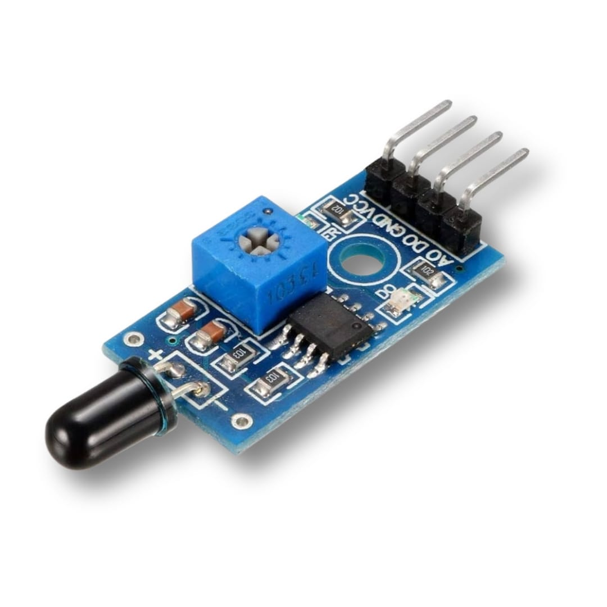

# 4.1.8. Smart Fire Safety  Alarm System

| **Description**| In this project, learners will combine a Flame Sensor Module, a 5V Relay Module, an Active Buzzer, and a Red LED. Upon flame detection, the system triggers audio alarms, flashes emergency LEDs, and trips an isolation relay.|
|------------------|----------------------------------------------------------------|
| **Use case**     |This project connects to real-world industrial and IoT applications such as: Essential multi-stage safety framework for industrial fire suppression installations.|

## Components (Things You will need)

|  |  |  |  | | | | | |
|------------------------------------------------------ | ----------------------------------------------------------- | --------------------------------------------------------- | ------------------------------------------------------ | ------------------------------------------------------ |------------------------------------------------------ |------------------------------------------------------ |------------------------------------------------------ |------------------------------------------------------ |

## Building the circuit

Things Needed:

- Arduino Uno Board = 1
- Flame Sensor Module = 1
- 5V Relay Module = 1
- Buzzer = 1
- Red LED = 1
- 220Ω Resistor = 1
- Breadboard = 1
- Jumper Wires = 10

## Mounting the component on the breadboard and wiring the circuit

**Step 1:** Identify the Components

Identify all the modules and components listed in the Required Components table before starting the assembly.

**Step 2:** Connect the Flame Sensor

Connect the DO (Digital Output) pin of the flame sensor to Pin 2 on the Arduino Uno board using a jumper wire. This provides the digital flame detection signal.

**Step 3:** Connect the Relay Module

Connect the IN (Signal) pin of the relay module to Pin 7 on the Arduino Uno board using a jumper wire. This allows the Arduino to control the relay.

**Step 4:** Connect the Buzzer

Connect the positive (+) pin of the buzzer to Pin 8 on the Arduino Uno board using a jumper wire. This provides the audio alert signal.

**Step 5:** Connect the LED

Connect the anode (positive leg) of the red LED to Pin 13 on the Arduino Uno board through a 220Ω resistor. Connect the cathode (negative leg) to GND using a jumper wire.

**Step 6:** Check the Power and Ground Connections

Double-check all VCC, 5V, 3.3V, and GND connections to ensure that the polarity is correct and there are no accidental short circuits.

**Step 7:** Connect the USB Cable

After verifying all signal, power, and ground connections, connect the USB programming cable to the Arduino Uno board and the computer.


_Make sure to connect the Arduino USB cable to the Arduino board._

## PROGRAMMING

**Step 1:** Open your Arduino IDE. See how to set up here: [Getting Started](../../../Getting Started/Arduino_IDE_Setup.md).

**Step 2:** Write the complete program implementing the system logic with appropriate pin definitions, setup configuration, and the main control loop.

```cpp
// Project 63: Smart Fire Safety & Alarm System
const int flamePin = 2;
const int relayPin = 7;
const int buzzerPin = 8;
const int ledPin = 13;

void setup() {
  pinMode(flamePin, INPUT);
  pinMode(relayPin, OUTPUT);
  pinMode(buzzerPin, OUTPUT);
  pinMode(ledPin, OUTPUT);
  digitalWrite(relayPin, LOW);
  digitalWrite(buzzerPin, LOW);
  digitalWrite(ledPin, LOW);
}

void loop() {
  if (digitalRead(flamePin) == LOW) {
    digitalWrite(relayPin, HIGH);
    digitalWrite(ledPin, HIGH);
    digitalWrite(buzzerPin, HIGH);
    delay(100);
    digitalWrite(buzzerPin, LOW);
    delay(100);
  } else {
    digitalWrite(relayPin, LOW);
    digitalWrite(ledPin, LOW);
    digitalWrite(buzzerPin, LOW);
    delay(200);
  }
}
```

**Step 3:** Save your code. _See the [Getting Started](../../../Getting Started/Arduino_IDE_Setup.md) section_

**Step 4:** Select the arduino board and port _See the [Getting Started](../../../Getting Started/Arduino_IDE_Setup.md) section:Selecting Arduino Board Type and Uploading your code_.

**Step 5:** Upload your code. _See the [Getting Started](../../../Getting Started/Arduino_IDE_Setup.md) section:Selecting Arduino Board Type and Uploading your code_

## CONCLUSION

Detecting fire immediately trips the power relay and triggers pulsing alarms.
