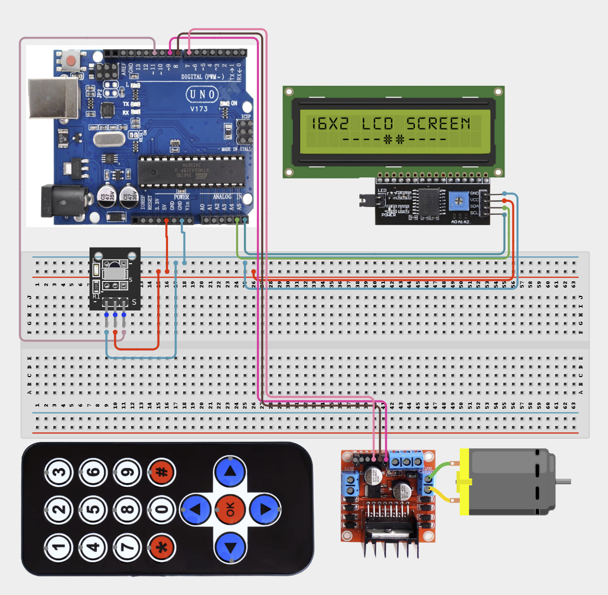

# 4.2.17. Multi Button Remote Fan Speed Switcher

| **Description** In Project 107, learners will construct an expert interactive system titled 'Multi-Button Remote Fan Speed Switcher'. This manual details the complete synthesis of IR Receiver + Remote + DC Motor + L298N Driver + IIC 1602 LCD into an intuitive, high-performance automated control platform.|------------------|----------------------------------------------------------------|
| **Use case**     |This project connects to real-world industrial and IoT applications such as: Project 107 equips students with professional skills in embedded human-machine interface (HMI) design and automated motion control.|

## Components (Things You will need)

|  |  |  |  | | | |
|------------------------------------------------------ | ----------------------------------------------------------- | --------------------------------------------------------- | ------------------------------------------------------ | ------------------------------------------------------ |------------------------------------------------------ |------------------------------------------------------ |

## Building the circuit

Things Needed:

- Arduino Uno Core Board
- IR Receiver
- Remote
- DC Motor/L298N
- USB Cable & Jumper Wires

## Mounting the component on the breadboard and wiring the circuit

**Step 1:** Connect the Arduino 5V pin to the breadboard's positive (+) power rail and the Arduino GND pin to the negative (-) power rail.

**Step 2:** Place the IR Receiver on the breadboard.
  - Connect the VCC pin to the 5V power rail on the breadboard
  - Connect the GND pin to the ground rail on the breadboard
  - Connect the OUT/Signal pin to Digital Pin 11

**Step 3:** Place the DC Motor and L298N Motor Driver on the breadboard.
  - Connect the 5V pin to the 5V power rail on the breadboard
  - Connect the GND pin to the ground rail on the breadboard
  - Connect ENA to Digital Pin 9
  - Connect IN1 to Digital Pin 8
  - Connect IN2 to Digital Pin 7
  - Connect the DC motor to the driver's OUT1 and OUT2 terminals

**Step 4:** Ensure all components share a common GND connection, then verify all wiring before connecting the Arduino Uno to your computer using the USB cable.



**Step 5:** After confirming that all connections are correct, connect the USB cable to the Arduino Uno board and the computer to power the circuit.

_Make sure to connect the Arduino USB cable to the Arduino board._

## PROGRAMMING

**Step 1:** Open your Arduino IDE. See how to set up here: [Getting Started](../../../Getting Started/Arduino_IDE_Setup.md).

**Step 2:** Write the complete program implementing the system logic with appropriate pin definitions, setup configuration, and the main control loop.

```cpp
#include <IRremote.h>
#include <Wire.h>
#include <LiquidCrystal_I2C.h>

// Define pins based on connection guide
const int IR_PIN = 11;
const int ENA = 9;
const int IN1 = 8;
const int IN2 = 7;

LiquidCrystal_I2C lcd(0x27, 16, 2);

void setup() {
  Serial.begin(9600);
  IrReceiver.begin(IR_PIN);
  lcd.init();
  lcd.backlight();
  pinMode(ENA, OUTPUT);
  pinMode(IN1, OUTPUT);
  pinMode(IN2, OUTPUT);
  Serial.println("System Online");
}

void loop() {
  if (IrReceiver.decode()) {
    // Add logic here to process specific remote button codes
    // Use analogWrite(ENA, speed) to control fan speed
    IrReceiver.resume();
  }
}

```

**Step 7:** Save your code. _See the [Getting Started](../../../Getting Started/Arduino_IDE_Setup.md) section_

**Step 8:** Select the arduino board and port _See the [Getting Started](../../../Getting Started/Arduino_IDE_Setup.md) section:Selecting Arduino Board Type and Uploading your code_.

**Step 9:** Upload your code. _See the [Getting Started](../../../Getting Started/Arduino_IDE_Setup.md) section:Selecting Arduino Board Type and Uploading your code_

## CONCLUSION

Operating physical input devices instantly modifies actuator behavior and updates visual indicators in real time.
