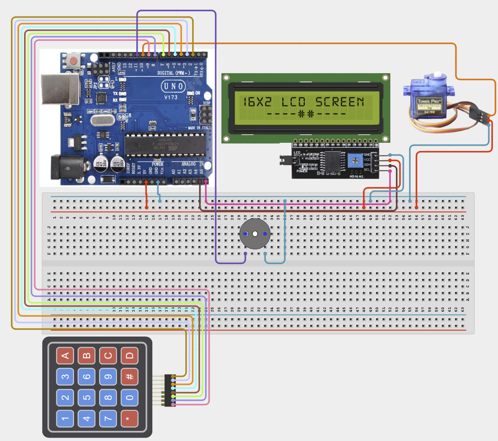

# 4.2.2. Keypad Digital Safe Lock Mechanism

| **Description** In Project 92, learners will construct an expert interactive system titled 'Keypad Digital Safe Lock Mechanism'. This manual details the complete synthesis of 4x4 Matrix Keypad + Servo Motor SG90 + IIC 1602 LCD + Active Buzzer into an intuitive, high-performance automated control platform.|------------------|----------------------------------------------------------------|
| **Use case**     |This project connects to real-world industrial and IoT applications such as: Project 92 equips students with professional skills in embedded human-machine interface (HMI) design and automated motion control.|

## Components (Things You will need)

|  |  |  |  | | | |
|------------------------------------------------------ | ----------------------------------------------------------- | --------------------------------------------------------- | ------------------------------------------------------ | ------------------------------------------------------ |------------------------------------------------------ |------------------------------------------------------ |

## Building the circuit

Things Needed:

- Arduino Uno Core Board
- 4x4 Matrix Keypad
- Servo Motor SG90
- IIC 1602 LCD
- USB Cable & Jumper Wires

## Mounting the component on the breadboard and wiring the circuit

**Step 1:** Connect the Arduino 5V pin to the breadboard's positive (+) power rail and the Arduino GND pin to the negative (-) power rail.

**Step 2:** Place the 4x4 Matrix Keypad on the breadboard.
  - Connect the 8 row and column pins to Digital Pins 9, 8, 7, 6, 5, 4, 3, and 2 respectively

**Step 3:** Place the Servo Motor SG90 on the breadboard.
  - Connect the red wire to the 5V power rail on the breadboard
  - Connect the brown wire to the ground rail on the breadboard
  - Connect the orange/yellow control wire to Digital Pin 10

**Step 4:** Place the IIC 1602 LCD on the breadboard.
  - Connect the VCC pin to the 5V power rail on the breadboard
  - Connect the GND pin to the ground rail on the breadboard
  - Connect the SDA pin to Analog Pin A4
  - Connect the SCL pin to Analog Pin A5

**Step 5:** Ensure all components share a common GND connection, then verify all wiring before connecting the Arduino Uno to your computer using the USB cable.



**Step 6:** After confirming that all connections are correct, connect the USB cable to the Arduino Uno board and the computer to power the circuit.

_Make sure to connect the Arduino USB cable to the Arduino board._

## PROGRAMMING

**Step 1:** Open your Arduino IDE. See how to set up here: [Getting Started](../../../Getting Started/Arduino_IDE_Setup.md).

**Step 2:** Write the complete program implementing the system logic with appropriate pin definitions, setup configuration, and the main control loop.

```cpp
// Project 92: Keypad Digital Safe Lock Mechanism
// Target Setup: 4x4 Matrix Keypad + Servo Motor SG90 + IIC 1602 LCD + Active Buzzer

void setup() {
  Serial.begin(9600);
  Serial.println("Project 92: Keypad Digital Safe Lock Mechanism Hardware Online");
}

void loop() {
  // Interactive input parsing and actuator drive routine
  delay(100);
}
```

**Step 7:** Save your code. _See the [Getting Started](../../../Getting Started/Arduino_IDE_Setup.md) section_

**Step 8:** Select the arduino board and port _See the [Getting Started](../../../Getting Started/Arduino_IDE_Setup.md) section:Selecting Arduino Board Type and Uploading your code_.

**Step 9:** Upload your code. _See the [Getting Started](../../../Getting Started/Arduino_IDE_Setup.md) section:Selecting Arduino Board Type and Uploading your code_

## CONCLUSION

Operating physical input devices instantly modifies actuator behavior and updates visual indicators in real time.
