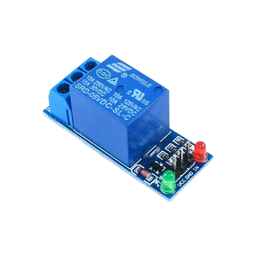
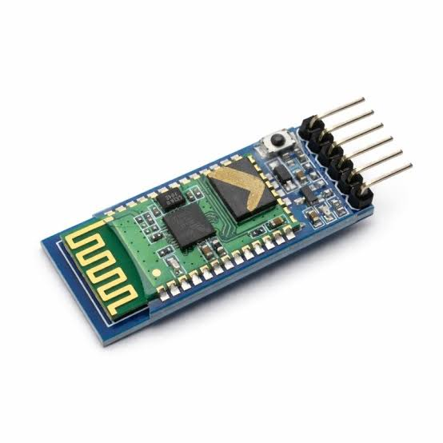

# 4.3.1. Bluetooth Smart Home Automation Hub

| **Description** In Project 121, learners will build an industrial-grade wireless home automation hub combining an HC-05 Bluetooth Module, a 4-Channel Relay Module, an IIC 1602 LCD, and an Active Buzzer. Users send wireless text commands from a smartphone terminal app to independently toggle up to 4 high-voltage appliance relays while monitoring channel statuses on the LCD.|------------------|----------------------------------------------------------------|
| **Use case**     |This project connects to real-world industrial and IoT applications such as: Wireless Bluetooth multi-channel relay hubs form the baseline architecture for modern commercial smart-home appliances.|

## Components (Things You will need)

|  |  |  |  |  |  |  |  |
| --- | --- | --- | --- | --- | --- | --- | --- |

## Building the circuit

Things Needed:

- Arduino Uno Core Board = 1
- HC-05 Bluetooth Module = 1
- 4-Channel Relay Module = 1
- IIC 1602 LCD Module = 1
- 5V Active Buzzer = 1
- USB Cable & Jumper Wires = 1
- Bread Board


## Mounting the component on the breadboard and wiring the circuit

**Step 1:** Inventory all modules listed in the Required Components table.

**Step 2:** Connect line [HC-05 TX / RX] to [Pins 10 / 11 (SoftwareSerial)] — (Wireless data channel.).

**Step 3:** Connect line [Relay IN1-IN4] to [Pins 4, 5, 6, 7] — (Relay switching control pins.).

**Step 4:** Connect line [IIC LCD SDA / SCL] to [Pins A4 / A5] — (I2C status screen bus.).

**Step 5:** Connect line [Buzzer (+)] to [Pin 8] — (Acoustic feedback pin.).

**Step 6:** Double-check all VCC, 5V, 3.3V, and GND polarities to prevent electrical shorts.

**Step 7:** Connect USB programming cable only after verifying all signal path wiring.


_Make sure to connect the Arduino USB cable to the Arduino board._

## PROGRAMMING

**Step 1:** Open your Arduino IDE. See how to set up here: [Getting Started](../../../Getting Started/Arduino_IDE_Setup.md).

**Step 2:** Write the complete program implementing the system logic with appropriate pin definitions, setup configuration, and the main control loop.

```cpp
// Project 121: Bluetooth Smart Home Automation Hub
#include <SoftwareSerial.h>
#include <Wire.h>
#include <LiquidCrystal_I2C.h>

SoftwareSerial BT(10, 11);
LiquidCrystal_I2C lcd(0x27, 16, 2);

void setup() {
  BT.begin(9600);
  lcd.init(); lcd.backlight();
  for(int p=4; p<=7; p++) pinMode(p, OUTPUT);
  pinMode(8, OUTPUT);
  lcd.print("Bluetooth Hub");
}

void loop() {
  if (BT.available()) {
    char cmd = BT.read();
    digitalWrite(8, HIGH); delay(50); digitalWrite(8, LOW);
    if (cmd == '1') digitalWrite(4, !digitalRead(4));
    lcd.setCursor(0, 1);
    lcd.print("Cmd Recv: "); lcd.print(cmd);
  }
}
```

**Step 7:** Save your code. _See the [Getting Started](../../../Getting Started/Arduino_IDE_Setup.md) section_

**Step 8:** Select the arduino board and port _See the [Getting Started](../../../Getting Started/Arduino_IDE_Setup.md) section:Selecting Arduino Board Type and Uploading your code_.

**Step 9:** Upload your code. _See the [Getting Started](../../../Getting Started/Arduino_IDE_Setup.md) section:Selecting Arduino Board Type and Uploading your code_

## CONCLUSION

Sending characters over Bluetooth instantly toggles corresponding relay contacts and emits confirmation audio beeps.
