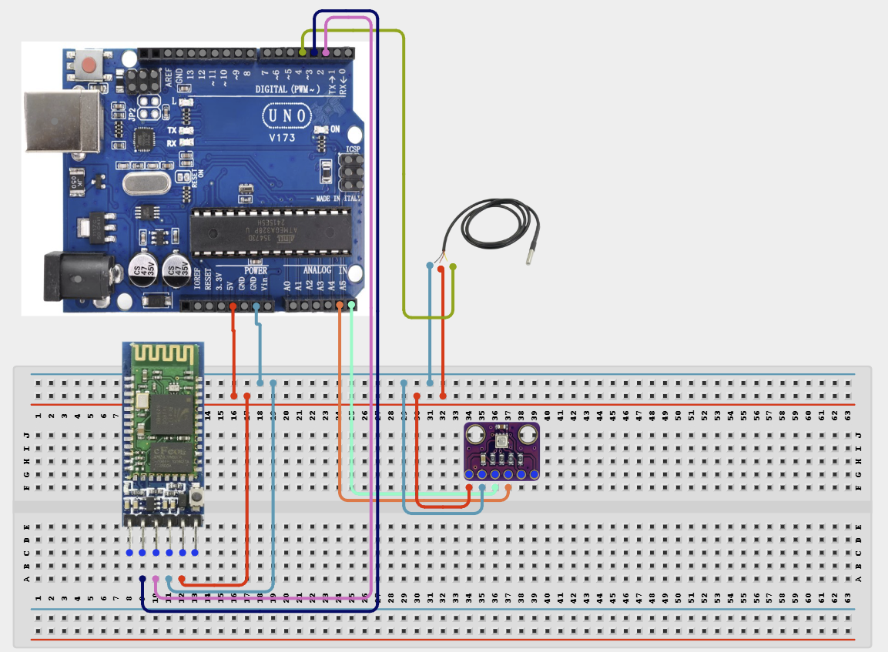

# 4.3.25. Bluetooth Telemetry Environmental Logger

| **Description** In Project 145, learners will build an expert wireless and automation system titled 'Bluetooth Telemetry Environmental Logger'. This manual details the synthesis of HC-05 Bluetooth + BME280 + DS18B20 + Active Buzzer into an industrial IoT automation solution.|------------------|----------------------------------------------------------------|
| **Use case**     |This project connects to real-world industrial and IoT applications such as: Project 145 provides master-level competency in wireless communication, industrial IoT architecture, and automated system integration.|

## Components (Things You will need)

|  |  |  |  | | | |
|------------------------------------------------------ | ----------------------------------------------------------- | --------------------------------------------------------- | ------------------------------------------------------ | ------------------------------------------------------ |------------------------------------------------------ |------------------------------------------------------ |

## Building the circuit

Things Needed:

- Arduino Uno Core Board = 1
- HC-05 Bluetooth = 1
- BME280 = 1
- DS18B20 = 1
- USB Cable & Jumper Wires = 1

## Mounting the component on the breadboard and wiring the circuit

**Step 1:** Inventory all modules listed in the Required Components table.

**Step 2:** Connect the HC-05 Bluetooth module (TX to Pin 2, RX to Pin 3) and the BME280 sensor (SDA to A4, SCL to A5).

**Step 3:** Connect the DS18B20 temperature sensor data pin to Pin 4 and the Active Buzzer to Pin 7.

**Step 4:** Connect line [Power Rails] to [5V / 3.3V / GND] — (System power and ground rails.).

**Step 5:** Double-check all VCC, 5V, 3.3V, and GND polarities to prevent electrical shorts.

**Step 6:** Connect USB programming cable only after verifying all signal path wiring.



_Make sure to connect the Arduino USB cable to the Arduino board._

## PROGRAMMING

**Step 1:** Open your Arduino IDE. See how to set up here: [Getting Started](../../../Getting Started/Arduino_IDE_Setup.md).

**Step 2:** Write the complete program implementing the system logic with appropriate pin definitions, setup configuration, and the main control loop.

```cpp
#include <SoftwareSerial.h>
#include <Wire.h>
#include <OneWire.h>
#include <DallasTemperature.h>

SoftwareSerial bluetooth(2, 3);
const int buzzerPin = 7;
OneWire oneWire(4);
DallasTemperature sensors(&oneWire);

void setup() {
  Serial.begin(9600);
  bluetooth.begin(9600);
  Wire.begin();
  sensors.begin();
  pinMode(buzzerPin, OUTPUT);
  Serial.println("Project 145: System Initialized");
}

void loop() {
  // Wireless telemetry and sensor processing
  delay(1000);
}
```

**Step 7:** Save your code. _See the [Getting Started](../../../Getting Started/Arduino_IDE_Setup.md) section_

**Step 8:** Select the arduino board and port _See the [Getting Started](../../../Getting Started/Arduino_IDE_Setup.md) section:Selecting Arduino Board Type and Uploading your code_.

**Step 9:** Upload your code. _See the [Getting Started](../../../Getting Started/Arduino_IDE_Setup.md) section:Selecting Arduino Board Type and Uploading your code_

## CONCLUSION

The system processes telemetry signals and security credentials in real time, driving relays, motors, and displays reliably.
