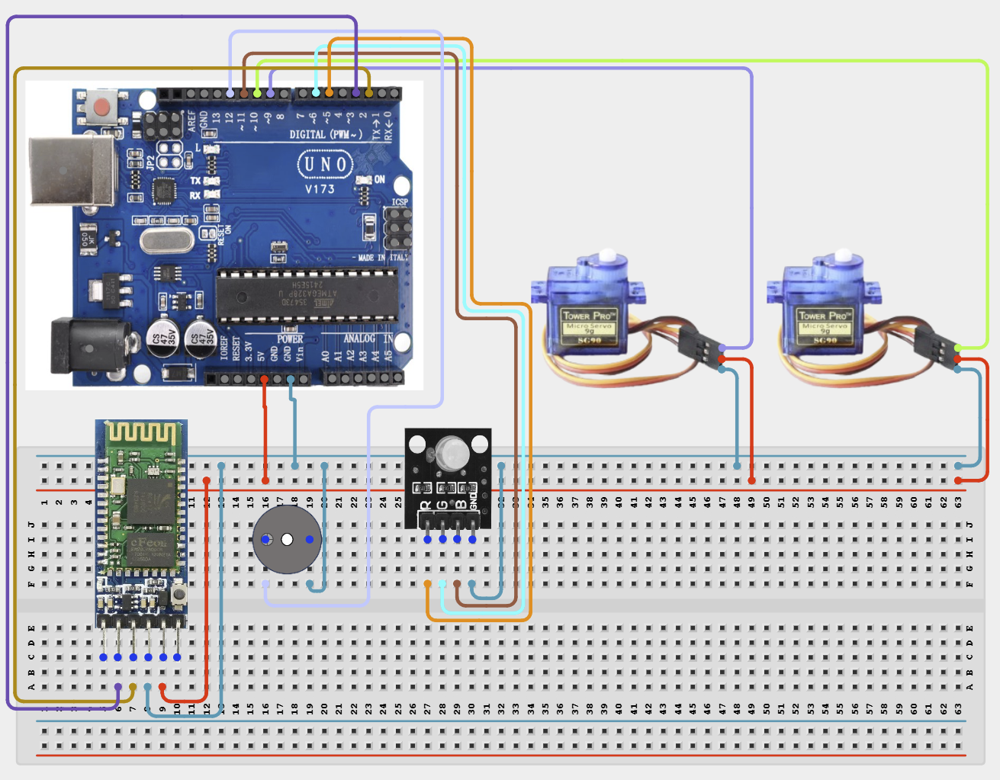

# Project 4.3.28: Bluetooth Controlled Pan Tilt Turret Camera

| **Description** In Project 148, learners will build an expert wireless and automation system titled 'Bluetooth Controlled Pan-Tilt Turret Camera'. This manual details the synthesis of HC-05 Bluetooth + 2 Servo Motors SG90 + RGB LED Module + Active Buzzer into an industrial IoT automation solution.|------------------|----------------------------------------------------------------|
| **Use case**     |This project connects to real-world industrial and IoT applications such as: Project 148 provides master-level competency in wireless communication, industrial IoT architecture, and automated system integration.|

## Components (Things You will need)

|  |  |  |  | | | |
|------------------------------------------------------ | ----------------------------------------------------------- | --------------------------------------------------------- | ------------------------------------------------------ | ------------------------------------------------------ |------------------------------------------------------ |------------------------------------------------------ |

## Building the circuit

Things Needed:

- Arduino Uno Core Board = 1
- HC-05 Bluetooth = 1
- 2 Servo Motors SG90 = 1
- RGB LED Module = 1
- USB Cable & Jumper Wires = 1

## Mounting the component on the breadboard and wiring the circuit

**Step 1:** Inventory all modules listed in the Required Components table.

**Step 2:** Connect the HC-05 Bluetooth TX to Arduino Pin 2 and RX to Pin 3.

**Step 3:** Wire Servo 1 (Pan) to Pin 9, Servo 2 (Tilt) to Pin 10, and the Active Buzzer to Pin 12.

**Step 4:** Connect the RGB LED Module pins R to Pin 5, G to Pin 6, and B to Pin 11.

**Step 5:** Connect all component VCC pins to the 5V rail and GND pins to the GND rail.

**Step 6:** Double-check all VCC, 5V, 3.3V, and GND polarities to prevent electrical shorts.

**Step 7:** Connect USB programming cable only after verifying all signal path wiring.



_Make sure to connect the Arduino USB cable to the Arduino board._

## PROGRAMMING

**Step 1:** Open your Arduino IDE. See how to set up here: [Getting Started](../../../Getting Started/Arduino_IDE_Setup.md).

**Step 2:** Write the complete program implementing the system logic with appropriate pin definitions, setup configuration, and the main control loop.

```cpp
#include <Servo.h>
#include <SoftwareSerial.h>

SoftwareSerial BT(2, 3); // TX, RX
Servo panServo;
Servo tiltServo;
const int redPin = 5, greenPin = 6, bluePin = 11;
const int buzzerPin = 12;

void setup() {
  Serial.begin(9600);
  BT.begin(9600);
  panServo.attach(9);
  tiltServo.attach(10);
  pinMode(redPin, OUTPUT);
  pinMode(greenPin, OUTPUT);
  pinMode(bluePin, OUTPUT);
  pinMode(buzzerPin, OUTPUT);
  Serial.println("Project 148 Online");
}

void loop() {
  if (BT.available()) {
    char command = BT.read();
    // Logic for controlling Servos based on command will go here
  }
}
```

**Step 7:** Save your code. _See the [Getting Started](../../../Getting Started/Arduino_IDE_Setup.md) section_

**Step 8:** Select the arduino board and port _See the [Getting Started](../../../Getting Started/Arduino_IDE_Setup.md) section:Selecting Arduino Board Type and Uploading your code_.

**Step 9:** Upload your code. _See the [Getting Started](../../../Getting Started/Arduino_IDE_Setup.md) section:Selecting Arduino Board Type and Uploading your code_

## CONCLUSION

The system processes telemetry signals and security credentials in real time, driving relays, motors, and displays reliably.
