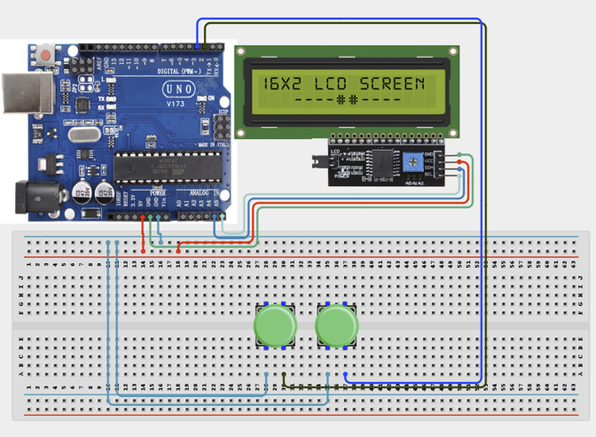

# 2.10. Electronic Auction System

| **Description** | In this project, learners will build a simple electronic auction system. Two participants compete by increasing their bids using separate buttons, and the LCD displays the current highest bid and the leading bidder. |
|------------------|----------------------------------------------------------------|
| **Use case**     | This project is connected to real-world uses such as: online bidding platforms, electronic auctions, and sales tracking systems. It demonstrates how comparison logic and user input can be used to manage competitive bidding and display live results. |

## Components (Things You will need)

|  |  |  |  |  |  |
| --- | --- | --- | --- | --- | --- |

## Building the circuit

Things Needed:

- Arduino Uno
- Push Buttons
- I2C LCD Display
- Breadboard
- Jumper Wires
- Arduino USB Cable

## Mounting the component on the breadboard and wiring the circuit

**Step 1:** Connect the power supply by connecting the 5V pin on the Arduino Uno to the positive rail on the breadboard and the GND pin to the negative rail.

**Step 2:** Place the two push buttons and the I2C LCD display on the breadboard. Ensure that the push buttons are positioned correctly across the center gap of the breadboard.

  - Connect one terminal of the first push button to Digital Pin 2 on the Arduino Uno.
  
  - Connect one terminal of the second push button to Digital Pin 3 on the Arduino Uno.
  
  - Connect the remaining terminals of both push buttons to the ground rail on the breadboard.

**Step 3:** Connect the I2C LCD display.

  - Connect the VCC pin of the I2C LCD display to the 5V power rail on the breadboard.
  
  - Connect the GND pin of the I2C LCD display to the ground rail on the breadboard.
  
  - Connect the SDA pin of the I2C LCD display to A4 on the Arduino Uno.
  
  - Connect the SCL pin of the I2C LCD display to A5 on the Arduino Uno using jumper wires.

**Step 4:** Compare all connections with the Circuit Connections table and the circuit diagram. Check that the push buttons are connected to the correct digital pins and that the LCD connections are correctly connected to 5V, GND, A4, and A5.



**Step 5:** After confirming that all connections are correct, connect the USB cable to the Arduino Uno board and the computer to power the circuit.

_Make sure to connect the Arduino USB cable to the Arduino board._

## PROGRAMMING

**Step 1:** Open your Arduino IDE. See how to set up here: [Getting Started](../../Getting Started/Arduino_IDE_Setup.md).

**Step 2:** Write the complete program implementing the system logic with appropriate pin definitions, setup configuration, and the main control loop.

```cpp

// LCD libraries
#include <Wire.h>
#include <LiquidCrystal_I2C.h>

// Create LCD object
LiquidCrystal_I2C lcd(0x27, 16, 2);

// Button pins
int player1Button = 2;
int player2Button = 3;

// Game variables
int highestBid = 0;
int leader = 0;

void setup() {
  // Configure buttons
  pinMode(player1Button, INPUT_PULLUP);
  pinMode(player2Button, INPUT_PULLUP);
  
  // Start LCD
  lcd.init();
  lcd.backlight();
  
  // Initial display
  lcd.setCursor(0, 0);
  lcd.print("Auction Started!");
  delay(2000);
  updateDisplay();
}

void loop() {
  // Player 1 bids
  if (digitalRead(player1Button) == LOW) {
    highestBid += 10;
    leader = 1;
    updateDisplay();
    delay(300); // Simple debounce and delay between bids
  }
  
  // Player 2 bids
  if (digitalRead(player2Button) == LOW) {
    highestBid += 10;
    leader = 2;
    updateDisplay();
    delay(300); // Simple debounce and delay between bids
  }
}

void updateDisplay() {
  lcd.clear();
  lcd.setCursor(0, 0);
  lcd.print("Highest Bid:$");
  lcd.print(highestBid);
  
  lcd.setCursor(0, 1);
  if (leader == 0) {
    lcd.print("Waiting for bids");
  } else {
    lcd.print("Bidder ");
    lcd.print(leader);
    lcd.print(" leads");
  }
}
```

**Step 3:** Save your code. _See the [Getting Started](../../Getting Started/Arduino_IDE_Setup.md) section_

**Step 4:** Select the arduino board and port _See the [Getting Started](../../Getting Started/Arduino_IDE_Setup.md) section:Selecting Arduino Board Type and Uploading your code_.

**Step 5:** Upload your code. _See the [Getting Started](../../Getting Started/Arduino_IDE_Setup.md) section:Selecting Arduino Board Type and Uploading your code_

## CONCLUSION

The Electronic Auction System powers on and waits for user input. When a participant presses their button, the system registers the bid, increases the highest bid amount, and updates the LCD display. The display provides real-time feedback, showing the current highest bid and the leading bidder, demonstrating how microcontrollers can manage competitive inputs and provide interactive feedback.
