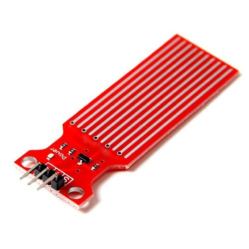

# 2.11. Intelligent Water Tank Monitor

| **Description** | This project introduces liquid level monitoring, threshold detection, and alert systems commonly used in homes, industries, and agricultural facilities. |
|------------------|----------------------------------------------------------------|
| **Use case**     | This project is connected to real-world uses such as: This project demonstrates how sensor data can be used to monitor resources and generate alerts. Similar systems are used in overhead tanks, industrial reservoirs, and agricultural water management systems. |

## Components (Things You will need)

|  |  |  |  |  |  |  |
| --- | --- | --- | --- | --- | --- | --- |

## Building the circuit

Things Needed:

- Arduino Uno
- Arduino USB Cable
- Breadboard
- Jumper Wires
- Water Level Sensor
- Buzzer
- LCD Display

## Mounting the component on the breadboard and wiring the circuit

**Step 1:** Connect the power supply by connecting the 5V pin on the Arduino Uno to the positive rail on the breadboard and the GND pin to the negative rail.

**Step 2:** Place the Water Level Sensor, buzzer and I2C LCD Display on the breadboard.

  - Connect the Water Level Sensor by connecting Signal to Analog Pin A0, VCC to the 5V rail, and GND to the ground rail. 

  - Connect the Buzzer by connecting the Positive (+) terminal to Digital Pin 8 and the Negative (-) terminal to the ground rail. 

  - Connect the I2C LCD by connecting SDA to A4, SCL to A5 on the Arduino board, VCC to the 5V rail, and GND to the ground rail.

**Step 3:** Ensure that all GND connections share the same ground line to maintain stable power distribution and reliable circuit operation.


**Step 4:** After confirming that all connections are correct, connect the USB cable to the Arduino Uno board and the computer to power the circuit.

_Make sure to connect the Arduino USB cable to the Arduino board._

## PROGRAMMING

**Step 1:** Open your Arduino IDE. See how to set up here: [Getting Started](../../Getting Started/Arduino_IDE_Setup.md).

**Step 2:** Write the complete program implementing the system logic with appropriate pin definitions, setup configuration, and the main control loop.

```cpp
#include <Wire.h>
#include <LiquidCrystal_I2C.h>
// Create LCD object
LiquidCrystal_I2C lcd(0x27,16,2);
// Sensor and buzzer pins
int waterPin = A0;
int buzzerPin = 8;
void setup() {
  lcd.init();
  lcd.backlight();
  pinMode(buzzerPin, OUTPUT);
}
void loop() {
  // Read water level
  int waterLevel = analogRead(waterPin);
  // Display reading
  lcd.setCursor(0,0);
  lcd.print("Water:");
  lcd.print(waterLevel);
  lcd.print("    ");
  // Low water condition
  if(waterLevel < 200){
    digitalWrite(buzzerPin,HIGH);
    lcd.setCursor(0,1);
    lcd.print("Tank Low!     ");
  }
  // Medium water condition
  else if(waterLevel < 600){
    digitalWrite(buzzerPin,LOW);
    lcd.setCursor(0,1);
    lcd.print("Level Normal  ");
  }
  // High water condition
  else{
    digitalWrite(buzzerPin,HIGH);
    lcd.setCursor(0,1);
    lcd.print("Tank Full!    ");
  }
  delay(500);
}


```

**Step 3:** Save your code. _See the [Getting Started](../../Getting Started/Arduino_IDE_Setup.md) section_

**Step 4:** Select the arduino board and port _See the [Getting Started](../../Getting Started/Arduino_IDE_Setup.md) section:Selecting Arduino Board Type and Uploading your code_.

**Step 5:** Upload your code. _See the [Getting Started](../../Getting Started/Arduino_IDE_Setup.md) section:Selecting Arduino Board Type and Uploading your code_

## CONCLUSION

The Intelligent Water Tank Monitor successfully reads the analog values from the water level sensor and displays them on the LCD screen. By comparing these values against defined thresholds, it can trigger the buzzer to alert users when the tank is either empty or full, demonstrating how sensor data can automate monitoring systems.
