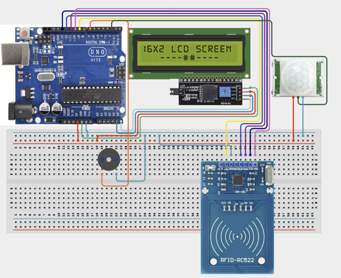

# 2.12. Multi Level Security Alarm

| **Description** | In this project, learners will build a security system that combines RFID authentication, motion detection, LCD notifications, and audible alarms. Authorized users gain access by scanning a registered RFID card, while unauthorized access or detected motion triggers an alarm. |
|------------------|----------------------------------------------------------------|
| **Use case**     | This project is connected to real-world uses such as: offices, warehouses, schools, and residential smart-security systems. It demonstrates multi-layered security principles used for access control, motion detection, and alert systems. |

## Components (Things You will need)

|  |  |  |  |  |  |  |  |
| --- | --- | --- | --- | --- | --- | --- | --- |

## Building the circuit

Things Needed:

- Arduino Uno
- Arduino USB Cable
- Breadboard
- Jumper Wires
- Motion Sensor
- RFID Tag/Card
- RFID Reader
- Buzzer
- LCD Display

## Mounting the component on the breadboard and wiring the circuit

**Step 1:** Connect the power supply by connecting the 5V pin on the Arduino Uno to the positive rail on the breadboard and the GND pin to the negative rail.

**Step 2:** Place the RFID Reader, Buzzer, PIR Sensor, and I2C LCD Display on the breadboard.

  - Connect the RFID MFRC522 module by connecting SDA to Digital Pin 10, SCK to Digital Pin 13, MOSI to Digital Pin 11, MISO to Digital Pin 12, and RST to Digital Pin 9 on the Arduino board.
  
  - Connect the 3.3V pin on the RFID reader to the 3.3V pin on the Arduino Uno, and GND to the ground rail.

  - Connect the I2C LCD Display by connecting SDA to A4 and SCL to A5 on the Arduino board, VCC to the 5V rail, and GND to the ground rail.

  - Connect the PIR Sensor by connecting the Signal pin to Digital Pin 2 on the Arduino board, VCC to the 5V rail, and GND to the ground rail.

  - Connect the Buzzer by connecting the Positive (+) terminal to Digital Pin 7 and the Negative (-) terminal to the ground rail.

**Step 3:** Ensure that all GND connections share the same ground line to maintain stable and reliable circuit operation.



**Step 4:** After confirming that all connections are correct, connect the USB cable to the Arduino Uno board and the computer to power the circuit.

_Make sure to connect the Arduino USB cable to the Arduino board._

## PROGRAMMING

**Step 1:** Open your Arduino IDE. See how to set up here: [Getting Started](../../Getting Started/Arduino_IDE_Setup.md).

**Step 2:** Write the complete program implementing the system logic with appropriate pin definitions, setup configuration, and the main control loop.

```cpp
#include <SPI.h>
#include <MFRC522.h>
#include <Wire.h>
#include <LiquidCrystal_I2C.h>

#define SS_PIN 10
#define RST_PIN 9

#define PIR_PIN 2
#define BUZZER_PIN 7

MFRC522 rfid(SS_PIN, RST_PIN);
LiquidCrystal_I2C lcd(0x27, 16, 2);

//----------------------------------------------------
// CHANGE THESE VALUES TO YOUR RFID CARD UID
//----------------------------------------------------
byte authorizedUID[4] = {0xDE, 0xAD, 0xBE, 0xEF};
// Example only.
// Replace with your own card UID.
//----------------------------------------------------

bool authorizedAccess = false;
unsigned long accessTimer = 0;
const unsigned long accessDuration = 10000;   //10 seconds

//----------------------------------------------------
void setup() {

  Serial.begin(9600);

  SPI.begin();
  rfid.PCD_Init();

  pinMode(PIR_PIN, INPUT);
  pinMode(BUZZER_PIN, OUTPUT);

  digitalWrite(BUZZER_PIN, LOW);

  lcd.init();
  lcd.backlight();

  lcd.clear();
  lcd.setCursor(0,0);
  lcd.print("Security");
  lcd.setCursor(0,1);
  lcd.print("System Ready");

  delay(2000);
  lcd.clear();

  Serial.println("Multi-Level Security Alarm Ready");
}

//----------------------------------------------------
void loop() {

  checkRFID();
  checkMotion();

  // Reset authorization after timeout
  if (authorizedAccess &&
      millis() - accessTimer > accessDuration) {

    authorizedAccess = false;

    lcd.clear();
    lcd.print("System Locked");
    delay(1500);
    lcd.clear();
  }
}

//----------------------------------------------------
// RFID CHECK
//----------------------------------------------------
void checkRFID() {

  if (!rfid.PICC_IsNewCardPresent())
    return;

  if (!rfid.PICC_ReadCardSerial())
    return;

  Serial.print("UID:");

  bool match = true;

  for (byte i = 0; i < 4; i++) {

    Serial.print(rfid.uid.uidByte[i], HEX);
    Serial.print(" ");

    if (rfid.uid.uidByte[i] != authorizedUID[i])
      match = false;
  }

  Serial.println();

  if (match) {

    authorizedAccess = true;
    accessTimer = millis();

    lcd.clear();
    lcd.setCursor(0,0);
    lcd.print("Access Granted");

    lcd.setCursor(0,1);
    lcd.print("Welcome!");

    tone(BUZZER_PIN, 2000, 150);

    Serial.println("Authorized Card");

  } else {

    authorizedAccess = false;

    lcd.clear();
    lcd.setCursor(0,0);
    lcd.print("Access Denied");

    lcd.setCursor(0,1);
    lcd.print("Unknown Card");

    alarm();

    Serial.println("Unauthorized Card");
  }

  rfid.PICC_HaltA();
  rfid.PCD_StopCrypto1();

  delay(1500);
  lcd.clear();
}

//----------------------------------------------------
// PIR CHECK
//----------------------------------------------------
void checkMotion() {

  int motion = digitalRead(PIR_PIN);

  if (motion == HIGH) {

    if (!authorizedAccess) {

      lcd.clear();

      lcd.setCursor(0,0);
      lcd.print("INTRUDER!");

      lcd.setCursor(0,1);
      lcd.print("Motion Detected");

      Serial.println("Unauthorized Motion");

      alarm();

      delay(1000);

      lcd.clear();

    } else {

      lcd.clear();

      lcd.setCursor(0,0);
      lcd.print("Authorized");

      lcd.setCursor(0,1);
      lcd.print("Movement");

      delay(500);

      lcd.clear();
    }
  }
}

//----------------------------------------------------
// BUZZER ALARM
//----------------------------------------------------
void alarm() {

  for (int i = 0; i < 5; i++) {

    tone(BUZZER_PIN, 1000);
    delay(150);

    noTone(BUZZER_PIN);
    delay(150);
  }
}

```

**Step 3:** Save your code. _See the [Getting Started](../../Getting Started/Arduino_IDE_Setup.md) section_

**Step 4:** Select the arduino board and port _See the [Getting Started](../../Getting Started/Arduino_IDE_Setup.md) section:Selecting Arduino Board Type and Uploading your code_.

**Step 5:** Upload your code. _See the [Getting Started](../../Getting Started/Arduino_IDE_Setup.md) section:Selecting Arduino Board Type and Uploading your code_

## CONCLUSION

The Multi-Level Security Alarm provides a robust demonstration of access control and intrusion detection. By scanning an authorized RFID card, the system temporarily grants access and suppresses alarms. If unauthorized motion is detected when the system is locked, or if an unrecognized card is scanned, the buzzer sounds and the LCD displays an alert, showcasing how different sensors can work together to secure an area.
