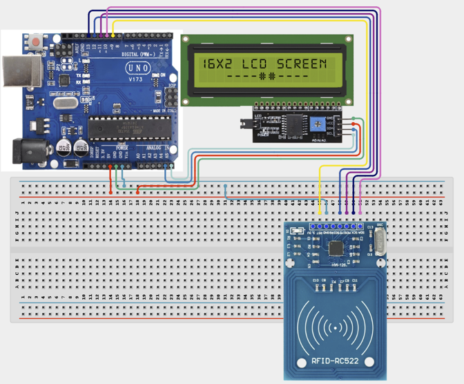

# 2.13. Smart Inventory Counter

| **Description** | This project uses RFID technology to automatically track items entering and leaving inventory. Every RFID tag represents an item, and the system updates the inventory count on an LCD display. |
|------------------|----------------------------------------------------------------|
| **Use case**     | This project is connected to real-world uses such as: retail stores, warehouses, logistics centers, and manufacturing facilities. It demonstrates how RFID and display systems can automate inventory tracking and asset management. |

## Components (Things You will need)

|  |  |  |  |  |  |  |
| --- | --- | --- | --- | --- | --- | --- |

## Building the circuit

Things Needed:

- Arduino Uno
- Arduino USB Cable
- Breadboard
- Jumper Wires
- RFID Tag/Card
- RFID Reader
- LCD Display

## Mounting the component on the breadboard and wiring the circuit

**Step 1:** Connect the power supply by connecting the 5V pin on the Arduino Uno to the positive power rail on the breadboard and the Arduino GND pin to the negative power rail.

**Step 2:** Place the RFID Reader (MFRC522) and the I2C LCD Display onto the breadboard.

  - Connect the RFID Reader (MFRC522) by connecting SDA to Digital Pin 10, SCK to Digital Pin 13, MOSI to Digital Pin 11, MISO to Digital Pin 12, RST to Digital Pin 9, 3.3V to the Arduino 3.3V pin, and GND to the ground rail.

  - Connect the I2C LCD Display by connecting SDA to A4, SCL to A5 on the Arduino board, VCC to the 5V rail, and GND to the ground rail.

**Step 3:** Ensure that all GND connections share the same ground line to maintain stable and reliable circuit operation. The RFID reader should be powered directly from the Arduino's 3.3V pin, as it operates at 3.3V, not 5V.



**Step 4:** Check the polarity and all wiring connections carefully before connecting the Arduino Uno to your computer via the USB cable to power the circuit.

_Make sure to connect the Arduino USB cable to the Arduino board._

## PROGRAMMING

**Step 1:** Open your Arduino IDE. See how to set up here: [Getting Started](../../Getting Started/Arduino_IDE_Setup.md).

**Step 2:** Write the complete program implementing the system logic with appropriate pin definitions, setup configuration, and the main control loop.

```cpp

#include <SPI.h>
#include <MFRC522.h>
#include <Wire.h>
#include <LiquidCrystal_I2C.h>

#define SS_PIN 10
#define RST_PIN 9

MFRC522 rfid(SS_PIN, RST_PIN);
LiquidCrystal_I2C lcd(0x27, 16, 2);

//--------------------------------------------------
// Maximum number of inventory items
//--------------------------------------------------
const int MAX_ITEMS = 20;

// Store scanned RFID UIDs
String inventory[MAX_ITEMS];

int inventoryCount = 0;

//--------------------------------------------------
void setup()
{
  Serial.begin(9600);

  SPI.begin();
  rfid.PCD_Init();

  lcd.init();
  lcd.backlight();

  lcd.clear();
  lcd.setCursor(0,0);
  lcd.print("Inventory");
  lcd.setCursor(0,1);
  lcd.print("System Ready");

  delay(2000);
  updateDisplay();
}

//--------------------------------------------------
void loop()
{

  if (!rfid.PICC_IsNewCardPresent())
    return;

  if (!rfid.PICC_ReadCardSerial())
    return;

  String uid = "";

  for (byte i = 0; i < rfid.uid.size; i++)
  {
    uid += String(rfid.uid.uidByte[i], HEX);
  }

  uid.toUpperCase();

  Serial.print("UID: ");
  Serial.println(uid);

  processInventory(uid);

  rfid.PICC_HaltA();
  rfid.PCD_StopCrypto1();

  delay(1000);
}

//--------------------------------------------------
void processInventory(String uid)
{

  // Check if already stored
  for (int i = 0; i < inventoryCount; i++)
  {

    if (inventory[i] == uid)
    {
      // Remove item
      for (int j = i; j < inventoryCount - 1; j++)
      {
        inventory[j] = inventory[j + 1];
      }

      inventoryCount--;

      lcd.clear();
      lcd.print("Item Removed");
      lcd.setCursor(0,1);
      lcd.print("Total:");
      lcd.print(inventoryCount);

      Serial.println("Item Removed");

      delay(1500);

      updateDisplay();
      return;
    }
  }

  // Add new item
  if (inventoryCount < MAX_ITEMS)
  {
    inventory[inventoryCount] = uid;
    inventoryCount++;

    lcd.clear();
    lcd.print("Item Added");
    lcd.setCursor(0,1);
    lcd.print("Total:");
    lcd.print(inventoryCount);

    Serial.println("Item Added");
  }
  else
  {
    lcd.clear();
    lcd.print("Inventory");
    lcd.setCursor(0,1);
    lcd.print("Memory Full");

    Serial.println("Inventory Full");
  }

  delay(1500);

  updateDisplay();
}

//--------------------------------------------------
void updateDisplay()
{

  lcd.clear();

  lcd.setCursor(0,0);
  lcd.print("Inventory");

  lcd.setCursor(0,1);
  lcd.print("Items: ");
  lcd.print(inventoryCount);
}
```

**Step 3:** Save your code. _See the [Getting Started](../../Getting Started/Arduino_IDE_Setup.md) section_

**Step 4:** Select the arduino board and port _See the [Getting Started](../../Getting Started/Arduino_IDE_Setup.md) section:Selecting Arduino Board Type and Uploading your code_.

**Step 5:** Upload your code. _See the [Getting Started](../../Getting Started/Arduino_IDE_Setup.md) section:Selecting Arduino Board Type and Uploading your code_

## CONCLUSION

The Smart Inventory Counter successfully demonstrates how RFID technology can be used for automated asset tracking. By reading the unique ID of each scanned card, the system dynamically adds or removes items from its memory array and updates the total count on the LCD display in real time, simulating a practical warehouse inventory management system.
