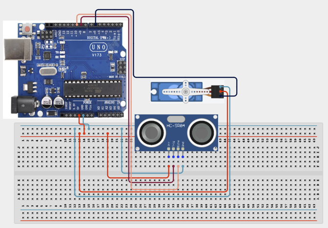

# 2.14. Touch Free Hand Sanitizer Simulator

| **Description** | This project demonstrates a contactless automation system that uses proximity sensing to simulate hand sanitizer dispensing. It introduces the principles of sensor-triggered control and motion-based automation commonly used in public and healthcare environments. |
|------------------|----------------------------------------------------------------|
| **Use case**     | This project is connected to real-world uses such as: hospitals, airports, schools, shopping centers, and public hygiene stations. It demonstrates how proximity sensors and servo-controlled mechanisms can support touch-free automation. |

## Components (Things You will need)

|  |  |  |  |  |  |
| --- | --- | --- | --- | --- | --- |

## Building the circuit

Things Needed:

- Arduino Uno
- Arduino USB Cable
- Breadboard
- Jumper Wires
- Ultrasonic Sensor
- Servo Motor

## Mounting the component on the breadboard and wiring the circuit

**Step 1:** Connect the Arduino 5V pin to the breadboard's positive (+) power rail and the Arduino GND pin to the negative (-) power rail. 

**Step 2:** Place the Ultrasonic Sensor and the Servo Motor on the breadboard or in suitable positions for wiring.

  - Connect the Ultrasonic Sensor by connecting VCC to the 5V rail, GND to the ground rail, Trig to Digital Pin 9, and Echo to Digital Pin 10 on the Arduino board.

  - Connect the Servo Motor by connecting VCC to the 5V rail, GND to the ground rail, and the Signal wire to Digital Pin 6 on the Arduino board.

**Step 3:** Ensure that all GND connections share the same ground line to maintain stable and reliable circuit operation.



**Step 4:** Check the polarity of the servo motor and ultrasonic sensor, and verify that all wiring connections are correct before connecting the Arduino Uno to your computer via the USB cable to power the circuit.

_Make sure to connect the Arduino USB cable to the Arduino board._

## PROGRAMMING

**Step 1:** Open your Arduino IDE. See how to set up here: [Getting Started](../../Getting Started/Arduino_IDE_Setup.md).

**Step 2:** Write the complete program implementing the system logic with appropriate pin definitions, setup configuration, and the main control loop.

```cpp

#include <Servo.h>

Servo dispenser;
int trigPin = 9;
int echoPin = 10;
int servoPin = 6;

void setup() {
  pinMode(trigPin, OUTPUT);
  pinMode(echoPin, INPUT);
  dispenser.attach(servoPin);
  dispenser.write(0); // Initial position
}

void loop() {
  // Trigger the ultrasonic sensor
  digitalWrite(trigPin, LOW);
  delayMicroseconds(2);
  digitalWrite(trigPin, HIGH);
  delayMicroseconds(10);
  digitalWrite(trigPin, LOW);
  
  // Read the echo duration
  long duration = pulseIn(echoPin, HIGH);
  // Calculate distance in cm
  int distance = duration * 0.034 / 2;
  
  // If hand is detected within 10 cm
  if (distance > 0 && distance < 10) {
    dispenser.write(90); // Dispense
    delay(1000);         // Wait for hands to move
    dispenser.write(0);  // Return to original position
    delay(1000);         // Cooldown before next dispense
  }
  
  delay(100);
}
```

**Step 3:** Save your code. _See the [Getting Started](../../Getting Started/Arduino_IDE_Setup.md) section_

**Step 4:** Select the arduino board and port _See the [Getting Started](../../Getting Started/Arduino_IDE_Setup.md) section:Selecting Arduino Board Type and Uploading your code_.

**Step 5:** Upload your code. _See the [Getting Started](../../Getting Started/Arduino_IDE_Setup.md) section:Selecting Arduino Board Type and Uploading your code_

## CONCLUSION

The Touch-Free Hand Sanitizer Simulator effectively demonstrates automated contactless dispensing. By using an ultrasonic sensor to measure distance, the system detects when a hand is placed in close proximity and triggers the servo motor to simulate pumping sanitizer, providing a hygienic and fully automated solution.
