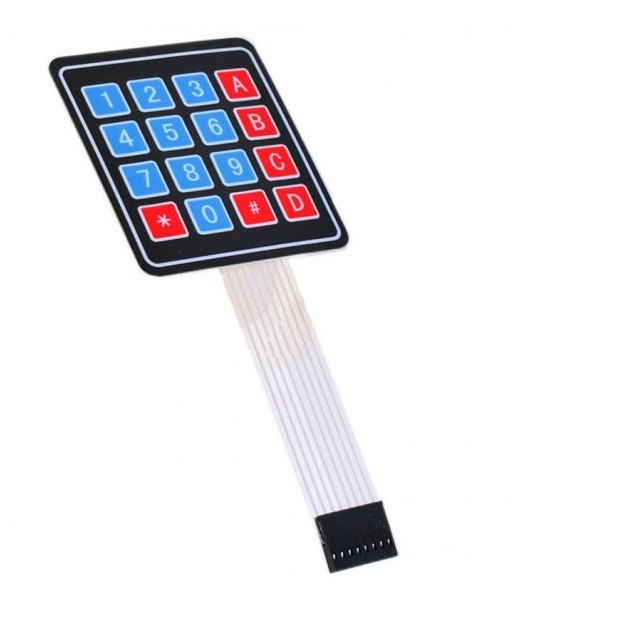

# 2.2. Digital Safe Lock

| **Description** | Build a password-protected safe using a keypad and LCD display. Users must enter the correct PIN to unlock the system. |
|------------------|---------------------------------------------------------------------------------------------------------------------|
| **Use case**     | This project is connected to real-world uses such as ATMs, smart locks, and security devices. |

## Components (Things You will need)

|  |  |  |  |  |  |  |  |
| --- | --- | --- | --- | --- | --- | --- | --- |

## Building the circuit

Things Needed:

- Arduino Uno = 1
- Arduino USB cable = 1
- Breadboard = 1
- Jumper Wires
- Ultrasonic Sensor
- LCD Display
- Buzzer
- 4x4 Keypad


## Mounting the component on the breadboard and wiring the circuit

**Step 1:**	Place the I2C LCD Display on the breadboard and with the help of jumper wires.

   - Connect the I2C LCD display by connecting the SDA pin to A4 on the Analog side of the arduino uno board.

   - Connect the SCL pin to A5 on the Analog side of the arduino uno board.

   - Connect the VCC pin to 5V on the Arduino Uno board.

   - Connect the GND pin to GND on the Arduino Uno board.

**Step 2:** Place the 4x4 keypad on the breadboard and with the help of jumper wires.

   - Connect the keypad by connecting Row 1 (R1) to Digital Pin 9 on the Digital side of the arduino uno board.

   - Connect Row 2 (R2) to Digital Pin 8 on the Digital side of the arduino uno board.

   - Connect Row 3 (R3) to Digital Pin 7 on the Digital side of the arduino uno board.

   - Connect Row 4 (R4) to Digital Pin 6 on the Digital side of the arduino uno board.

   - Connect Column 1 (C1) to Digital Pin 5 on the Digital side of the arduino uno board.

   - Connect Column 2 (C2) to Digital Pin 4 on the Digital side of the arduino uno board.

   - Connect Column 3 (C3) to Digital Pin 3 on the Digital side of the arduino uno board.
   
   - Connect Column 4 (C4) to Digital Pin 2 on the Digital side of the arduino uno board.


_Make sure to connect the Arduino USB cable to the Arduino board._

## PROGRAMMING

**Step 1:** Open your Arduino IDE. See how to set up here: [Getting Started](../../Getting Started/Arduino_IDE_Setup.md).

**Step 2:** Write the complete program implementing the system logic with appropriate pin definitions, setup configuration, and the main control loop.

```cpp

#include <Keypad.h>
#include <LiquidCrystal_I2C.h>
// LCD setup
LiquidCrystal_I2C lcd(0x27,16,2);
// Keypad setup
const byte ROWS = 4;
const byte COLS = 4;
char keys[ROWS][COLS] = {
{'1','2','3','A'},
{'4','5','6','B'},
{'7','8','9','C'},
{'*','0','#','D'}
};
byte rowPins[ROWS] = {9,8,7,6};
byte colPins[COLS] = {5,4,3,2};
Keypad keypad = Keypad(makeKeymap(keys),
rowPins,colPins,ROWS,COLS);
String password = "1234";
String input = "";
void setup() {
 lcd.init();
 lcd.backlight();
 lcd.print("Enter PIN:");
}
void loop() {
 char key = keypad.getKey();
 if(key){
   input += key;
   lcd.setCursor(0,1);
   lcd.print(input);
 }
 if(input.length() == 4){
   lcd.clear();
   if(input == password){
     lcd.print("Access Granted");
   }
   else{
     lcd.print("Access Denied");
   }
   delay(2000);
   input = "";
   lcd.clear();
   lcd.print("Enter PIN:");
 }
}


```

**Step 3:** Save your code. _See the [Getting Started](../../Getting Started/Arduino_IDE_Setup.md) section_

**Step 4:** Select the arduino board and port _See the [Getting Started](../../Getting Started/Arduino_IDE_Setup.md) section:Selecting Arduino Board Type and Uploading your code_.

**Step 5:** Upload your code. _See the [Getting Started](../../Getting Started/Arduino_IDE_Setup.md) section:Selecting Arduino Board Type and Uploading your code_

## CONCLUSION

Users enter a PIN using the keypad. LCD displays entered characters. Correct password grants access. Incorrect password displays an error message.


