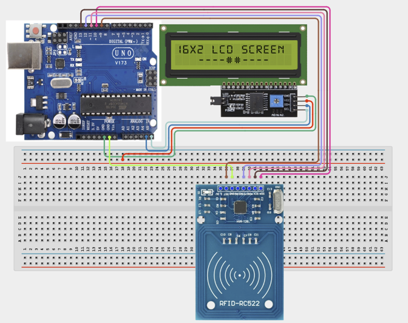

# 2.4. RFID Attendance Logger

| **Description** | In this project, learners will build a digital attendance logging system using an RFID reader, RFID cards or tags, and an LCD display. When a registered RFID card is presented to the reader, the system displays the user's attendance status on the LCD. RFID technology is widely used in schools, offices, libraries, and access-control systems, and this project introduces contactless identification and data verification. |
|------------------|------------------------------------------------------------------------------------------------------------------------------------------------------------------------------------------------------------------------------------------------------------------------------------------------------------------------------------------------------------------------------------------------------------------------------------------------------------|
| **Use case**     | This project is connected to real-world uses such as school attendance systems, office access control, library check-ins, and hotel key-card systems. |

## Components (Things You will need)

|  |  |  |  | | | |
|------------------------------------------------------ | ----------------------------------------------------------- | --------------------------------------------------------- | ------------------------------------------------------ | ------------------------------------------------------ |------------------------------------------------------ |------------------------------------------------------ |

## Building the circuit

Things Needed:

- Arduino Uno = 1
- Arduino USB cable = 1
- Breadboard = 1
- Jumper Wires
- RFID Reader
- LCD Display
- RFID Card

## Mounting the component on the breadboard and wiring the circuit

**Step 1:** Connect the power supply by connecting the 5V pin on the Arduino Uno to the positive rail on the breadboard and the GND pin to the negative rail.

**Step 2:** Place the RFID Reader (MFRC522) on the breadboard. 
 
  - Connect SDA to digital pin 10 on the arduino uno board

  - Connect SCK to digital pin 13 on the arduino uno board

  - Connect MOSI to digital pin 11 on the arduino uno board

  - Connect MISO to digital pin 12 on the arduino uno board

  - Connect RST to digital pin 9 on the arduino uno board

  - Connect 3.3V to the 3.3V pin on the arduino uno board using jumper wires. (**NB:** Do not connect the RFID reader to 5V.)

  - Connect GND to the negative power rail on the breadboard where we connected the GND pin on the Arduino Uno to.

**Step 3:** Place the I2C LCD display on the breadboard.

    - Connect VCC of the I2C LCD display to the positive power rail on the breadboard where we connected the 5V pin on the Arduino Uno to.

    - Connect GND of the I2C LCD display to the negative power rail on the breadboard where we connected the GND pin on the Arduino Uno to.

    - Connect SDA (Serial Data) pin of the I2C LCD display to A4 on the Arduino Uno board

    - Connect SCL (Serial Clock) pin of the I2C LCD display to A5 on the Arduino Uno board

**NB:** Double-check all wiring connections before connecting the USB power cable to the Arduino Uno board.



_Make sure to connect the Arduino USB cable to the Arduino board._

## PROGRAMMING

**Step 1:** Open your Arduino IDE. See how to set up here: [Getting Started](../../Getting Started/Arduino_IDE_Setup.md).

**Step 2:** Write the complete program implementing the system logic with appropriate pin definitions, setup configuration, and the main control loop.

```cpp
// RFID Libraries
#include <SPI.h>
#include <MFRC522.h>
// LCD Library
#include <Wire.h>
#include <LiquidCrystal_I2C.h>
// RFID Pins
#define SS_PIN 10
#define RST_PIN 9
// Create RFID object
MFRC522 rfid(SS_PIN, RST_PIN);
// Create LCD object
LiquidCrystal_I2C lcd(0x27,16,2);
// Registered UID
String authorizedCard = "A1 B2 C3 D4";
void setup() {
 // Start serial monitor
 Serial.begin(9600);
 // Start SPI communication
 SPI.begin();
 // Initialize RFID
 rfid.PCD_Init();
 // Initialize LCD
 lcd.init();
 lcd.backlight();
 lcd.print("Scan Your Card");
}
void loop() {
 // Check for RFID card
 if (!rfid.PICC_IsNewCardPresent()) {
   return;
 }
 if (!rfid.PICC_ReadCardSerial()) {
   return;
 }
 // Store UID
 String cardUID = "";
 // Read card UID
 for (byte i = 0; i < rfid.uid.size; i++) {
   cardUID += String(rfid.uid.uidByte[i], HEX);
   cardUID += " ";
 }
 cardUID.toUpperCase();
 Serial.println(cardUID);
 lcd.clear();
 // Verify card
 if(cardUID == authorizedCard) {
   lcd.print("Attendance");
   lcd.setCursor(0,1);
   lcd.print("Recorded");
 }
 else {
   lcd.print("Unknown Card");
   lcd.setCursor(0,1);
   lcd.print("Access Denied");
 }
 delay(3000);
 lcd.clear();
 lcd.print("Scan Your Card");
}

```

**Step 3:** Save your code. _See the [Getting Started](../../Getting Started/Arduino_IDE_Setup.md) section_

**Step 4:** Select the arduino board and port _See the [Getting Started](../../Getting Started/Arduino_IDE_Setup.md) section:Selecting Arduino Board Type and Uploading your code_.

**Step 5:** Upload your code. _See the [Getting Started](../../Getting Started/Arduino_IDE_Setup.md) section:Selecting Arduino Board Type and Uploading your code_

## CONCLUSION

When a registered RFID card is scanned, the LCD displays "Attendance Recorded", confirming that the user's attendance has been successfully logged. If an unregistered RFID card is scanned, the LCD displays "Unknown Card" on the first line and "Access Denied" on the second line, indicating that the card is not authorized and attendance is not recorded.
