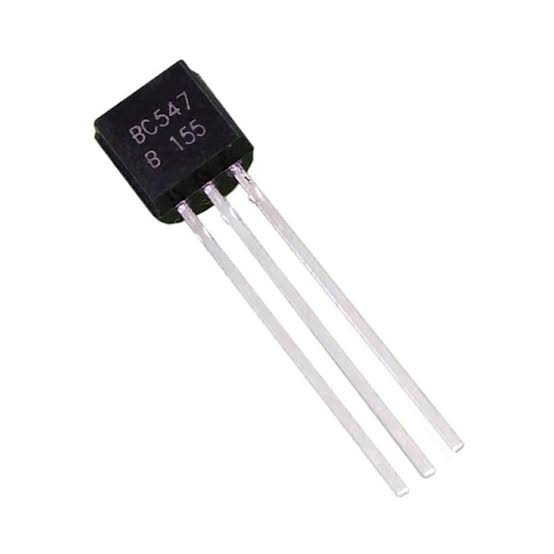
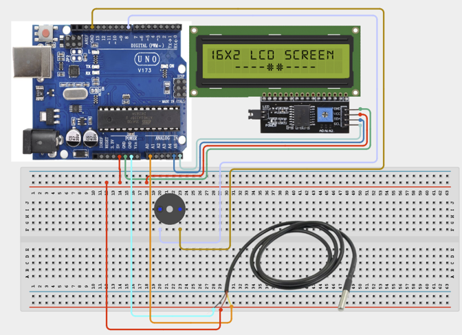

# 2.5. Smart Room Climate Controller

| **Description** | In this project, learners will build an intelligent room climate controller. The system continuously monitors room temperature and automatically controls a cooling fan. If the temperature becomes dangerously high, a buzzer sounds an alarm while temperature information is displayed on an LCD. This project combines sensing, display, automation, and alert systems into a single solution. |
|------------------|----------------------------------------------------------------------------------------------------------------------------------------------------------------------------------------------------------------------------------------------------------------------------------------------------------------------------------------------------------------------------------------------------------|
| **Use case**     | This project is connected to real-world uses such as server rooms, greenhouses, industrial control systems, and smart homes. |

## Components (Things You will need)

|  |  |  |  | | | | | | |
|------------------------------------------------------ | ----------------------------------------------------------- | --------------------------------------------------------- | ------------------------------------------------------ | ------------------------------------------------------ |------------------------------------------------------ |------------------------------------------------------ |------------------------------------------------------ |------------------------------------------------------ |------------------------------------------------------ |

## Building the circuit

Things Needed:

- Arduino Uno = 1
- Arduino USB cable = 1
- Breadboard = 1
- Jumper Wires
- Temperature Sensor
- LCD Display
- DC Motor
- Fan Blade
- NPN Transistor
- Buzzer

## Mounting the component on the breadboard and wiring the circuit

**Step 1:** Connect the power supply by connecting the 5V pin on the Arduino Uno to the positive rail on the breadboard and the GND pin to the negative rail.

**Step 2:**	Place the Temperature Sensor.

- Connect the temperature sensor to the Arduino Uno board using jumper wires as follows:
    - Connect VCC to the positive power rail on the breadboard where we connected the 5V pin on the Arduino Uno to.

    - Connect GND to the negative power rail on the breadboard where we connected the GND pin on the Arduino Uno to.

    - Connect OUT to A0 on the arduino uno board using jumper wires.

**Step 3:**	Place the LCD Display on the breadboard.

- Connect the LCD display to the Arduino Uno board using jumper wires as follows:

    - Connect Negative to GND on the negative power rail on the breadboard where we connected the GND pin on the Arduino Uno to.

    - Connect SDA to A4 on the arduino uno board using jumper wires.

    - Connect SCL to A5 on the arduino uno board using jumper wires.

    - Connect VCC to 5V on the positive power rail on the breadboard where we connected the 5V pin on the Arduino Uno to.

    - Connect GND to GND on the negative power rail on the breadboard where we connected the GND pin on the Arduino Uno to.

    - Check that all GND connections share the same ground line if more than one module is used.




_Make sure to connect the Arduino USB cable to the Arduino board._

## PROGRAMMING

**Step 1:** Open your Arduino IDE. See how to set up here: [Getting Started](../../Getting Started/Arduino_IDE_Setup.md).

**Step 2:** Write the complete program implementing the system logic with appropriate pin definitions, setup configuration, and the main control loop.

```cpp
#include <Wire.h>
#include <LiquidCrystal_I2C.h>
// LCD object
LiquidCrystal_I2C lcd(0x27,16,2);
// Temperature sensor
int tempPin = A0;
// Outputs
int fanPin = 9;
int buzzerPin = 8;
void setup() {
 lcd.init();
 lcd.backlight();
 pinMode(fanPin, OUTPUT);
 pinMode(buzzerPin, OUTPUT);
 Serial.begin(9600);
}
void loop() {
 // Read temperature sensor
 int sensorValue = analogRead(tempPin);
 // Convert reading to voltage
 float voltage = sensorValue * (5.0 / 1023.0);
 // Convert voltage to Celsius
 float temperature = voltage * 100;
 // Display temperature
 lcd.setCursor(0,0);
 lcd.print("Temp:");
 lcd.print(temperature);
 lcd.print("C ");
 // Normal Condition
 if(temperature < 28){
   digitalWrite(fanPin, LOW);
   digitalWrite(buzzerPin, LOW);
   lcd.setCursor(0,1);
   lcd.print("Status:Normal ");
 }
 // Cooling Required
 else if(temperature >= 28 && temperature < 35){
   digitalWrite(fanPin, HIGH);
   digitalWrite(buzzerPin, LOW);
   lcd.setCursor(0,1);
   lcd.print("Cooling Active");
 }
 // Critical Temperature
 else{
   digitalWrite(fanPin, HIGH);
   digitalWrite(buzzerPin, HIGH);
   lcd.setCursor(0,1);
   lcd.print("TEMP WARNING!");
 }
 delay(500);
}


```

**Step 7:** Save your code. _See the [Getting Started](../../Getting Started/Arduino_IDE_Setup.md) section_

**Step 8:** Select the arduino board and port _See the [Getting Started](../../Getting Started/Arduino_IDE_Setup.md) section:Selecting Arduino Board Type and Uploading your code_.

**Step 9:** Upload your code. _See the [Getting Started](../../Getting Started/Arduino_IDE_Setup.md) section:Selecting Arduino Board Type and Uploading your code_

## CONCLUSION

Normal/start-up condition: The Smart Room Climate Controller powers on and waits for sensor input or user action. Input or command changes: The display, buzzer, LED, motor, servo, relay, or RGB output responds according to the program logic. Threshold or event condition: The system gives visible, audible, movement, or display feedback when the condition is detected.
