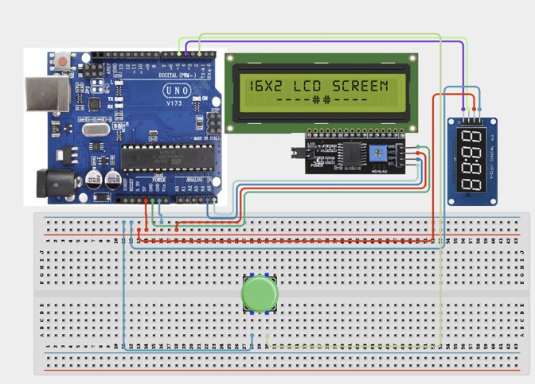

# 2.8. Smart Queue Management System

| **Description** | This project simulates a customer queue system using push buttons and a 4-digit display. Each button press issues the next queue number. |
|------------------|----------------------------------------------------------------|
| **Use case**     | This project is connected to real-world uses such as: Queue systems are widely used in hospitals, banks, government offices, and customer service centres. |

## Components (Things You will need)

|  |  |  |  | | |
|------------------------------------------------------ | ----------------------------------------------------------- | --------------------------------------------------------- | ------------------------------------------------------ | ------------------------------------------------------ |------------------------------------------------------ |

## Building the circuit

Things Needed:

- Arduino Uno = 1
- Arduino USB cable = 1
- Breadboard = 1
- Jumper Wires
- Push Button
- 4-Digit Display

## Mounting the component on the breadboard and wiring the circuit

**Step 1:** Connect the power supply by connecting the 5V pin on the Arduino Uno to the positive rail on the breadboard and the GND pin to the negative rail.

**Step 2:**	Place the Push Button on the breadboard.

   - Connect one terminal of the push button to Digital Pin 2 on the Arduino Uno board.

   - Connect the other terminal of the push button to GND on the negative power rail of the breadboard where we connected the GND pin on the Arduino Uno to.

**Step 3:**	Place the 4-Digit Display on the breadboard.

   - Connect the TM1637 4-digit display by connecting VCC to 5V on the positive power rail of the breadboard where we connected the 5V pin on the Arduino Uno to.

   - Connect GND to GND on the negative power rail of the breadboard where we connected the GND pin on the Arduino Uno to, 

   - CLK to Digital Pin 4 on the Arduino Uno board, 

   - and DIO to Digital Pin 5 on the Arduino Uno board.



_Make sure to connect the Arduino USB cable to the Arduino board._

## PROGRAMMING

**Step 1:** Open your Arduino IDE. See how to set up here: [Getting Started](../../Getting Started/Arduino_IDE_Setup.md).

**Step 2:** Write the complete program implementing the system logic with appropriate pin definitions, setup configuration, and the main control loop.

```cpp

#include <TM1637Display.h>
TM1637Display display(4,5);
int buttonPin = 2;
int queueNumber = 0;
void setup() {
 pinMode(buttonPin, INPUT_PULLUP);
}
void loop() {
 if(digitalRead(buttonPin)==LOW){
   queueNumber++;
   display.showNumberDec(queueNumber);
   delay(300);
 }
}

```

**Step 3:** Save your code. _See the [Getting Started](../../Getting Started/Arduino_IDE_Setup.md) section_

**Step 4:** Select the arduino board and port _See the [Getting Started](../../Getting Started/Arduino_IDE_Setup.md) section:Selecting Arduino Board Type and Uploading your code_.

**Step 5:** Upload your code. _See the [Getting Started](../../Getting Started/Arduino_IDE_Setup.md) section:Selecting Arduino Board Type and Uploading your code_

## CONCLUSION

Each press of the push button increments the queue number by one. The TM1637 4-digit display updates immediately to show the new queue number, and the numbers continue increasing sequentially with each subsequent button press.
