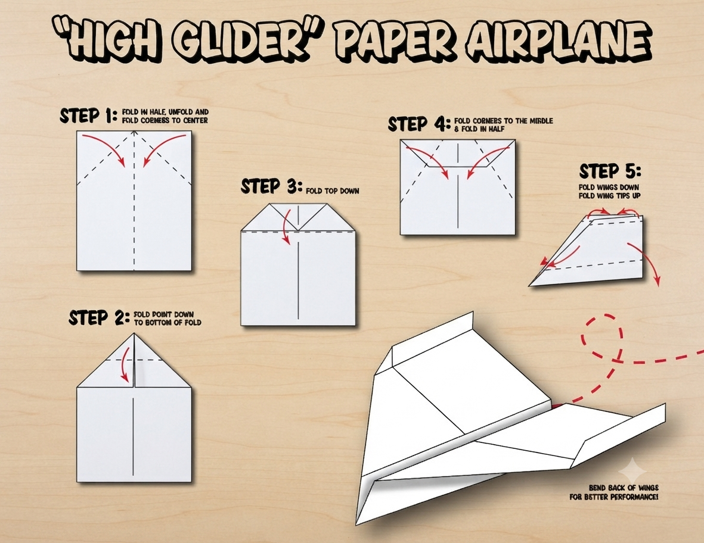
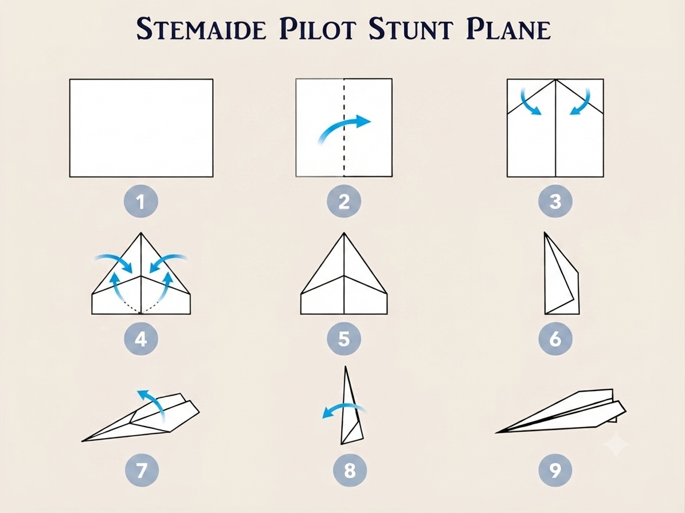
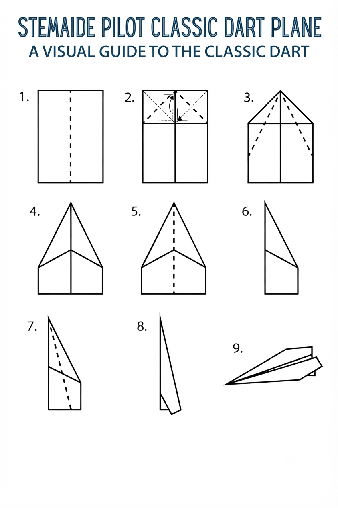

**AVIATION & AEROSPACE EDUCATION KIT**

SECTION 2 • BEGINNER PROJECTS • SHS 1 TERMS 1–2

**PROJECT 1**

**Paper Dart & Glider**

**Comparison Tournament**

| **LEVEL**  Beginner | **DURATION**  2 Lessons (40–50 min each) | **KIT**  Kit 1 |
| --- | --- | --- |

**Student & Teacher Manual**

**1. Project Overview**

This project introduces students to the fundamental principles of aerodynamics by designing, building, and testing three different paper aircraft. Through a structured tournament format, students collect flight data, compare the effect of different design features, and apply scientific methodology to analyse results.

| **Curriculum Area** | Aviation Science – Aerodynamics & Flight |
| --- | --- |
| **Year Group** | SHS 1 (Terms 1–2) |
| **Duration** | 2 lessons of 40–50 minutes each |
| **Materials Source** | Kit 1 (all items) |
| **Power Required** | None – manual launch only |

**Learning Objectives**

* Identify and explain the four forces of flight: lift, drag, weight, and thrust
* Understand how wing shape, area, and aspect ratio affect flight performance
* Collect, record, and compare quantitative flight data
* Apply the engineering design process by testing and iterating on a physical artefact
* Work collaboratively and communicate findings to peers

Z

**2. Components Required**

| **Item** | **Quantity** | **Source** |
| --- | --- | --- |
| A4 card stock paper | 10 sheets | Kit 1 |
| Steel ruler (30 cm) | 1 | Kit 1 |
| Craft knife with safety guard | 1 | Kit 1 |
| Cutting mat (A3) | 1 | Kit 1 |
| Masking tape | 1 roll | Kit 1 |
| Pencil | 1 | Kit 1 |
| Measuring tape (5 m) | 1 | Kit 1 |

**3. Build Steps & Assembly**

**Lesson 1 – Preparation & Build**

| **STEP 1** | **Tool Orientation & Safety Contract** |
| --- | --- |
|  | * Introduce all tools: craft knife, steel ruler, cutting mat * Demonstrate safe cutting technique (cut away from the body, mat beneath the work) * Students sign the safety contract before touching any tools * Review the project brief and tournament rules |

| **STEP 2** | **Template Preparation** |
| --- | --- |
|  | * Distribute A4 card stock and printed templates * Each group traces three designs onto card stock: * Design A – Classic Dart (long, narrow body) * Design B – Wide Glider (broad, high-aspect-ratio wings) * Design C – Stunt Plane (small body with elevator flaps) * Label each template with the group name before cutting |

| **STEP 3** | **Build All Three Aircraft** |
| --- | --- |
|  | * Cut out each design carefully using the craft knife and steel ruler * Fold along dashed lines precisely – hold folds for 5 seconds to crease * Apply masking tape only at indicated locations * Check for symmetry: hold each aircraft at arm's length and sight along the wing * Write the group name on the underside of each aircraft |

| **STEP 4** | **Decorate & Name** |
| --- | --- |
|  | * Decorate each aircraft with a unique colour or pattern * Give each aircraft an individual name (e.g. Ghana Eagle, Kotoka Flyer) * Keep decorations on the underside only – markings on the upper surface can affect airflow |

**Lesson 2 – Tournament Day**

| **STEP 5** | **Set Up the Measurement Station** |
| --- | --- |
|  | * Clear a corridor or outdoor area at least 20 m long * Mark the launch line with masking tape * Lay the measuring tape along the floor from the launch line * Assign roles: Launcher, Timer, Measurer, Recorder |

| **STEP 6** | **Conduct Tournament Flights** |
| --- | --- |
|  | * Launch each design three times using an identical standing throw * Launcher must stand behind the line and release at the same height each time * Record distance (metres) and hang time (seconds) for every flight * Calculate averages once all flights are complete |

| **STEP 7** | **Data Analysis & Graphing** |
| --- | --- |
|  | * Use the data collection table on page 6 to calculate averages * Create a bar graph comparing average distance for each design * Create a second bar graph comparing average hang time * Label both axes; give each graph a title |

| **STEP 8** | **Tournament Final & Debrief** |
| --- | --- |
|  | * Hold the tournament final: one launch per design per group * Award titles: Furthest Flight, Longest Hang Time, Best Accuracy * Class debrief: Which design performed best and why? * Discuss how wing area, aspect ratio, and CG position affected results |

**4. Power & Safety Notes**

| **⚠ Safety Requirements**  Power: None required – manual (hand) launch only.  Craft knives: Teacher or supervising adult must be present at all times during cutting.  Eye protection: Safety goggles are mandatory during all cutting activities.  Flight zone: Clear the area of all people before each launch; no one should stand in the flight path.  Supervision: Never allow unsupervised use of craft knives or cutting mats. |
| --- |

**5. Engineering Principles**

**The Four Forces of Flight**

Every aircraft in flight is acted upon by four forces. Understanding how these interact is the foundation of aeronautical engineering.

| **Force** | **Direction** | **Explanation** |
| --- | --- | --- |
| **Lift** | Upward force | Created by wing shape and angle of attack |
| **Drag** | Rearward force | Air resistance that slows the aircraft |
| **Weight** | Downward force | Gravity acting on the aircraft mass |
| **Thrust** | Forward force | Provided by the human launch (hand) |

**Design Features That Affect Flight**

* Wing Area – Larger wings generate more lift but also more drag, reducing speed
* Aspect Ratio – Long, narrow wings (high aspect ratio) produce a better glide ratio than short, wide wings
* Centre of Gravity (CG) – The CG must be slightly forward of the aerodynamic centre for stable flight
* Symmetry – Any asymmetry in the wing or fuselage will cause the aircraft to turn during flight
* Surface Smoothness – Rough or crumpled surfaces increase drag and reduce flight distance

**Bernoulli's Principle (Simplified)**

| **Key Concept**  When air flows over a curved surface, it must travel farther – and therefore faster – than air flowing under a flat surface.  Faster-moving air exerts lower pressure (Bernoulli's Principle).  The higher pressure beneath the wing pushes upward, creating LIFT. |
| --- |

**6. How to Test**

**Test Methods**

| **Test** | **Method** | **Measure** |
| --- | --- | --- |
| **Distance** | Launch from standing position | Measure from launch line to landing point |
| **Hang Time** | Launch with stopwatch running | Time from release to first ground contact |
| **Accuracy** | Target set at 5 metres | Distance from target centre |

**Data Collection Table**

Complete this table during Tournament Day. Use a pencil so you can correct mistakes.

| **Design** | **Launch 1 (m)** | **Launch 2 (m)** | **Launch 3 (m)** | **Average (m)** | **Hang Time (s)** |
| --- | --- | --- | --- | --- | --- |
| **Classic Dart** |  |  |  |  |  |
| **Wide Glider** |  |  |  |  |  |
| **Stunt Plane** |  |  |  |  |  |

Example expected results for reference:

* Classic Dart: ~8 m distance, ~2 s hang time
* Wide Glider: ~15 m distance, ~4 s hang time
* Stunt Plane: ~5 m distance, ~1.5 s hang time

**7. Expected Output & Success Criteria**

| **Outcome** | **Success Criteria** |
| --- | --- |
| **Three built aircraft** | Clean cuts, correct folds, fully functional |
| **Data collected** | 3 launches per design, all entries complete |
| **Graphs created** | Bar graphs with labelled axes and titles |
| **Tournament participation** | All groups compete in at least one category |

**8. Common Errors & Fixes**

| **Error** | **Likely Cause** | **Fix** |
| --- | --- | --- |
| **Aircraft turns left/right** | Asymmetric folding or wing shape | Refold carefully; check for symmetry |
| **Aircraft nosedives** | Too much nose weight | Add tail weight or adjust leading-edge folds |
| **Aircraft stalls** | Too much tail weight | Add nose weight or adjust folds |
| **Short flight distance** | Drag from poor folds | Smooth all folds; ensure clean flat surfaces |
| **Inconsistent data** | Different launch angles or force | Standardise launch method across group |

**9. Upgrade & Extension Ideas**

Students who complete the core project early, or who want to investigate further, can try the following extensions:

* Weight Experiment – Add 1–3 paper clips to the nose; measure the change in flight distance and hang time
* Winglet Modification – Fold the wing tips upward 90°; compare stability and turning behaviour
* Material Experiment – Build the same Design A in standard 80 gsm paper, card stock, and tracing paper; compare performance
* Custom Design – Design a fourth aircraft from scratch, hypothesise its performance, then test against the tournament winners
* Measurement Upgrade – Use a distance sensor or stopwatch app to improve measurement accuracy
* Wind Effect – Test outdoors in a gentle breeze; record wind speed and direction; analyse the effect on results

**10. Teacher Notes & Differentiation**

**Lesson Planning Tips**

* Pre-cut templates save significant time in Lesson 1 if students are younger or if craft knives are unavailable
* Assign group roles in advance: Launcher, Timer, Measurer, Recorder. Rotate for each design
* Laminate the data collection table so groups can wipe and redo if needed
* For the debrief, prompt students with: "What would you change about your design if you built it again?"

**Differentiation Strategies**

* Support – Provide pre-traced, pre-scored templates; reduce to two designs instead of three
* Core – Standard build with full data collection and bar graphs
* Extension – Students design their own fourth aircraft using rules they derive from the data

**Assessment Suggestions**

* Observation: Correct and safe tool use during cutting (formative)
* Data table: Completeness and accuracy of recorded measurements
* Graph: Axes labelled, title present, bars drawn to scale
* Debrief contribution: Ability to link design feature to flight outcome

| **Curriculum Link**  This project supports STEM integration across: Physics (forces, measurement), Mathematics (averages, graphing), and Design & Technology (design process, materials).  It also aligns with aviation education goals set by the Ghana Civil Aviation Authority (GCAA) for youth aerospace awareness programmes. |
| --- |

## Images

