**AVIATION & AEROSPACE EDUCATION KIT**

SECTION 2 • BEGINNER PROJECTS • SHS 1 TERMS 1–2

**PROJECT 22**

**Balsa Wood Tower**

**Structure Challenge**

| **LEVEL**  Intermediate | **DURATION**  3 Lessons (40–50 min each) | **KIT**  Kit 1 |
| --- | --- | --- |

**Student & Teacher Manual**

**1. Project Overview**

Structural engineering is the foundation of all aircraft design. By building and load-testing four different balsa wood tower designs, students directly experience the principles of compression, tension, buckling, and bracing that structural engineers apply to aircraft fuselages, spars, and landing gear. The efficiency metric — load carried divided by tower weight — mirrors the strength-to-weight ratio that drives every real aircraft structural decision.

|  |  |
| --- | --- |
| Curriculum Area | Structural Engineering – Compression, Tension, Buckling & Load Paths |
| Year Group | SHS 1 (Terms 1–2) |
| Duration | 3 lessons of 40–50 minutes each |
| Materials Source | Kit 1 (balsa, glue, tools) and Kit 6 (test weights) |
| Power Required | None – manual assembly and testing |
| Prerequisite | None – suitable as a standalone beginner project |

**Learning Objectives**

* Distinguish between compression forces (pushing inward) and tension forces (pulling outward) in a loaded structure
* Explain why triangular bracing prevents column buckling
* Build four structurally different towers: square base, triangular base, X-braced, and pyramid
* Load test each tower to failure; record failure load and failure mode
* Calculate structural efficiency (failure load ÷ tower weight) for each design
* Identify the most efficient design and explain it using structural principles

**2. Components Required**

| **Item** | **Quantity** | **Source** |
| --- | --- | --- |
| **Balsa wood strips (3 mm × 3 mm)** | 20 | Kit 1 |
| **PVA wood glue** | 1 bottle | Kit 1 |
| **Craft knife** | 1 | Kit 1 |
| **Cutting mat** | 1 | Kit 1 |
| **Ruler (30 cm)** | 1 | Kit 1 |
| **Sandpaper** | 1 sheet | Kit 1 |
| **Test weights (small)** | 1 set | Kit 6 |
| **Right-angle card (jig for square joints)** | 1 | Teacher-made or Kit 1 |

**3. Build Steps & Assembly**

**Lesson 1 – Design & Cutting**

| **STEP 1** | **Design Phase** |
| --- | --- |
|  | * Each group sketches 4 tower designs on A4 paper before cutting any balsa * Square base: 4 vertical columns on a square footprint; horizontal rungs; no diagonals * Triangular base: 3 vertical columns on a triangular footprint; horizontal rungs * X-Braced: 4 vertical columns with X-shaped diagonal bracing on each face * Pyramid: 4 leaning columns meeting at the top with no vertical uprights * All towers must be 25 cm tall; base footprint: 8 cm × 8 cm (or equivalent area) |

| **STEP 2** | **Cutting** |
| --- | --- |
|  | * Cut all balsa strips to required lengths using the craft knife and steel ruler on the cutting mat * Organise cut pieces by function: columns, horizontals, diagonals * Sand all cut ends smooth immediately to prevent splinters |

**Lesson 2 – Assembly**

| **STEP 3** | **Assembly** |
| --- | --- |
|  | * Apply PVA glue sparingly to each joint — too much glue adds weight without strength * Use the right-angle card to hold joints at 90° while glue sets * Build from the base upward: base frame → vertical columns → cross-bracing → top platform * Allow all joints to cure for a minimum of 20 minutes before adding the next level * Label each tower with its design name |

**Lesson 3 – Load Testing**

| **STEP 4** | **Load Testing Protocol** |
| --- | --- |
|  | * Place tower on a flat surface; ensure it stands without support * Weigh each tower using the kitchen scale; record in the data table * Add weights to the top platform one at a time, pausing 10 seconds between additions * Record the total load when the first sign of failure occurs (lean, crack, buckle) * Identify the failure mode: column buckling, joint failure, base collapse, or top platform failure * Calculate efficiency: failure load ÷ tower weight; record in the data table |

**4. Power & Safety Notes**

| **⚠ Safety Notes**  Power: None required.  Craft knives: Teacher or adult must be present during all cutting. Safety goggles mandatory.  PVA glue: Non-toxic, but ensure hands are washed after use.  Load testing: Stand clear when adding final weights to avoid being hit by falling towers or weights. |
| --- |

**5. Engineering Principles**

**Structural Concepts**

* Compression: forces pushing inward along a column. Columns under compression are prone to buckling if they are slender
* Tension: forces pulling outward along a member. Diagonal braces usually carry tension when a column is pushed
* Buckling: sudden sideways collapse of a slender column under compression. The most common failure mode in balsa towers
* Triangulation: dividing a rectangular panel into triangles makes it rigid — a triangle cannot change shape without changing its member lengths
* Efficiency: the ratio of load carried to structure weight is the most important metric in aerospace structural design

| **Aviation Connection**  Aircraft wings use a spar as the main compression/tension member, with ribs providing shape and preventing buckling.  The Eiffel Tower (also a structural landmark in aviation history) uses the same X-bracing principle students test in this project.  Modern composite aircraft fuselages are designed to achieve structural efficiency ratios far exceeding any metal design — exactly the metric students calculate here. |
| --- |

**6. Data Collection Table**

| **Design** | **Tower Weight (g)** | **Failure Load (g)** | **Failure Mode** | **Efficiency (Load÷Weight)** |
| --- | --- | --- | --- | --- |
| **Square Base** |  |  |  |  |
| **Triangular Base** |  |  |  |  |
| **X-Braced** |  |  |  |  |
| **Pyramid** |  |  |  |  |

**7. Expected Output & Success Criteria**

| **Outcome** | **Success Criteria** |
| --- | --- |
| 4 towers built | All four designs constructed; joints dry before load testing |
| All towers load tested | Weights applied gradually to failure; failure load recorded |
| Failure modes identified | Collapse type named (buckle, joint failure, base collapse) |
| Efficiency calculated | Load ÷ tower weight calculated for each design |
| Best design identified | Highest-efficiency design named and explained with reference to structural principles |

**8. Common Errors & Fixes**

| **Error** | **Likely Cause** | **Fix** |
| --- | --- | --- |
| **Tower leans to one side** | Joints not square during assembly | Use a right-angle card at every joint; hold for 60 s while glue sets |
| **Joints fail before columns** | Insufficient glue or not fully cured | Apply glue generously; allow 20 min cure before adding more weight |
| **Columns buckle under low load** | No cross-bracing on vertical members | Add diagonal braces between columns; triangulate all panel faces |
| **Tower too heavy to be efficient** | Too much material used | Use the thinnest balsa strips that can still carry the load; plan before building |

**9. Upgrade & Extension Ideas**

* Material Comparison: build the same design in bamboo skewers vs. balsa; compare efficiency ratios
* Height Challenge: who can build the tallest tower that supports 100 g?
* Bridge Design: adapt the same principles to span a 20 cm gap while carrying maximum load
* Weight Challenge: lightest tower that supports exactly 200 g without failing

**10. Teacher Notes & Differentiation**

**Lesson Planning Tips**

* PVA glue needs 20 minutes to cure — plan lesson pacing to include drying breaks; have students start the next design while the previous one cures
* Pre-cut balsa strips save 15 minutes in Lesson 1 for younger groups
* For load testing, use identical coins as weights — 1 GHS coin ≈ 4 g; students can count coins and multiply

**Differentiation Strategies**

* Support – Build two designs only (square vs. X-braced); focus on the concept of buckling prevention
* Core – All four designs; load testing; efficiency calculation; class comparison
* Extension – Material comparison; height or weight challenge; bridge design

| **Curriculum Links**  Physics: Compression, tension, buckling, moments and equilibrium  Mathematics: Ratios (efficiency), measurement, data recording and comparison  Design & Technology: Iterative structural design; materials selection; engineering trade-offs  Aviation: Aircraft structural design; spar and rib function; strength-to-weight ratio |
| --- |

## Images

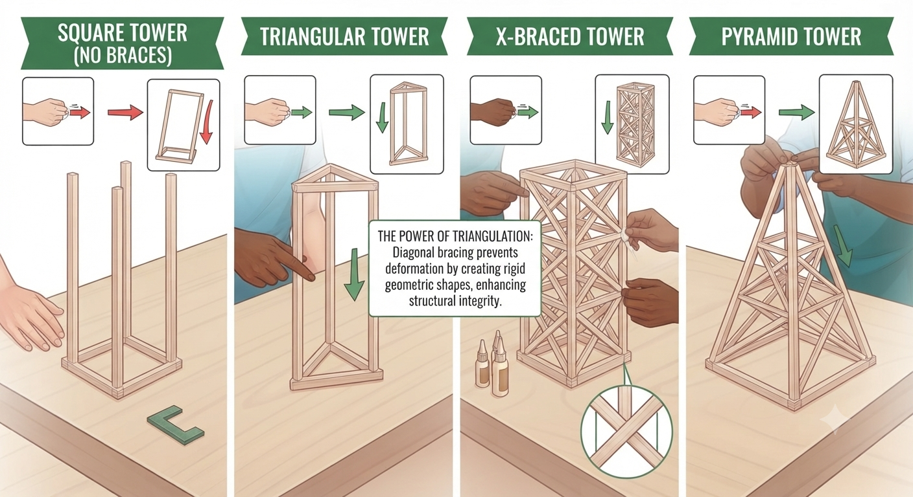

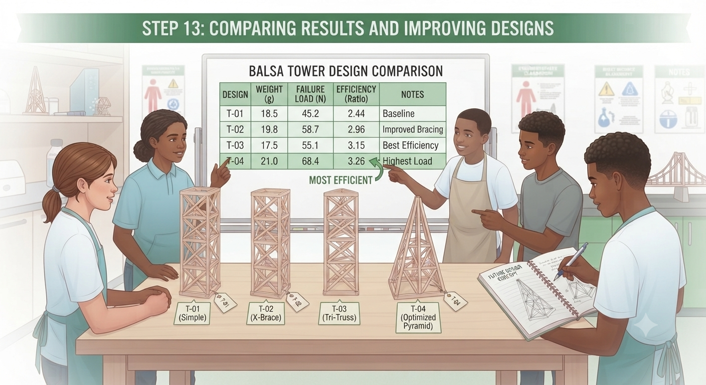

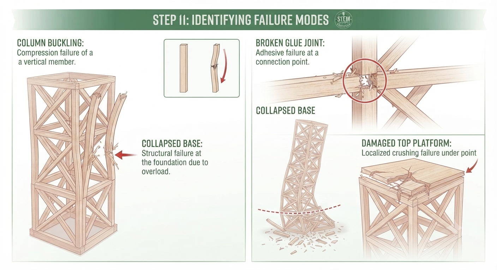

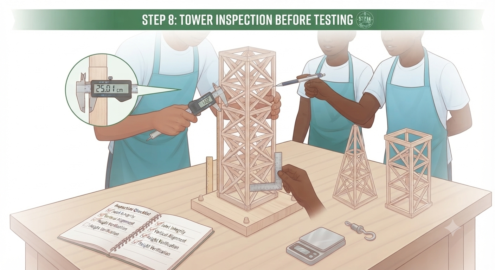

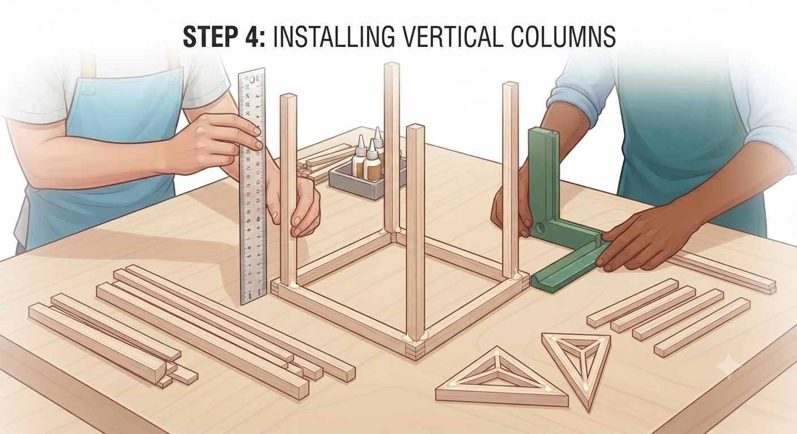

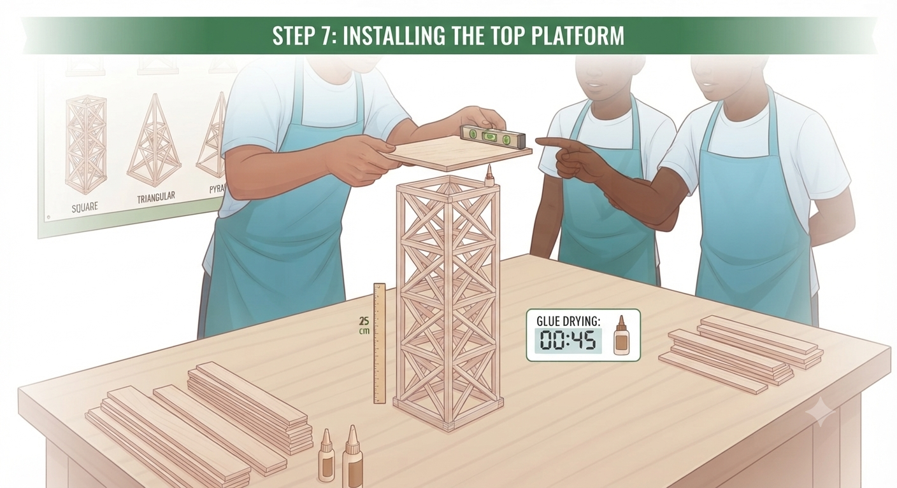

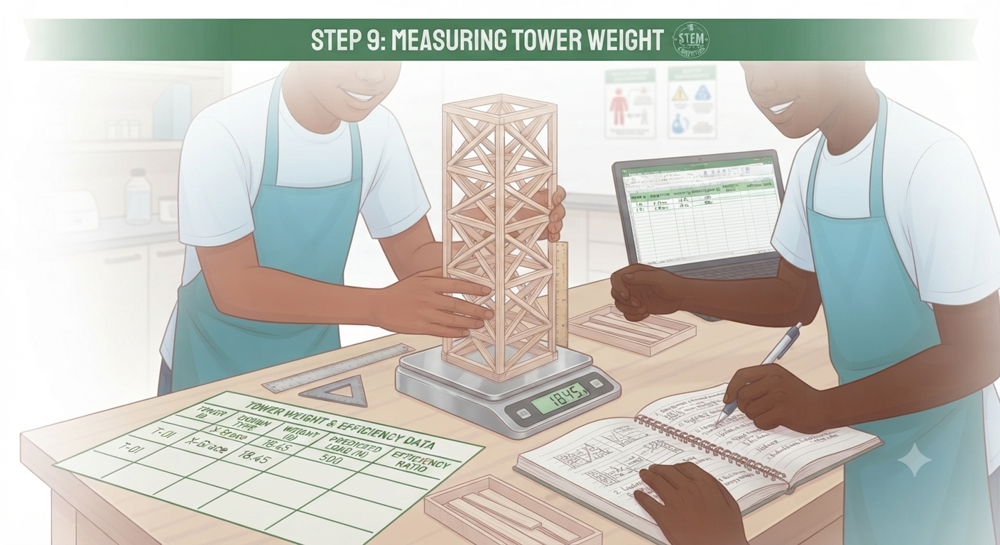

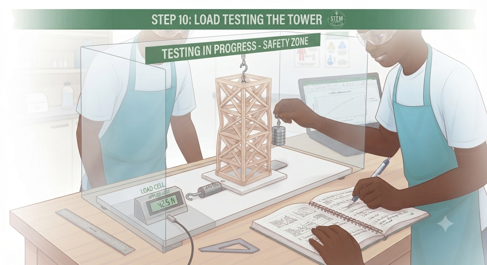

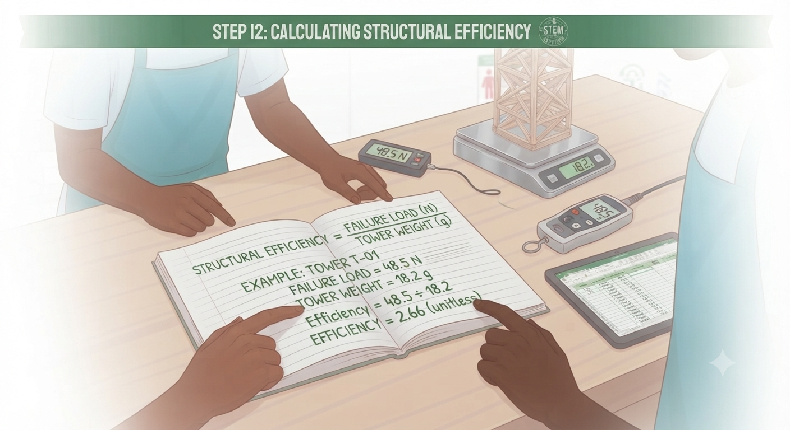

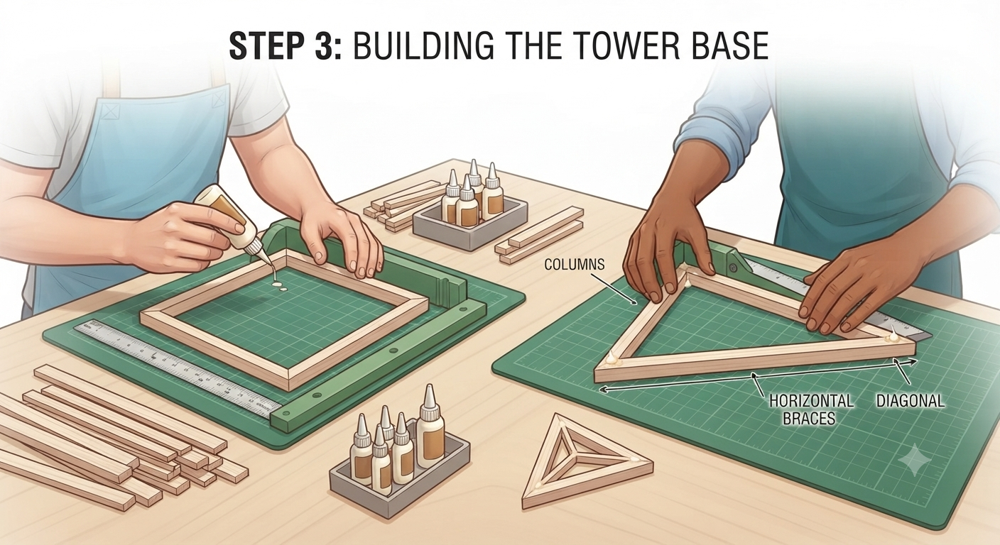

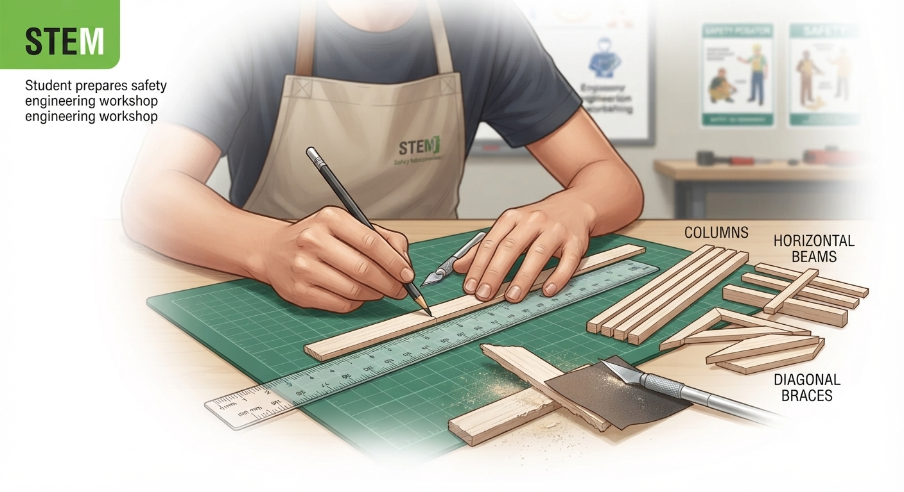

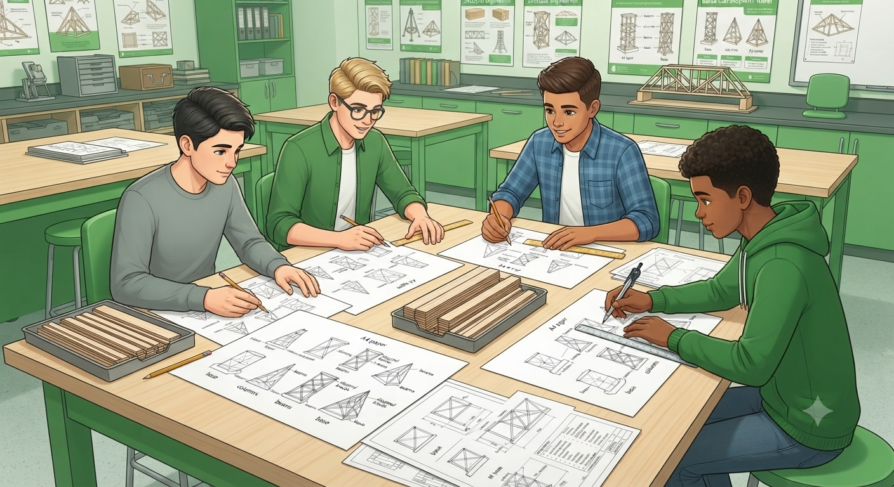

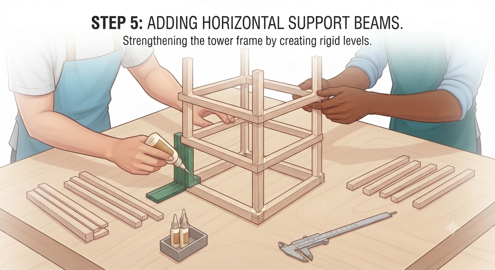
