**1. Project Overview**

Structural engineering is the foundation of all aircraft design. By building and load-testing four different balsa wood tower designs, students directly experience the principles of compression, tension, buckling, and bracing that structural engineers apply to aircraft fuselages, spars, and landing gear. The efficiency metric — load carried divided by tower weight — mirrors the strength-to-weight ratio that drives every real aircraft structural decision.

**2. Components Required**

| **Item** | **Quantity** | **Source** |
| --- | --- | --- |
| **Balsa wood strips (3 mm × 3 mm)** | 20 | Kit 1 |
| **PVA wood glue** | 1 bottle | Kit 1 |
| **Craft knife** | 1 | Kit 1 |
| **Cutting mat** | 1 | Kit 1 |
| **Ruler (30 cm)** | 1 | Kit 1 |
| **Sandpaper** | 1 sheet | Kit 1 |
| **Test weights (small)** | 1 set | Kit 6 |
| **Right-angle card (jig for square joints)** | 1 | Teacher-made or Kit 1 |

**3. Build Steps & Assembly**

**Guide 1 – Design & Cutting**

| **STEP 1** | **Design Phase** |
| --- | --- |
|  |  Each group sketches 4 tower designs on A4 paper before cutting any balsa  Square base: 4 vertical columns on a square footprint; horizontal rungs; no diagonals  Triangular base: 3 vertical columns on a triangular footprint; horizontal rungs  X-Braced: 4 vertical columns with X-shaped diagonal bracing on each face  Pyramid: 4 leaning columns meeting at the top with no vertical uprights  All towers must be 25 cm tall; base footprint: 8 cm × 8 cm (or equivalent area) |

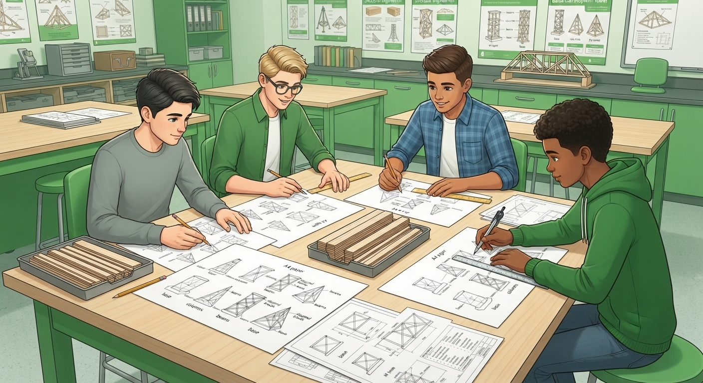

| **STEP 2** | **Cutting** |
| --- | --- |
|  |  Cut all balsa strips to required lengths using the craft knife and steel ruler on the cutting mat  Organise cut pieces by function: columns, horizontals, diagonals * Sand all cut ends smooth immediately to prevent splinters |

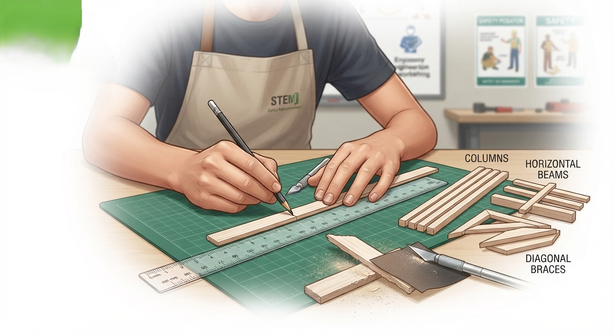

**Guide 2 – Assembly**

| **STEP 3** | **Assembly** |
| --- | --- |
|  |  Apply PVA glue sparingly to each joint — too much glue adds weight without strength  Use the right-angle card to hold joints at 90° while glue sets  Build from the base upward: base frame → vertical columns → cross-bracing → top platform  Allow all joints to cure for a minimum of 20 minutes before adding the next level   Label each tower with its design name |

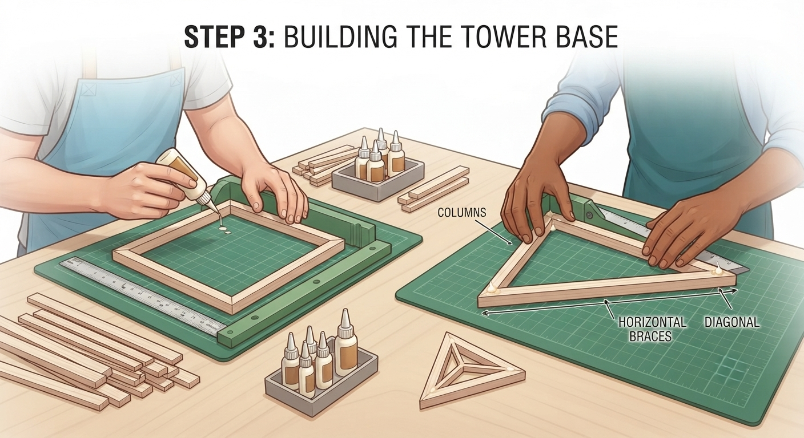

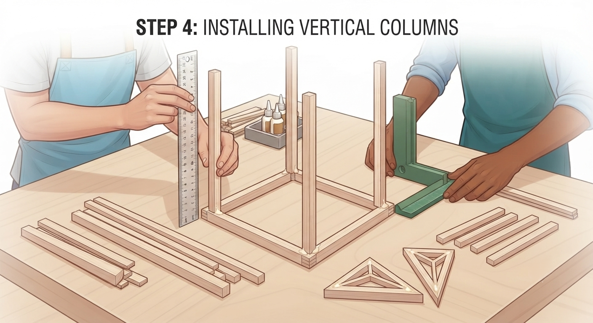

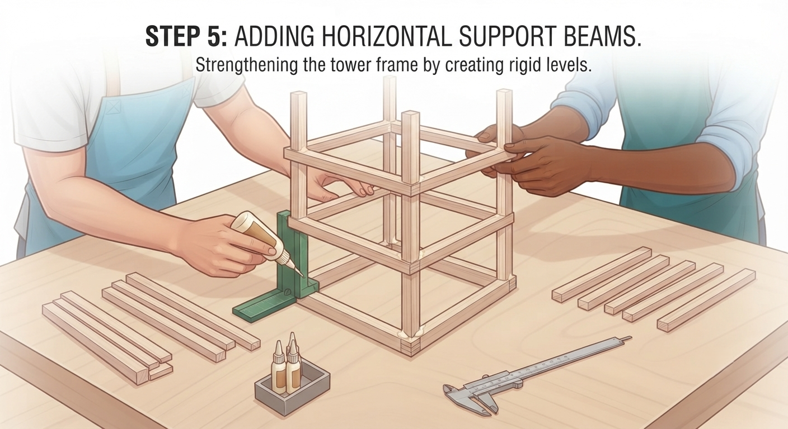

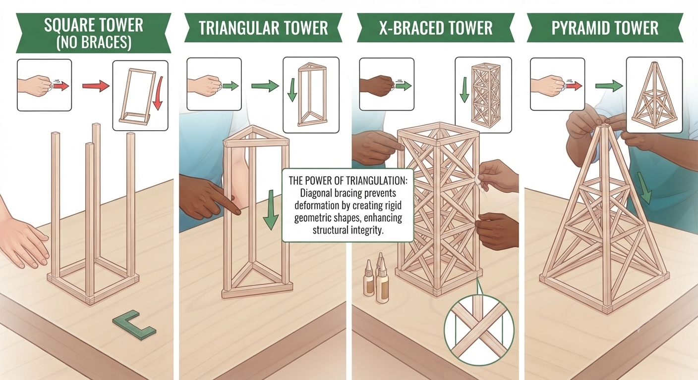

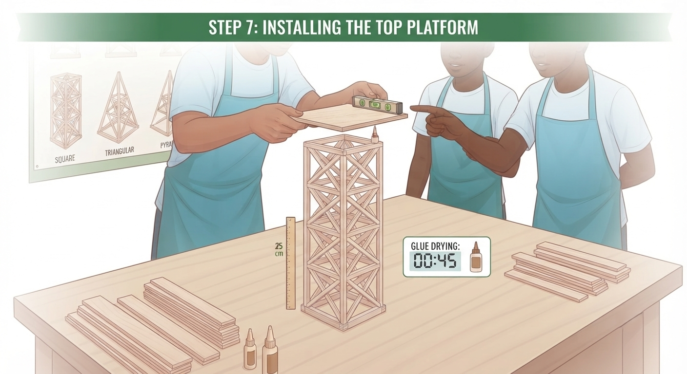

**Guide 3 – Load Testing**

| **STEP 4** | **Load Testing Protocol** |
| --- | --- |
|  |  Place tower on a flat surface; ensure it stands without support  Weigh each tower using the kitchen scale; record in the data table  Add weights to the top platform one at a time, pausing 10 seconds between additions  Record the total load when the first sign of failure occurs (lean, crack, buckle)  Identify the failure mode: column buckling, joint failure, base collapse, or top platform failure  Calculate efficiency: failure load ÷ tower weight; record in the data table |
    
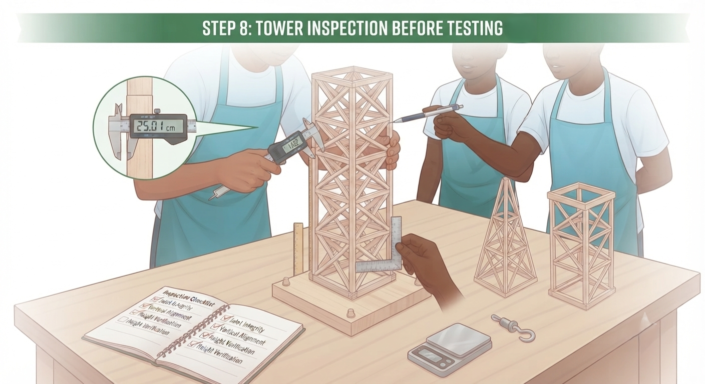

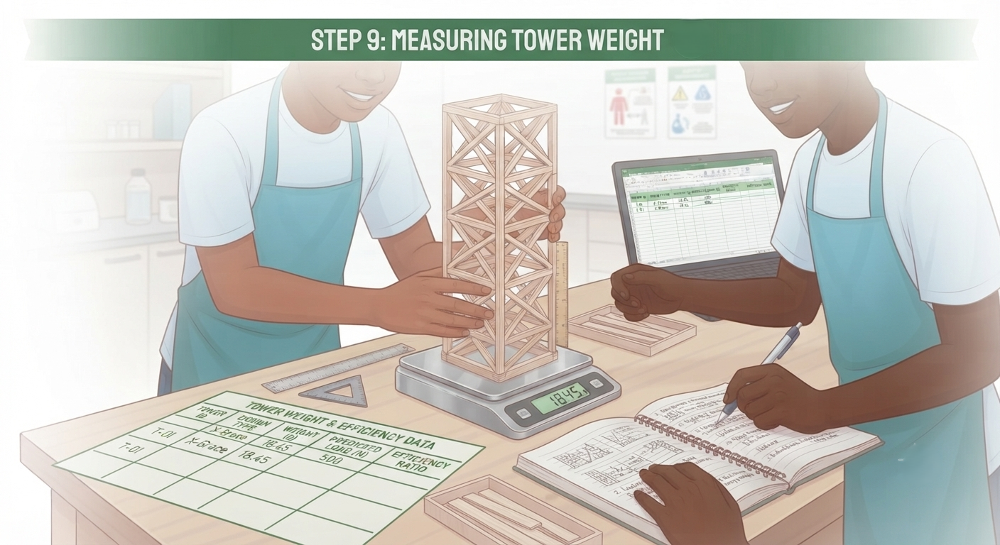

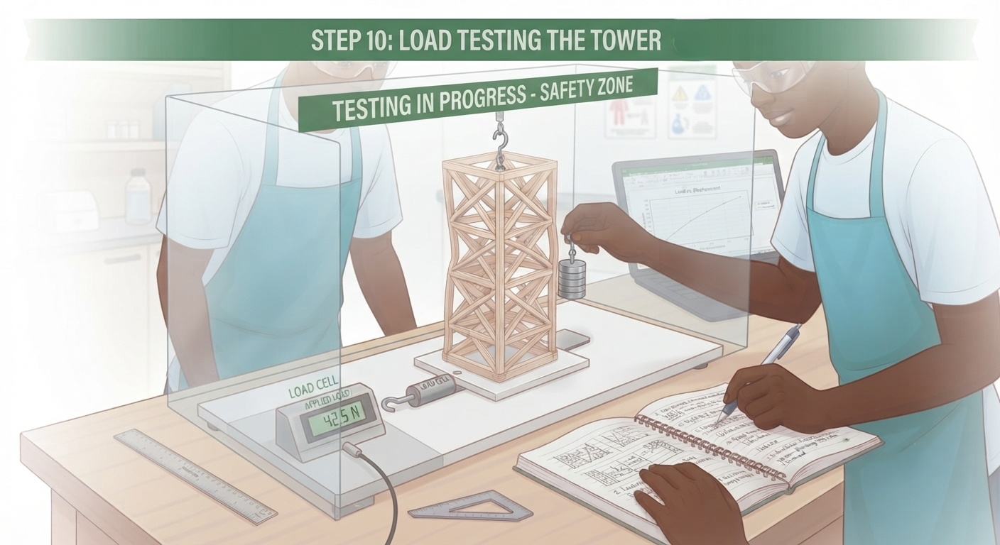

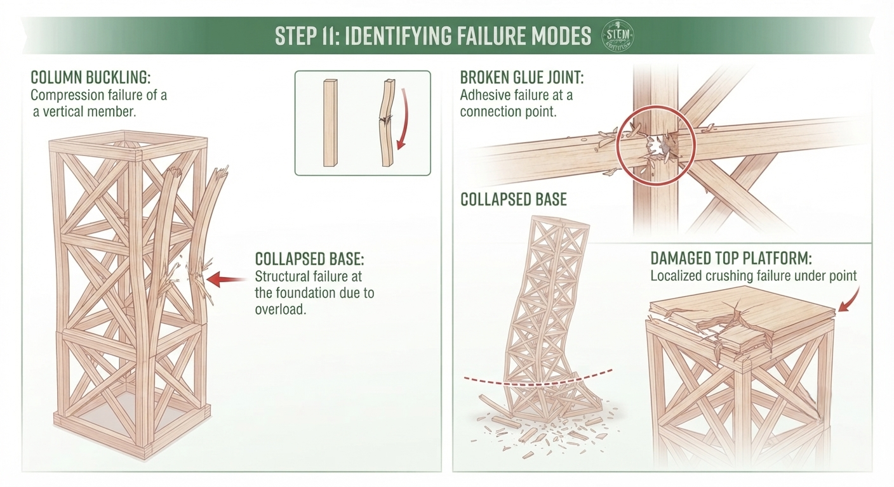

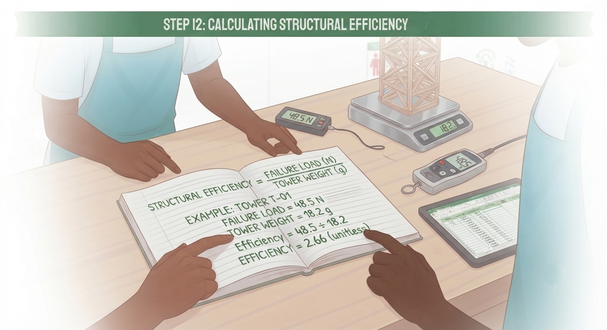

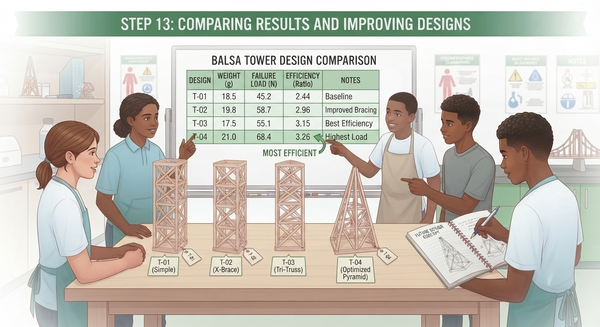

**4. Engineering Principles**

**Structural Concepts**

* Compression: forces pushing inward along a column. Columns under compression are prone to buckling if they are slender
* Tension: forces pulling outward along a member. Diagonal braces usually carry tension when a column is pushed
* Buckling: sudden sideways collapse of a slender column under compression. The most common failure mode in balsa towers
* Triangulation: dividing a rectangular panel into triangles makes it rigid — a triangle cannot change shape without changing its member lengths
* Efficiency: the ratio of load carried to structure weight is the most important metric in aerospace structural design

| **Aviation Connection**  Aircraft wings use a spar as the main compression/tension member, with ribs providing shape and preventing buckling.  The Eiffel Tower (also a structural landmark in aviation history) uses the same X-bracing principle students test in this project.  Modern composite aircraft fuselages are designed to achieve structural efficiency ratios far exceeding any metal design — exactly the metric students calculate here. |
| --- |

**5. Data Collection Table**

| **Design** | **Tower Weight (g)** | **Failure Load (g)** | **Failure Mode** | **Efficiency (Load÷Weight)** |
| --- | --- | --- | --- | --- |
| **Square Base** |  |  |  |  |
| **Triangular Base** |  |  |  |  |
| **X-Braced** |  |  |  |  |
| **Pyramid** |  |  |  |  |

**6. Expected Output & Success Criteria**

| **Outcome** | **Success Criteria** |
| --- | --- |
| 4 towers built | All four designs constructed; joints dry before load testing |
| All towers load tested | Weights applied gradually to failure; failure load recorded |
| Failure modes identified | Collapse type named (buckle, joint failure, base collapse) |
| Efficiency calculated | Load ÷ tower weight calculated for each design |
| Best design identified | Highest-efficiency design named and explained with reference to structural principles |

**7. Common Errors & Fixes**

| **Error** | **Likely Cause** | **Fix** |
| --- | --- | --- |
| **Tower leans to one side** | Joints not square during assembly | Use a right-angle card at every joint; hold for 60 s while glue sets |
| **Joints fail before columns** | Insufficient glue or not fully cured | Apply glue generously; allow 20 min cure before adding more weight |
| **Columns buckle under low load** | No cross-bracing on vertical members | Add diagonal braces between columns; triangulate all panel faces |
| **Tower too heavy to be efficient** | Too much material used | Use the thinnest balsa strips that can still carry the load; plan before building |

**8. Upgrade & Extension Ideas**

* Material Comparison: build the same design in bamboo skewers vs. balsa; compare efficiency ratios
* Height Challenge: who can build the tallest tower that supports 100 g?
* Bridge Design: adapt the same principles to span a 20 cm gap while carrying maximum load
* Weight Challenge: lightest tower that supports exactly 200 g without failing

