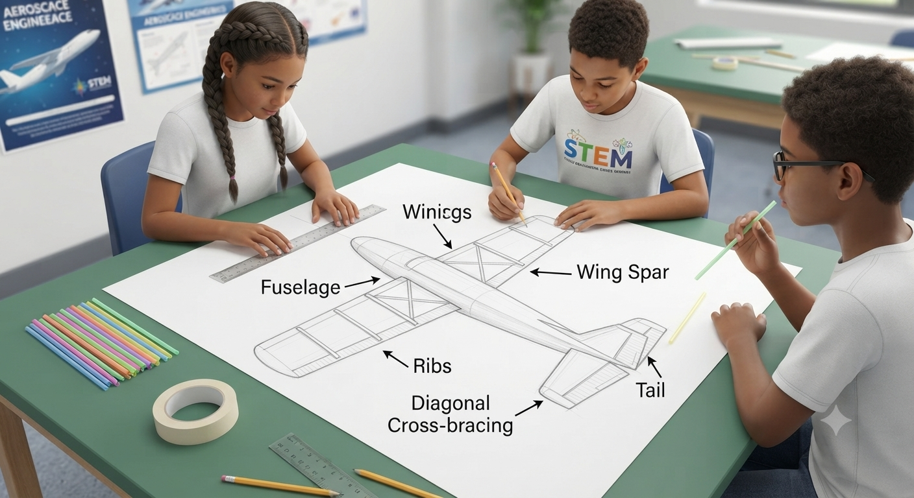
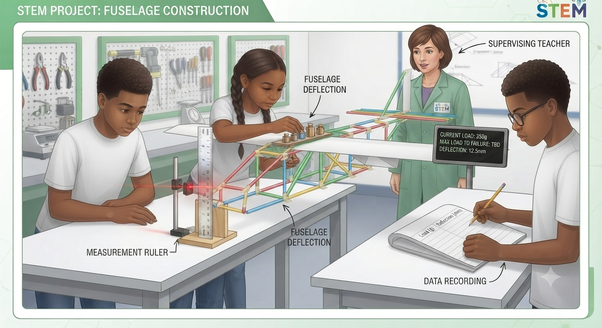
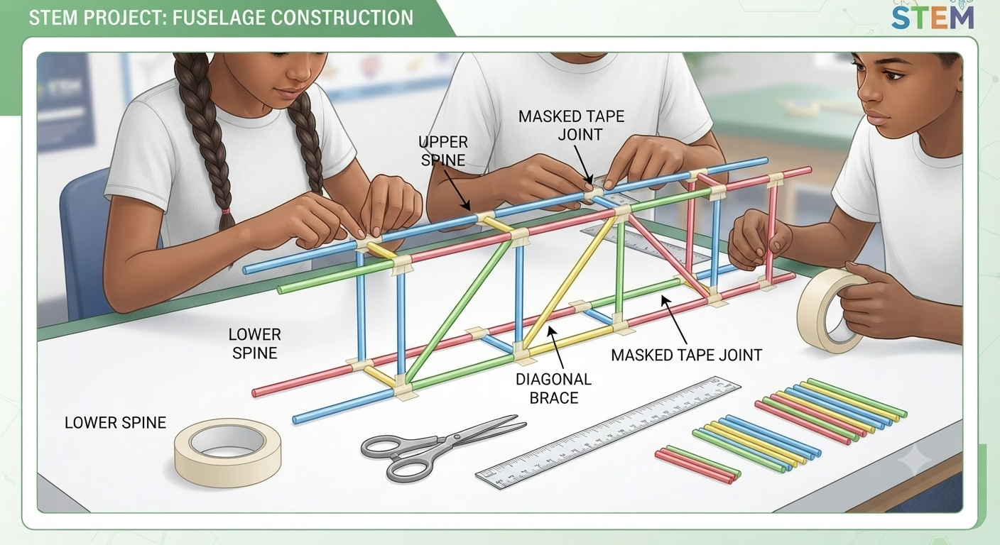
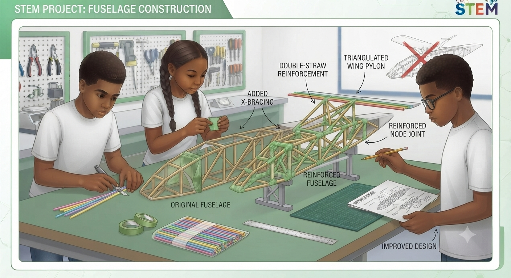
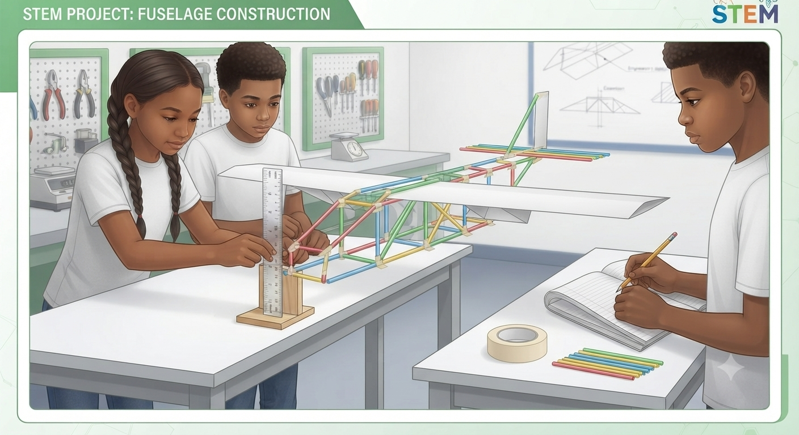
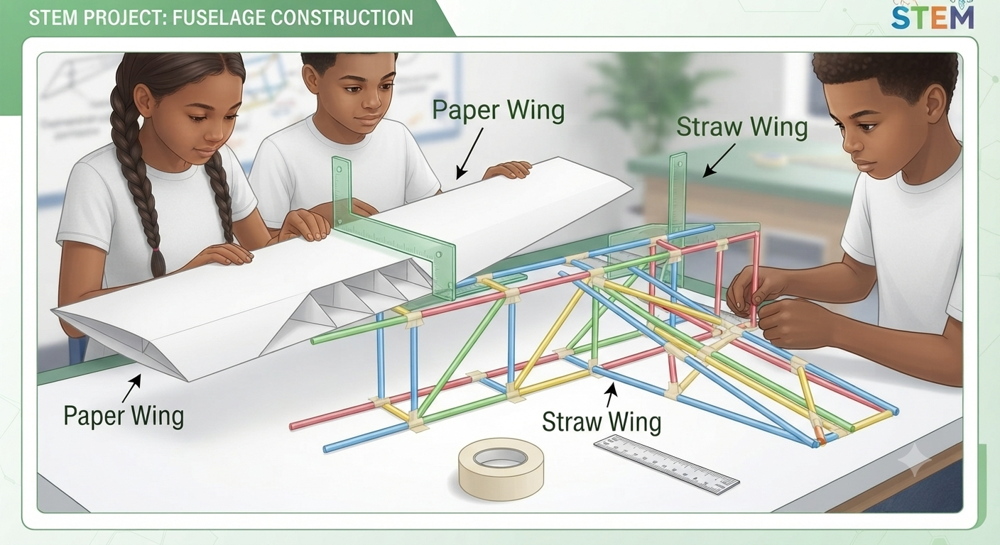
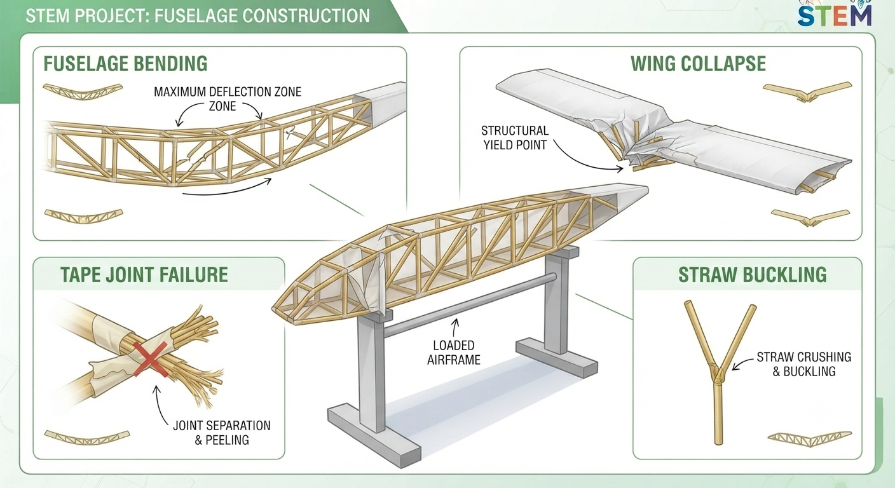
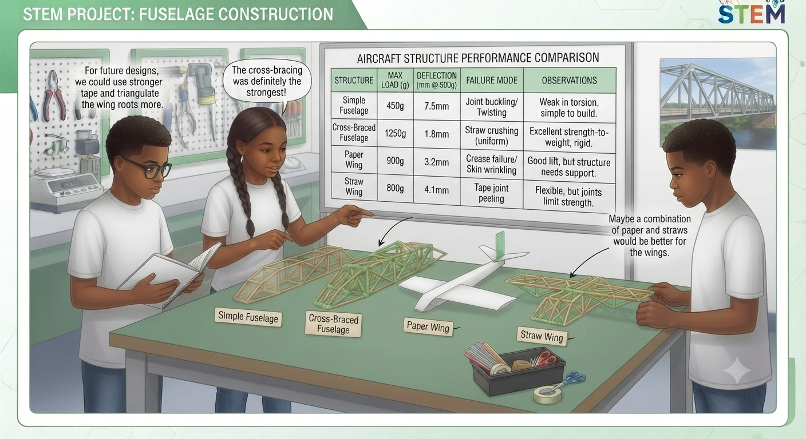

**AVIATION & AEROSPACE EDUCATION KIT**

SECTION 2 • BEGINNER PROJECTS • SHS 1 TERMS 1–2

**PROJECT 23**

**Straw & Paper**

**Airframe Strength Test**

| **LEVEL**  Intermediate | **DURATION**  2 Lessons (40–50 min each) | **KIT**  Kit 1 |
| --- | --- | --- |

**Student & Teacher Manual**

**1. Project Overview**

Every aircraft must carry its own weight plus passenger, cargo, and aerodynamic loads — all transferred through the airframe without failing. This project uses drinking straws and paper to model the load paths inside a real aircraft structure. Students build a simple airframe, load it to failure, and then redesign it to carry more weight — experiencing in miniature the iterative structural testing that real aircraft manufacturers conduct before certification.

|  |  |
| --- | --- |
| Curriculum Area | Airframe Structural Design – Load Transfer, Spars, Ribs & Fuselage |
| Year Group | SHS 1 (Terms 1–2) |
| Duration | 2 lessons of 40–50 minutes each |
| Materials Source | Kit 1 (straws, paper, tape, string) and Kit 6 (test weights) |
| Power Required | None |
| Prerequisite | Project 22 (Balsa Tower) recommended — introduces compression and tension concepts |

**Learning Objectives**

* Identify the four main airframe members: spar, rib, fuselage, and stringer
* Explain how lift loads travel from the wing spar through the fuselage
* Build a simple straw-and-paper airframe with a fuselage, wings, and cross-bracing
* Load test four structural configurations; record failure load and deflection
* Draw the load path from wing to fuselage to landing gear on a diagram
* Propose and implement one design improvement to the weakest structure

**2. Components Required**

| **Item** | **Quantity** | **Source** |
| --- | --- | --- |
| **Drinking straws** | 30 | Kit 1 |
| **A4 paper** | 10 sheets | Kit 1 |
| **Masking tape** | 1 roll | Kit 1 |
| **String** | 1 roll | Kit 1 |
| **Test weights (small)** | 1 set | Kit 6 |
| **Scissors** | 1 pair | Kit 1 |
| **Ruler (30 cm)** | 1 | Kit 1 |

**3. Build Steps & Assembly**

**Lesson 1 – Structure Build**

| **STEP 1** | **Design the Airframe** |
| --- | --- |
|  | * Sketch a simple aircraft top-view on A4 paper: fuselage (spine), two wings, tail * Identify where the main spar will run (left wing tip → right wing tip through the fuselage centre) * Mark where cross-bracing will be added to prevent fuselage bending |

| **STEP 2** | **Build the Fuselage** |
| --- | --- |
|  | * Connect 4 straws end-to-end with tape to form the fuselage spine (approximately 40 cm total) * Add a parallel second spine 3 cm below the first, connected with 5 cm vertical cross-straws * Add diagonal cross-bracing straws between the verticals to prevent racking * Tape all joints with 3 cm of masking tape; press firmly |

| **STEP 3** | **Add Wings** |
| --- | --- |
|  | * Structure A (Paper Wing): tape a folded A4 paper strip (10 cm wide) across the fuselage midpoint * Structure B (Straw Wing): tape 4 straws side-by-side to form a 20 cm × 3 cm wing panel; attach to fuselage * Ensure wings are perpendicular to the fuselage; check with a right-angle card |

**Lesson 2 – Load Testing & Improvement**

| **STEP 4** | **Load Testing** |
| --- | --- |
|  | * Support the airframe at two points: hold each wing tip over the edge of a table * Place weights at the fuselage centre, one at a time * Measure deflection (how much the fuselage bends) at the midpoint with a ruler * Continue until failure; record maximum load and failure mode in the data table |

| **STEP 5** | **Improvement & Retest** |
| --- | --- |
|  | * Identify the weakest failure mode; design one modification to fix it * Build the modification; re-test using the same loading procedure * Record improved load; calculate the percentage improvement * Draw the load path on your airframe sketch: arrows showing force direction through each member |

**4. Power & Safety Notes**

| **⚠ Safety Notes**  Power: None required.  Scissors: Standard classroom supervision is sufficient.  Load testing: Stand clear when adding final weights — straw structures fail suddenly.  String: Ensure string used as a tie is not a trip hazard on the floor. |
| --- |

**5. Engineering Principles**

**Airframe Structural Members**

* Spar: the main spanwise structural member of the wing; carries bending loads from lift
* Rib: cross-sectional members perpendicular to the spar; give the wing its shape and transfer loads to the spar
* Fuselage: the main body structure; must carry the weight of passengers, cargo, engines, and fuel — all transferred to the wings
* Stringer: longitudinal members running along the fuselage length; resist bending and compression

| **Load Path in a Real Wing**  Lift is generated across the entire wing surface and acts perpendicular to the airflow.  This distributed lift force is collected by the wing ribs and transferred to the main spar.  The spar carries it inboard to the wing root, where it is transferred into the fuselage structure.  The fuselage distributes the load through its frames and stringers to the landing gear and tail.  If any element in this chain fails, the aircraft is lost — load path integrity is non-negotiable. |
| --- |

**6. Data Collection Table**

| **Structure** | **Max Load (g)** | **Deflection (cm)** | **Failure Mode** | **Notes** |
| --- | --- | --- | --- | --- |
| **Simple Fuselage** |  |  |  |  |
| **Cross-Braced Fuselage** |  |  |  |  |
| **Paper Wing** |  |  |  |  |
| **Straw Wing** |  |  |  |  |

**7. Expected Output & Success Criteria**

| **Outcome** | **Success Criteria** |
| --- | --- |
| Airframe built | Fuselage spine and wings assembled; structure holds its own weight |
| Load tested | All 4 structures tested; max load and deflection recorded |
| Failure modes identified | Mode correctly named for each structure |
| Improved design | Student proposes one modification to strengthen the weakest structure |
| Load path explained | Student draws the load path from wing through fuselage |

**8. Common Errors & Fixes**

| **Error** | **Likely Cause** | **Fix** |
| --- | --- | --- |
| **Too weak — collapses under first weight** | No cross-bracing in fuselage | Add diagonal straw braces between fuselage members |
| **Joints fail at tape** | Tape applied over oil or dust | Clean straw surfaces with dry cloth; press tape firmly for 10 s |
| **Fuselage bends instead of breaks** | No spine spar | Add a single long straw along the centreline as the main spar |
| **Wing deflects too much** | No spanwise spar | Add a straw along the leading edge to resist bending |

**9. Upgrade & Extension Ideas**

* Truss Structure: rebuild the wing as a triangulated truss; compare efficiency with the flat-panel version
* Balsa Replacement: substitute balsa strips for straws; compare the load capacity increase
* Team Competition: strongest airframe per 100 g of structure weight wins
* Deflection Graph: plot load (x) vs. deflection (y) for the cross-braced design; identify the linear elastic range

**10. Teacher Notes & Differentiation**

* For load testing, books make excellent test weights — 200 g reference paperback; 500 g hardback
* The load path drawing (Step 5) is the most important conceptual deliverable — spend 10 minutes discussing it as a class
* Support – Pre-built fuselage; students focus on wing attachment, loading, and observation
* Core – Full build; all 4 configurations tested; failure modes identified; improvement implemented
* Extension – Truss wing; deflection graph; team competition

| **Curriculum Links**  Physics: Forces, moments, structural failure modes  Design & Technology: Iterative design; materials; structural testing  Aviation: Airframe members; load paths; aircraft certification structural testing |
| --- |

## Images

