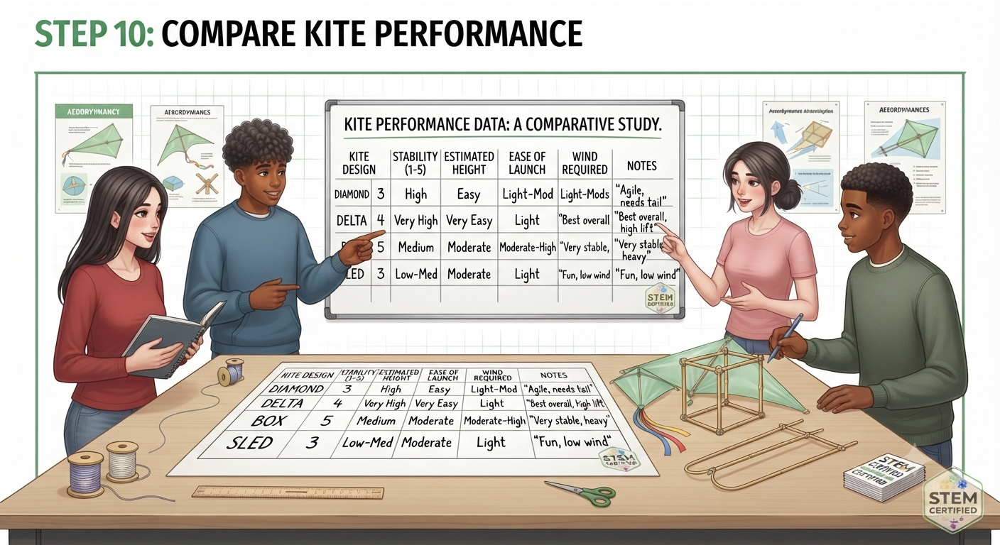
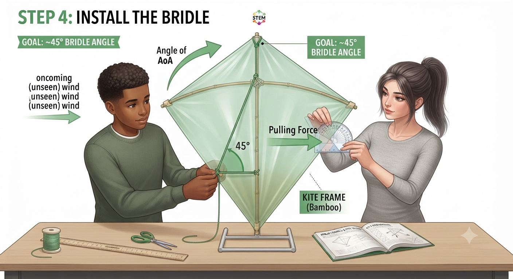
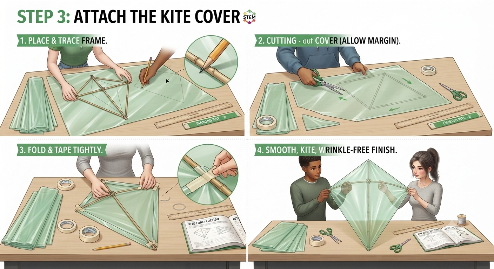
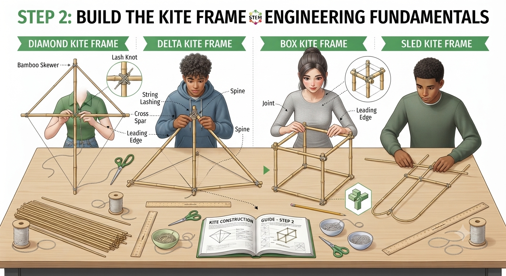
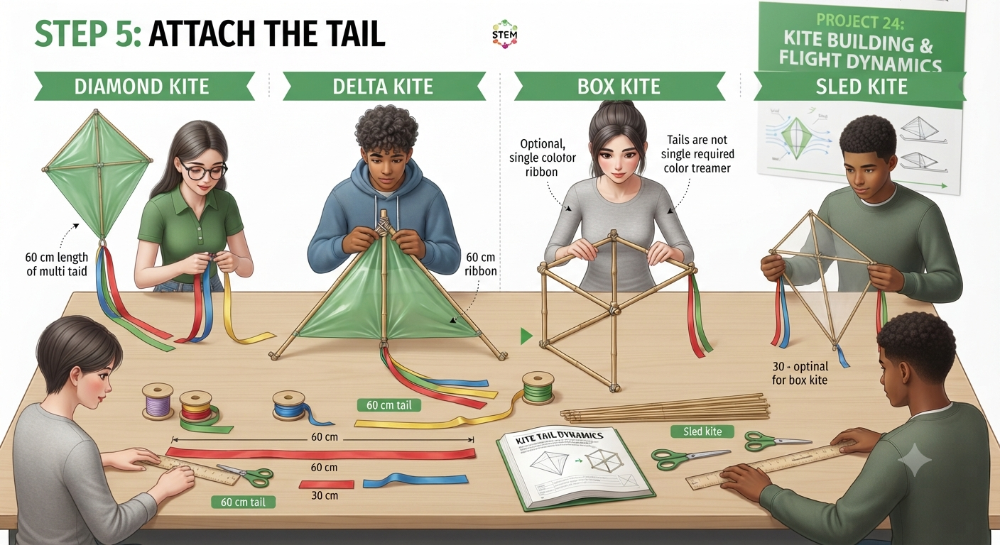
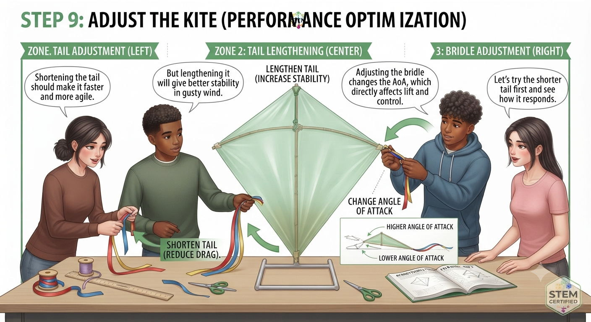
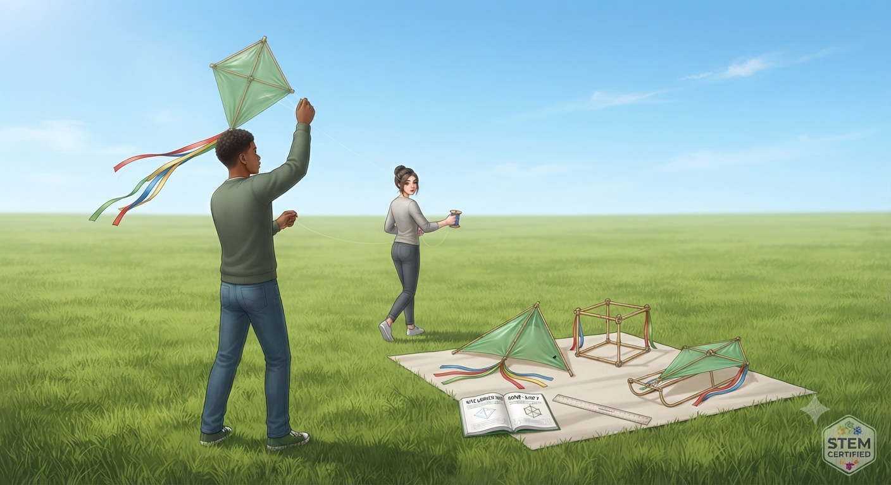
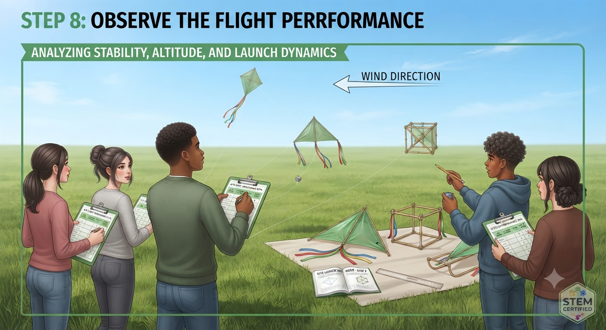

**AVIATION & AEROSPACE EDUCATION KIT**

SECTION 2 • BEGINNER PROJECTS • SHS 1 TERMS 1–2

**PROJECT 24**

**Kite Building**

**& Flight Dynamics**

| **LEVEL**  Intermediate | **DURATION**  3 Lessons (40–50 min each) | **KIT**  Kit 1 & 3 |
| --- | --- | --- |

**Student & Teacher Manual**

**1. Project Overview**

Kites are the oldest flying devices in human history — and the first tools aviation pioneers like the Wright Brothers used to study aerodynamics. By building and flying four different kite designs, students observe lift, drag, stability, and bridle angle in a wind-powered system that requires no engine. The competition between designs — which flies highest, which is most stable, which is easiest to launch — directly reflects the engineering trade-offs in real aircraft design.

|  |  |
| --- | --- |
| Curriculum Area | Aerodynamics – Lift, Drag, Stability & Bridle Angle |
| Year Group | SHS 1 (Terms 1–2) |
| Duration | 3 lessons of 40–50 minutes each |
| Materials Source | Kit 1 (materials) and Kit 3 (streamers for tail) |
| Power Required | Wind only — no mechanical or electrical power |
| Prerequisite | Project 1 (Paper Dart) for familiarity with lift and drag concepts |

**Learning Objectives**

* Identify the four forces acting on a kite: lift, drag, weight, and tension
* Explain how the bridle angle determines the kite's angle of attack and therefore its lift
* Construct four kite designs: diamond, delta, box, and sled
* Fly all four designs and record stability, height, and launch ease
* Explain why a longer tail increases stability by increasing the kite's pendulum moment
* Identify the best overall design and justify the choice with aerodynamic reasoning

**2. Components Required**

| **Item** | **Quantity** | **Source** |
| --- | --- | --- |
| **A4 paper or light plastic sheet** | 5 sheets | Kit 1 |
| **Bamboo skewers (30 cm)** | 10 | Kit 1 |
| **String (for bridle and flying line)** | 1 roll | Kit 1 |
| **Masking tape** | 1 roll | Kit 1 |
| **Scissors** | 1 pair | Kit 1 |
| **Coloured ribbon / streamers (for tail)** | 1 roll | Kit 3 |
| **Ruler (30 cm)** | 1 | Kit 1 |

**3. Build Steps & Assembly**

**Lesson 1 – Design & Frame Construction**

| **STEP 1** | **Choose and Design Kite Type** |
| --- | --- |
|  | * Each group assigns one design per student (4 students = 4 designs); groups of fewer than 4 build fewer designs * Diamond: cross-shaped frame (spine + cross-spar); classic pointed diamond cover * Delta: triangular frame (spine + two angled spars meeting at the nose); triangular cover * Box: rectangular 3D frame (4 spars forming a box with open sides); complex but stable * Sled: simple flat rectangle with two parallel spars; no cross-spar; curved into shape by the wind |

| **STEP 2** | **Frame Construction** |
| --- | --- |
|  | * Build each frame from bamboo skewers: tie joints with string (not tape — it allows adjustment) * Diamond: tie the cross-spar 1/3 from the top of the spine * Delta: tie two spars to the nose point and spread to 45° on each side * Box: tie 4 skewers into a rectangle using overhand knots; add corner skewers for 3D shape * Sled: two parallel skewers with a horizontal spar tied across the middle |

**Lesson 2 – Cover & Tail**

| **STEP 3** | **Cover Attachment** |
| --- | --- |
|  | * Lay the frame on the paper/plastic; trace the outline; add 1 cm border all round * Cut out the cover; fold the 1 cm border over each spar and tape firmly * Check: cover must be taut and smooth, with no wrinkles or air pockets * Add the bridle: tie string from the nose and a lower point; the bridle angle should be approximately 45° |

| **STEP 4** | **Tail Attachment** |
| --- | --- |
|  | * Cut 60 cm of ribbon as a starting tail; tie to the base of the kite * A tail is mandatory for diamond and delta designs; optional for box and sled * Longer tail = more drag = more stability; short tail = kite can spin * Test tail length during first flights; adjust by adding or removing 10 cm sections |

**Lesson 3 – Flight Testing**

| **STEP 5** | **Flight Testing Protocol** |
| --- | --- |
|  | * Find an open outdoor area of at least 50 m with no overhead power lines * Launch into the wind: one student holds the kite above their head; pilot walks backward paying out string * Record stability (1 = spins constantly, 5 = completely stable) and estimated height * Test each design for at least 2 minutes before adjusting * After each flight: adjust bridle or tail length if needed; record all adjustments |

**4. Power & Safety Notes**

| **⚠ Safety Notes**  Power: Wind only — no mechanical or electrical power.  Power lines: NEVER fly near overhead power lines. Choose a location with clear overhead space.  Road proximity: Kite flying must be in an open field away from roads — a falling kite can distract drivers.  String tension: Kite string under tension can cut skin. Wear gloves if available; do not wrap string around fingers.  Wind limit: Do not fly in gusts above 25 km/h — box kites especially can exert significant pull. |
| --- |

**5. Engineering Principles**

**Kite Aerodynamics**

* Lift: the kite's angled surface deflects wind downward, creating an upward reaction force (Newton's Third Law) — this is lift
* Drag: the kite also resists the wind, creating drag that pulls it back and holds it at an angle
* Tension: the flying string holds the kite at the bridle angle, balancing lift and drag
* Bridle angle: the point where the string attaches determines the kite's angle of attack; moving it higher flattens the angle and reduces lift
* Stability: the tail acts as a pendulum moment — wind force on the tail creates a restoring torque that prevents spinning

| **Aviation Historical Connection**  Lawrence Hargrave invented the box kite in 1893 — the same structural principle was used in the wings of early biplanes.  Samuel Langley and Octave Chanute used kite experiments to study lift long before the Wright Brothers' first flight.  The Wright Brothers used a kite with control surfaces to test wing warping — the concept that became the aileron — before they built their first glider.  Modern power kites (kitesurfing, kite buggies) generate hundreds of kilograms of lift — all from the same principles in this project. |
| --- |

**6. Data Collection Table**

| **Design** | **Stability (1–5)** | **Est. Height (m)** | **Ease of Launch (1–5)** | **Wind Required** | **Notes** |
| --- | --- | --- | --- | --- | --- |
| **Diamond** |  |  |  |  |  |
| **Delta** |  |  |  |  |  |
| **Box** |  |  |  |  |  |
| **Sled** |  |  |  |  |  |

**7. Expected Output & Success Criteria**

| **Outcome** | **Success Criteria** |
| --- | --- |
| 4 kites built | All four designs constructed with frame, cover, and tail |
| All kites flown | Stable flight achieved for at least 30 s for each design |
| Data recorded | Stability score, estimated height, and launch ease recorded |
| Best design identified | Design ranked and choice justified with reference to bridle angle, tail, and area |
| Aerodynamics explained | Student explains how the kite generates lift using angle of attack |

**8. Common Errors & Fixes**

| **Error** | **Likely Cause** | **Fix** |
| --- | --- | --- |
| **Kite will not launch** | Too heavy or insufficient wind | Remove excess tape; wait for stronger wind (10+ km/h) |
| **Spins and dives** | No tail or tail too short | Add a 60 cm tail; increase tail length until stable |
| **Nose dives repeatedly** | Bridle angle too flat | Move the bridle attachment point upward to increase the angle of attack |
| **Kite drifts sideways** | Asymmetric frame or cover | Check both sides of the frame are identical; re-centre the cover |

**9. Upgrade & Extension Ideas**

* Wind Measurement: use the Kit 3 streamer to estimate wind direction; use a hand anemometer (or phone app) to record wind speed during each flight
* Larger Kite: scale the diamond design up to A1 poster size; compare flight characteristics
* Multiple Tails: test 30 cm, 60 cm, and 120 cm tails on the same kite; graph tail length vs. stability score
* Kite Photography: attach a small phone to the line using a picavet rig; capture aerial photos of the school grounds

**10. Teacher Notes & Differentiation**

* Check the weather before Lesson 3 — kite flying needs 8–20 km/h sustained wind; if calm, use the project day for analysis and save flying for a windy day
* The bridle angle is the hardest concept for students — demonstrate the effect by adjusting a single kite in front of the class before group flights
* Support – Diamond and sled only; pre-tied frame; focus on flying and tail adjustment rather than building
* Core – All four designs; full build; flight testing; data collection; best design analysis
* Extension – Wind measurement; kite photography; tail length experiment; scale-up challenge

| **Curriculum Links**  Physics: Lift, drag, forces in equilibrium, moments and stability  History / Social Studies: Aviation history; Wright Brothers; kite as first flight tool  Mathematics: Data recording, rating scales, wind speed estimation  Design & Technology: Frame construction, cover attachment, iterative tail adjustment |
| --- |

## Images

